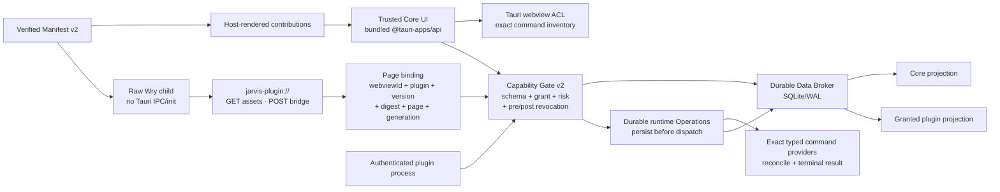

# Isolated Plugin UI and Data Broker Implementation Plan

> **For agentic workers:** REQUIRED SUB-SKILL: Use superpowers:subagent-driven-development (recommended) or
> superpowers:executing-plans to implement this plan task-by-task. Steps use checkbox (`- [ ]`) syntax for tracking.

**Goal:** Ship isolated multi-page plugin UI, Bridge v1, a durable typed Data Broker, scoped cross-plugin grants,
typed settings and host-rendered extension points without giving plugin content Tauri IPC, Jarvis DOM, raw host paths
or provider-specific shortcuts.

**Architecture:** Trusted Jarvis webviews use an explicit bundled Tauri transport and webview-scoped ACLs. Untrusted
plugin pages run in direct, pinned Wry child webviews that do not receive Tauri's IPC handler or initialization
scripts; a strict custom scheme serves verified assets and a same-origin POST/long-poll bridge. Every page/process
request is rebound to server-side exact package identity, then passes Capability Gate v2 before reaching a
SQLite/WAL Broker. Core surfaces render declarative contributions; arbitrary plugin markup stays inside the isolated
child webview.

**Tech Stack:** Rust 2021; Rust 1.77.2 is an MSRV claim only for the
public/pure protocol, SDK and test-host crates whose complete locked graphs run
in the dedicated `plugin-msrv` job. The Tauri host and its Wry/objc2/SQLite
graph use the current stable toolchain from CI unless that complete graph is
separately pinned and tested. Tauri `2.11.2`, `tauri-build` `2.6.2`, direct Wry
`0.55.1`, `objc2` `0.6.4`, `objc2-foundation`/`objc2-web-kit` `0.3.2`, Tokio,
SQLite/WAL, JSON Schema, TypeScript/ES modules, Node test runner, macOS
WKWebView, Tauri official Figma workflow at the mandatory design checkpoint.

**Approved design:** `docs/superpowers/specs/2026-07-31-plugin-platform-agent-vm-v2-design.md` §§3.2, 7.1, 8–11,
13–14, 22, 25.2 and 26 Increment B.

**Roadmap:** `docs/superpowers/plans/2026-07-31-plugin-platform-agent-vm-v2.md`.

**Implementation base audited for this plan:** `087502d33831252a293d9433499f04175edfbdfd`. A1 is present as
`61c6fbb5a28cd037d6406087fc97e7ca4883fd3e`; A2 and the rest of Increment A are not present on this base. Execute
the code tasks on the integration branch only after the dependency gates below pass. Run every command from the
repository root unless a step gives another working directory.

---

## Increment boundary, dependencies and claims

### Dependency gates

| Gate | Required before | Proof |
|---|---|---|
| A1 public protocol/SDK/test-host | B1 | `61c6fbb` is an ancestor and all three public-crate test suites pass |
| A2 strict Manifest v2 DTO and schema | B1 GREEN | `ManifestV2.contributes` contains pages, commands, actions, hotkeys, settings and data contracts; its fixture suite passes |
| A5–A7 receipts, operations and manager service | B9 | Plugin Manager consumes one shared manager service; it does not synthesize installed/update state |
| A8 exact receipt resolver | B3 production activation and B9 page opening | Page assets resolve from one immutable exact-digest package instance; legacy source folders never become a UI origin |
| P0 isolation attestation from B3 | B8 and every custom page | Raw-child hostile WKWebView suite passes for the exact pinned Tauri/Wry/WebKit support tuple |
| Figma checkpoint after B6 | B7 and later | Required frames, components, states, screenshots and node IDs are recorded in `docs/design/plugin-platform-v2-figma.md` |

If A2 changes a name used by this plan, update the B public DTO once at B1 and regenerate all golden fixtures before
writing host implementation. Do not add a second competing manifest model.

### What Increment B does and does not claim

- This file intentionally refines the coarse roadmap split by pulling the provider-neutral durable Broker mechanics
  required by Bridge v1 into B. Before implementation starts, update the integration roadmap so Increment C owns
  generic Project/Runtime/Session/Turn contracts and Core projections instead of reimplementing B's stores, Gate or
  cursors. Until that index correction lands, this file is authoritative for the Broker mechanics listed here.
- B delivers the generic isolation, Broker, persist-before-dispatch runtime
  Operation service, settings, bridge and contribution mechanisms.
- B proves that a core reader and a plugin reader can observe projections from the same Broker transaction and
  revision.
- B does **not** claim final Projects ↔ Agent VM state synchronization. Increment C must add stable Core Project
  Catalog and provider-neutral Runtime/Session/Turn schemas; Increment E must migrate Agent VM controller outbox,
  pages and current data onto them.
- B does not replace Agent VM's current working legacy UI or storage. New generic modules cannot add further
  Agent VM/cwd coupling; C and E remove the old coupling after migration and rollback evidence.
- Opening a new plugin route is read-only. It may activate the UI bridge, but cannot provision a VM, ensure a
  terminal, create a Session or invoke a provider command. C/E add the equivalent guarantee to migrated Project
  routes.
- Generic `notifications` bridge calls are in B. Durable Agent VM task-completion dedupe and memory/mount
  notifications remain Increment F.
- Credential values never enter Broker entities, events, settings, bridge payloads or audit. Credential leases remain
  Increment F.

### Non-negotiable security sequence

No Plugin Manager toggle, page route, manifest placement or Developer Mode path may enable custom plugin HTML before
Tasks B2 and B3 pass. The production feature gate defaults closed and remains closed when:

1. the direct Wry/Tauri/objc2 version tuple differs from the attested tuple;
2. the current macOS/WebKit family has no passing support record;
3. any hostile assertion is missing, skipped or failed;
4. a package digest/generation/grant binding cannot be revalidated;
5. the UI delegate, custom scheme or capability inventory is not installed;
6. the application is built with an unreviewed webview backend feature.

Signed or first-party plugin pages get no exception.

## Audited platform facts and corrected implementation choice

The audit snapshot pins these exact dependency facts from `src-tauri/Cargo.lock`:

```text
tauri             2.11.2
tauri-build       2.6.2
tauri-runtime-wry 2.11.2
wry               0.55.1
objc2             0.6.4
objc2-foundation  0.3.2
objc2-web-kit     0.3.2
```

Primary references checked on 2026-07-31:

- [Tauri 2 capabilities](https://v2.tauri.app/security/capabilities/) states that app commands registered without
  `AppManifest::commands` are available to all app webviews by default.
- [Tauri capability reference](https://v2.tauri.app/reference/acl/capability/) states that `windows` grants a
  capability to every webview in that window and recommends `webviews` for multi-webview windows.
- [Tauri 2.11.2 `Window::add_child`](https://docs.rs/tauri/2.11.2/tauri/window/struct.Window.html#method.add_child)
  is available only with the unstable feature.
- [Tauri 2.11.2 `WebviewBuilder`](https://docs.rs/tauri/2.11.2/tauri/webview/struct.WebviewBuilder.html) documents
  the navigation/new-window/download hooks and that macOS clipboard access is always enabled at the WebKit layer.
- [Tauri 2.11.2 managed-webview initialization source](https://github.com/tauri-apps/tauri/blob/tauri-v2.11.2/crates/tauri/src/manager/webview.rs#L157-L224)
  creates non-configurable `window.__TAURI_INTERNALS__` before user initialization scripts.
- [Wry 0.55.1 child webview API](https://docs.rs/wry/0.55.1/wry/struct.WebViewBuilder.html#method.build_as_child)
  supports a raw macOS `NSView` child without Tauri's IPC initialization.
- [Wry 0.55.1 macOS UI delegate source](https://github.com/tauri-apps/wry/blob/wry-v0.55.1/src/wkwebview/class/wry_web_view_ui_delegate.rs#L97-L139)
  opens a file panel and grants media capture by default, so raw Wry alone is not sufficient.
- [Apple `WKWebsiteDataStore.nonPersistent`](https://developer.apple.com/documentation/webkit/wkwebsitedatastore/nonpersistent%28%29)
  keeps website data in memory instead of writing it to disk.
- [Apple `WKUIDelegate`](https://developer.apple.com/documentation/webkit/wkuidelegate) owns popups, JavaScript
  panels, upload panels and media/device permission decisions.
- [Apple navigation policy](https://developer.apple.com/documentation/webkit/wknavigationdelegate/webview%28_%3Adecidepolicyfor%3Adecisionhandler%3A%29-2ni62)
  can cancel navigation before content loads.
- [Apple custom scheme handling](https://developer.apple.com/documentation/webkit/wkurlschemehandler) provides the
  request that the host must validate and answer.
- [Apple download destination contract](https://developer.apple.com/documentation/webkit/wkdownloaddelegate/download%28_%3Adecidedestinationusing%3Asuggestedfilename%3Acompletionhandler%3A%29)
  confirms that returning no destination cancels a download.

Therefore the production plugin page is **not** a Tauri-managed child webview. Task B3 keeps a managed-child
`unstable` harness as reproducible RED evidence, but production uses direct `wry::WebViewBuilder::build_as_child`
with:

- no `with_ipc_handler`;
- no Tauri initialization script;
- a Jarvis-owned macOS `WKUIDelegate` that denies upload panels, popup creation, JavaScript dialogs,
  media capture, motion and supported device prompts;
- native Wry navigation, download and drag/drop denial handlers;
- non-persistent storage;
- a document-start primordial hardening script plus CSP for browser APIs that WebKit does not expose through a
  native deny callback;
- a live hostile WKWebView certification suite.

If a deny cannot be demonstrated on a supported OS/WebKit tuple, custom pages remain disabled on that tuple. A
JavaScript shim is defense in depth, never the only acceptance evidence.

## Target architecture



## Shared limits and stable error vocabulary

Use one `src-tauri/src/plugin_platform/limits.rs` source and mirror it in generated public DTO constants:

```rust
pub const MAX_BRIDGE_BODY_BYTES: usize = 1_048_576;
pub const MAX_BRIDGE_IN_FLIGHT: usize = 64;
pub const MAX_BRIDGE_SUBSCRIPTIONS: usize = 32;
pub const MAX_BRIDGE_BATCH_EVENTS: usize = 128;
pub const MAX_ENTITY_BYTES: usize = 256 * 1024;
pub const MAX_EVENT_BYTES: usize = 128 * 1024;
pub const MAX_PRIVATE_VALUE_BYTES: usize = 256 * 1024;
pub const MAX_PRIVATE_PLUGIN_BYTES: usize = 32 * 1024 * 1024;
pub const MAX_HANDLE_READS: u32 = 8;
pub const MAX_HANDLE_BYTES: u64 = 16 * 1024 * 1024;
pub const DEFAULT_REQUEST_DEADLINE_MS: u64 = 10_000;
pub const MAX_REQUEST_DEADLINE_MS: u64 = 30_000;
```

Public errors are stable, redacted and non-secret:

```text
bridge_protocol_incompatible
bridge_message_too_large
bridge_rate_limited
bridge_in_flight_limit
bridge_subscription_limit
bridge_deadline
bridge_cancelled
page_binding_missing
page_generation_stale
package_digest_stale
grant_revoked
grant_scope_denied
contract_not_found
contract_incompatible
schema_invalid
revision_conflict
cursor_gap
resource_handle_invalid
resource_handle_expired
resource_handle_exhausted
operation_pending
provider_unavailable
plugin_ui_isolation_unavailable
```

Human-readable diagnostics go to host logs with correlation IDs. Bridge messages and plugin-visible errors never
contain host paths, SQL text, raw provider output, grants of other plugins, tokens or secret values.

---

### Task B1: Extend the public boundary with Broker, Bridge, contribution and setting contracts

**Files:**

- Create: `crates/jarvis-plugin-protocol/src/broker.rs`
- Create: `crates/jarvis-plugin-protocol/src/bridge.rs`
- Create: `crates/jarvis-plugin-protocol/src/contribution.rs`
- Create: `crates/jarvis-plugin-protocol/src/settings.rs`
- Create: `crates/jarvis-plugin-protocol/src/bin/export_ui_contracts.rs`
- Create: `crates/jarvis-plugin-protocol/tests/broker_wire.rs`
- Create: `crates/jarvis-plugin-protocol/tests/bridge_wire.rs`
- Create: `crates/jarvis-plugin-protocol/tests/contribution_wire.rs`
- Create: `crates/jarvis-plugin-protocol/tests/settings_wire.rs`
- Create: `crates/jarvis-plugin-test-host/src/ui.rs`
- Create: `crates/jarvis-plugin-test-host/tests/ui_contract.rs`
- Create: `schemas/plugin-broker-v1.schema.json`
- Create: `schemas/plugin-ui-bridge-v1.schema.json`
- Create: `schemas/plugin-contribution-v1.schema.json`
- Create: `schemas/plugin-settings-v1.schema.json`
- Create: `packages/jarvis-plugin-ui/package.json`
- Create: `packages/jarvis-plugin-ui/tsconfig.contracts.json`
- Create: `packages/jarvis-plugin-ui/src/generated/contracts.ts`
- Create: `packages/jarvis-plugin-ui/test/wire.test.mjs`
- Create: `packages/jarvis-plugin-ui/test/wire-types.ts`
- Create: `scripts/generate-plugin-ui-contracts.mjs`
- Create: `scripts/check-plugin-contract-generation.sh`
- Modify: `crates/jarvis-plugin-protocol/src/lib.rs`
- Modify: `crates/jarvis-plugin-protocol/Cargo.toml`
- Modify: `crates/jarvis-plugin-test-host/src/lib.rs`
- Modify: `crates/jarvis-plugin-test-host/Cargo.toml`
- Modify: `package.json`
- Modify: `package-lock.json`
- Modify: `.github/workflows/ci.yml`

- [ ] **Step 1: Verify A2 before editing B contracts**

Run:

```bash
git merge-base --is-ancestor 61c6fbb HEAD
test -f crates/jarvis-plugin-protocol/src/manifest.rs
test -f schemas/plugin-manifest-v2.schema.json
cargo test --manifest-path crates/jarvis-plugin-protocol/Cargo.toml --test manifest_contract
```

Expected: all commands exit `0`. If either A2 file is absent, stop B implementation and land A2 first. Do not
recreate A2 inside this increment.

- [ ] **Step 2: Add RED Rust wire tests**

`crates/jarvis-plugin-protocol/tests/bridge_wire.rs` starts with:

```rust
use jarvis_plugin_protocol::bridge::{
    BridgeClientFrame, BridgeRequest, BRIDGE_PROTOCOL_V1, MAX_BRIDGE_MESSAGE_BYTES,
};
use serde_json::json;

#[test]
fn request_has_no_caller_identity_field() {
    let request: BridgeClientFrame = serde_json::from_value(json!({
        "v": 1,
        "type": "request",
        "id": "request/01",
        "generation": 7,
        "namespace": "broker",
        "method": "entities.watch",
        "params": {"contract": "dev.example/runtime@1.0.0"},
        "deadlineMs": 10000
    }))
    .unwrap();
    let BridgeClientFrame::Request(BridgeRequest { generation, .. }) = request else {
        panic!("request frame expected");
    };
    assert_eq!(generation, 7);
    assert_eq!(BRIDGE_PROTOCOL_V1, 1);
    assert_eq!(MAX_BRIDGE_MESSAGE_BYTES, 1_048_576);
}

#[test]
fn spoofed_identity_is_rejected_as_unknown_input() {
    let error = serde_json::from_value::<BridgeClientFrame>(json!({
        "v": 1,
        "type": "request",
        "id": "request/01",
        "generation": 7,
        "pluginId": "dev.victim",
        "namespace": "broker",
        "method": "entities.query",
        "params": {},
        "deadlineMs": 10000
    }))
    .unwrap_err();
    assert!(error.to_string().contains("unknown field"));
}
```

`broker_wire.rs` covers full contract SemVer, immutable schema digest, optimistic entity revision, event sequence,
snapshot revision, cursor gap, field projection and the durable runtime
Operation subject/query/watch/cancel wire shapes. `contribution_wire.rs` covers
namespaced IDs, declared locations, host-computed risk floor and a context
reference without raw path/text. `settings_wire.rs` covers user/project scopes,
revision and secret-reference-only sensitivity.

- [ ] **Step 3: Run the wire tests and verify RED**

Run:

```bash
cargo test --manifest-path crates/jarvis-plugin-protocol/Cargo.toml --test bridge_wire
cargo test --manifest-path crates/jarvis-plugin-protocol/Cargo.toml --test broker_wire
cargo test --manifest-path crates/jarvis-plugin-protocol/Cargo.toml --test contribution_wire
cargo test --manifest-path crates/jarvis-plugin-protocol/Cargo.toml --test settings_wire
```

Expected: each command fails because its public module does not exist. A parse typo or missing fixture path is not an
acceptable RED; the failure must name the missing module/type.

- [ ] **Step 4: Implement the minimal stable Rust DTOs**

Add these modules to `lib.rs` and keep `#![forbid(unsafe_code)]`. All wire objects use
`#[serde(rename_all = "camelCase", deny_unknown_fields)]`.

`bridge.rs` owns `Hello`, `Welcome`, `BridgeRequest`, `BridgeResponse`, `SubscribeResult`, `BridgeEvent`, `Poll`,
`Cancel`, `Unsubscribe`, `Gap`, `Close`, `BridgeError` and tagged `BridgeClientFrame`/`BridgeHostFrame`. The request
has only request/generation/namespace/method/params/deadline fields. Plugin ID, digest, page ID and grants occur only
in informational `Welcome`; they are never accepted as authorization input.

`broker.rs` owns:

```rust
pub struct ContractRef {
    pub id: String,
    pub version: semver::Version,
    pub schema_digest: String,
}

pub struct EntityEnvelope {
    pub contract: ContractRef,
    pub id: String,
    pub revision: u64,
    pub broker_revision: u64,
    pub state: String,
    pub data: serde_json::Value,
    pub updated_at_ms: i64,
    pub stale: bool,
}

pub struct EventEnvelope {
    pub contract: ContractRef,
    pub stream_id: String,
    pub event_id: String,
    pub seq: u64,
    pub subject: String,
    pub kind: String,
    pub correlation_id: Option<String>,
    pub data: serde_json::Value,
    pub at_ms: i64,
}
```

Also define typed selectors, projections, compare-and-swap mutations, query snapshots, watch/cursor requests, typed
command declarations/invocations, provider `OutboxBatch`/`OutboxAck` replay DTOs and
`Completed | Accepted(OperationRef)` results. Owners/callers are absent from write payloads because authenticated
channels supply them.

The runtime Operation wire types are distinct from A's package-manager
operation journal and reuse A1's opaque `OperationRef`:

```text
OperationSubjectRef { contract, subjectId }
RuntimeOperationState =
  queued | dispatching | running | waiting_for_provider |
  succeeded | failed | cancelled | interrupted | timed_out
RuntimeOperationView {
  operationRef, subject, exactCommand, state, phase,
  providerGeneration, createdAt, updatedAt, deadlineAt, error
}
RuntimeOperationQuery { subjects, includeTerminalSince, limit }
RuntimeOperationWatch { cursor, subjects, limit }
RuntimeOperationChange { cursor, operation }
RuntimeOperationGap { requestedCursor, earliestCursor, latestCursor }
RuntimeOperationCancel { operationRef, expectedStateRevision }
```

Subjects are exact canonical contract + ID pairs; callers cannot send provider
identity, principal/grant data or risk. DTOs use strict unknown-field rejection
and contain no raw args/results, path, resource handle or provider-private
provenance.

`contribution.rs` reuses A2 manifest contribution identifiers and exposes resolved host view models only. It never
contains HTML. `settings.rs` defines `SettingScope::{User, Project}`, setting key/value/revision DTOs and change
events; sensitive values are `CredentialReference`, not strings.

- [ ] **Step 5: Generate JSON Schema and TypeScript from the Rust contract**

Use `schemars = "=0.8.22"` in the public protocol crate, `json-schema-to-typescript = "15.0.4"` and
`typescript = "5.9.3"` as exact root dev dependencies. The Rust exporter writes the four schemas with deterministic
key ordering. `scripts/generate-plugin-ui-contracts.mjs` compiles those schemas into
`packages/jarvis-plugin-ui/src/generated/contracts.ts`, removes generator timestamps and formats stable newlines.

Add:

```json
{
  "scripts": {
    "generate:plugin-contracts": "cargo run --quiet --manifest-path crates/jarvis-plugin-protocol/Cargo.toml --bin export_ui_contracts && node scripts/generate-plugin-ui-contracts.mjs",
    "check:plugin-contracts": "bash scripts/check-plugin-contract-generation.sh",
    "test:plugin-ui-sdk": "node --test packages/jarvis-plugin-ui/test/*.test.mjs"
  }
}
```

`check-plugin-contract-generation.sh` creates a temporary output directory and invokes the Rust/Node generators with
explicit `--out-dir`, `--schema-dir` and `--typescript-out` arguments. It diffs those temporary outputs
byte-for-byte against the committed four schemas and generated TS file, and never writes the worktree. It fails with
the first changed path.

- [ ] **Step 6: Add RED cross-language and fake-host tests**

The Node wire test runs `tsc --noEmit -p packages/jarvis-plugin-ui/tsconfig.contracts.json` over
`wire-types.ts`, reads the same golden JSON used by Rust and asserts exact frame tags and error fields.
`ui_contract.rs` starts with:

```rust
use jarvis_plugin_test_host::ui::{BoundPage, UiTestHost};

#[test]
fn payload_identity_never_changes_bound_principal() {
    let host = UiTestHost::new(BoundPage::fixture(
        "dev.example.owner",
        "sha256:aaaaaaaaaaaaaaaaaaaaaaaaaaaaaaaaaaaaaaaaaaaaaaaaaaaaaaaaaaaaaaaa",
        9,
    ));
    let error = host
        .request_fixture(r#"{"pluginId":"dev.victim","method":"entities.query"}"#)
        .unwrap_err();
    assert_eq!(error.code(), "bridge_unknown_field");
    assert_eq!(host.bound_plugin_id(), "dev.example.owner");
}
```

Run:

```bash
npm run generate:plugin-contracts
npm run test:plugin-ui-sdk
cargo test --manifest-path crates/jarvis-plugin-test-host/Cargo.toml --test ui_contract
```

Expected: generation and the Node contract/type check pass; Rust fails because the `ui` module does not exist. A
Node import/TypeScript configuration failure is not the intended RED.

- [ ] **Step 7: Implement only the public fake host**

After Step 5, the Node contract/type check is GREEN. The RED in Step 6 must be the missing Rust `ui` module.
`UiTestHost` validates frames, enforces size/in-flight/subscription limits, records requests and returns deterministic
fixture responses. It has no Tauri, Wry, filesystem, SQLite or Jarvis Core dependency. Add the four public schemas to
the A1 boundary script's allowlist and keep every `crates/jarvis-plugin-*` crate independent of `src-tauri`.

- [ ] **Step 8: Run the B1 gate**

Run:

```bash
npm run generate:plugin-contracts
npm run check:plugin-contracts
npm run test:plugin-ui-sdk
npm run check:plugin-boundaries
cargo test --manifest-path crates/jarvis-plugin-protocol/Cargo.toml
cargo test --manifest-path crates/jarvis-plugin-sdk/Cargo.toml
cargo test --manifest-path crates/jarvis-plugin-test-host/Cargo.toml
cargo +1.77.2 test --locked --manifest-path crates/jarvis-plugin-protocol/Cargo.toml
git diff --check
```

Expected: all commands exit `0`; generation produces no diff; public crates pass on Rust 1.77.2.

- [ ] **Step 9: Commit B1**

```bash
git add crates/jarvis-plugin-protocol crates/jarvis-plugin-test-host schemas \
  packages/jarvis-plugin-ui scripts/generate-plugin-ui-contracts.mjs \
  scripts/check-plugin-contract-generation.sh package.json package-lock.json .github/workflows/ci.yml
git commit -m "feat(plugins): define broker and ui bridge contracts"
```

---

### Task B2: Close the Tauri command boundary and migrate trusted core UI off the global API

**Files:**

- Create: `src-tauri/src/app_command_inventory.rs`
- Create: `src-tauri/tests/app_command_acl.rs`
- Create: `src-tauri/capabilities/main.json`
- Create: `src-tauri/capabilities/toast.json`
- Create: `src-tauri/capabilities/onboarding.json`
- Create: `src-tauri/capabilities/agent-chat.json`
- Create: `ui/core/tauri-transport.ts`
- Create: `ui/generated/tauri-transport.js`
- Create: `ui/core-transport.test.mjs`
- Create: `scripts/build-core-transport.mjs`
- Create: `scripts/check-tauri-acl.mjs`
- Create: `scripts/check-tauri-acl.test.mjs`
- Modify: `src-tauri/build.rs`
- Modify: `src-tauri/src/main.rs`
- Modify: `src-tauri/Cargo.toml`
- Modify: `src-tauri/Cargo.lock`
- Modify: `src-tauri/capabilities/default.json`
- Modify: `src-tauri/tauri.conf.json`
- Modify: `ui/bridge.js`
- Modify: `ui/index.html`
- Modify: `ui/toast.html`
- Modify: `ui/onboarding.html`
- Modify: `ui/agent-chat.html`
- Modify: `package.json`
- Modify: `package-lock.json`
- Modify: `.github/workflows/ci.yml`

- [ ] **Step 1: Add RED source-boundary tests**

`app_command_acl.rs` checks:

1. `src-tauri/build.rs` uses `tauri_build::AppManifest::commands`;
2. `main.rs` builds `invoke_handler` from `app_command_inventory.rs`;
3. every app command name occurs once;
4. every capability uses `webviews`, never `windows`;
5. no capability target matches `plugin-*`;
6. `tauri.conf.json` explicitly lists the four capability identifiers;
7. a command permission is granted only to the core webviews recorded for it.

`core-transport.test.mjs` loads `ui/bridge.js` with only
`globalThis.__JARVIS_CORE_TRANSPORT__` and asserts it initializes. It also sets a throwing getter on
`window.__TAURI__`; any access fails the test.

`check-tauri-acl.test.mjs` supplies an unsafe fixture containing `"windows":["main"]` and expects:

```text
tauri_acl_window_scope_forbidden
```

- [ ] **Step 2: Run the tests and verify RED**

Run:

```bash
cargo test --manifest-path src-tauri/Cargo.toml --no-default-features --test app_command_acl
node --test ui/core-transport.test.mjs
node --test scripts/check-tauri-acl.test.mjs
```

Expected: Rust fails because the inventory and scoped files do not exist; the UI test fails on
`window.__TAURI__.core`; the script test fails because the checker does not exist.

- [ ] **Step 3: Make the command inventory the single source for build and runtime registration**

`app_command_inventory.rs` exposes one callback macro. Start by moving all 125 handler paths from the audited
`087502d` `generate_handler!` invocation into it without renaming or dropping a command. This is the tuple syntax:

```rust
macro_rules! with_app_commands {
    ($callback:ident) => {
        $callback! {
            ("state_get", crate::ipc::state_get, ["main"]),
            ("toast_ready", crate::ipc::toast_ready, ["toast"]),
            ("onboarding_status", crate::onboarding::onboarding_status, ["onboarding"]),
            ("agent_send", crate::ipc::agent_send, ["agent-chat"])
        }
    };
}

pub(crate) use with_app_commands;
```

The code block is the four-row compile fixture in `app_command_acl.rs`; the production macro has the same syntax and
all 125 audited rows. The test extracts `#[tauri::command]` names, the runtime expansion and build manifest names,
then compares sets rather than preserving `125` as a permanent magic number. Preserve every existing handler.

`main.rs` expands the handler paths from this macro. `build.rs` includes the same file, expands the string names into
a static slice and calls:

```rust
tauri_build::try_build(
    tauri_build::Attributes::new().app_manifest(
        tauri_build::AppManifest::new().commands(APP_COMMAND_NAMES),
    ),
)
.expect("tauri build with explicit app command manifest");
```

The callback macro's build-side arm ignores handler paths and webview arrays without resolving them. Add a test that
fails when a `#[tauri::command]` is added to the handler without passing through the inventory macro.

- [ ] **Step 4: Replace window-scoped capabilities with exact webview scopes**

Delete the old capability body or reduce `default.json` to an unused schema fixture; it must not be enabled.
`main.json`, `toast.json`, `onboarding.json` and `agent-chat.json` each use an exact `webviews` array. Do not use
`core:default`. Grant only the required core event/window/path permissions, exact generated `allow-<command>`
permissions and clipboard write only where an existing feature needs it.

Set:

```json
{
  "app": {
    "withGlobalTauri": false,
    "security": {
      "freezePrototype": true,
      "capabilities": ["main", "toast", "onboarding", "agent-chat"],
      "csp": "default-src 'self'; object-src 'none'; base-uri 'none'; frame-src 'none'; img-src 'self' data:; font-src 'self'; style-src 'self' 'unsafe-inline'; script-src 'self' 'unsafe-inline'; connect-src 'self' ipc: http://ipc.localhost"
    }
  }
}
```

Core inline scripts require the temporary `'unsafe-inline'` entries. This is not the plugin-page CSP; B3 injects a
strict no-inline policy per custom-scheme response.

- [ ] **Step 5: Bundle an explicit trusted transport**

Pin exact root dependencies:

```json
{
  "devDependencies": {
    "@tauri-apps/api": "2.11.1",
    "esbuild": "0.25.12"
  }
}
```

`ui/core/tauri-transport.ts` imports only `invoke` from `@tauri-apps/api/core` and `listen` from
`@tauri-apps/api/event`, freezes:

```typescript
globalThis.__JARVIS_CORE_TRANSPORT__ = Object.freeze({ invoke, listen });
```

`scripts/build-core-transport.mjs` emits one deterministic IIFE at
`ui/generated/tauri-transport.js`. Load it before `ui/bridge.js` in all four trusted documents. `bridge.js` consumes
only `__JARVIS_CORE_TRANSPORT__`, then deletes its writable reference after creating the frozen `window.jarvis`
facade. No plugin package can import or receive this file because B3 serves assets only from its exact package index.

Add `build:core-transport` before every app build/start command and to CI.

- [ ] **Step 6: Implement the ACL checker**

`check-tauri-acl.mjs` parses capability JSON and command inventory tuples. It fails on:

- `windows`;
- wildcard webview labels;
- plugin-prefixed labels;
- unlisted capability files implicitly enabled;
- `core:default`;
- command permission/inventory drift;
- `withGlobalTauri !== false`;
- `csp === null`;
- missing exact dependency pins.

- [ ] **Step 7: Run focused GREEN verification**

Run:

```bash
npm run build:core-transport
node --test ui/core-transport.test.mjs
node --test scripts/check-tauri-acl.test.mjs
node scripts/check-tauri-acl.mjs
npm run test:ui
cargo test --manifest-path src-tauri/Cargo.toml --no-default-features --test app_command_acl
cargo check --manifest-path src-tauri/Cargo.toml --no-default-features --bin jarvis
git diff --check
```

Expected: all commands exit `0`; no production `window.__TAURI__` reference remains under `ui/`; the deliberate
throwing getter remains only in the test; generated transport is stable; capability files contain only `webviews`.

- [ ] **Step 8: Review the exact ACL diff**

Run:

```bash
rg -n '"windows"|window\\.__TAURI__|core:default|"csp": null' \
  src-tauri/capabilities src-tauri/tauri.conf.json ui --glob '!*.test.mjs'
rg -n '"withGlobalTauri": false' src-tauri/tauri.conf.json
git diff -- src-tauri/build.rs src-tauri/src/app_command_inventory.rs \
  src-tauri/capabilities src-tauri/tauri.conf.json ui/bridge.js
```

Expected: the first command prints nothing and the second prints exactly the explicit false setting. Review every
command-to-webview grant in the diff; being a trusted core webview is not a reason to grant commands it never calls.

- [ ] **Step 9: Commit B2**

```bash
git add src-tauri/build.rs src-tauri/src/main.rs src-tauri/src/app_command_inventory.rs \
  src-tauri/tests/app_command_acl.rs src-tauri/capabilities src-tauri/tauri.conf.json \
  src-tauri/Cargo.toml src-tauri/Cargo.lock ui package.json package-lock.json \
  scripts/build-core-transport.mjs scripts/check-tauri-acl.mjs \
  scripts/check-tauri-acl.test.mjs .github/workflows/ci.yml
git commit -m "security(plugins): scope tauri ipc to trusted webviews"
```

---

### Task B3: Prove managed-child exposure and ship a fail-closed raw Wry isolation boundary

**Files:**

- Create: `tools/plugin-webview-harness/Cargo.toml`
- Create: `tools/plugin-webview-harness/src/main.rs`
- Create: `tools/plugin-webview-harness/src/managed_probe.rs`
- Create: `tools/plugin-webview-harness/src/raw_probe.rs`
- Create: `tools/plugin-webview-harness/tests/policy.rs`
- Create: `tools/plugin-webview-harness/fixtures/hostile/index.html`
- Create: `tools/plugin-webview-harness/fixtures/hostile/worker.js`
- Create: `tools/plugin-webview-harness/fixtures/hostile/nested/link`
- Create: `scripts/run-plugin-webview-isolation.sh`
- Create: `src-tauri/security/plugin-ui-isolation-policy-v1.json`
- Create: `src-tauri/security/plugin-ui-isolation-attestations.json`
- Create: `src-tauri/src/plugin_platform/mod.rs`
- Create: `src-tauri/src/plugin_platform/limits.rs`
- Create: `src-tauri/src/plugin_platform/page_binding.rs`
- Create: `src-tauri/src/plugin_platform/isolation_gate.rs`
- Create: `src-tauri/src/plugin_platform/webview/mod.rs`
- Create: `src-tauri/src/plugin_platform/webview/asset_index.rs`
- Create: `src-tauri/src/plugin_platform/webview/custom_scheme.rs`
- Create: `src-tauri/src/plugin_platform/webview/host.rs`
- Create: `src-tauri/src/plugin_platform/webview/primordial.js`
- Create: `src-tauri/src/plugin_platform/webview/macos_deny_delegate.rs`
- Create: `src-tauri/tests/plugin_page_binding.rs`
- Create: `src-tauri/tests/plugin_asset_protocol.rs`
- Create: `src-tauri/tests/plugin_isolation_attestation.rs`
- Modify: `src-tauri/src/main.rs`
- Modify: `src-tauri/Cargo.toml`
- Modify: `src-tauri/Cargo.lock`
- Modify: `package.json`
- Modify: `.github/workflows/ci.yml`

- [ ] **Step 1: Pin the audited production and probe dependency tuples**

Change production pins to:

```toml
[build-dependencies]
tauri-build = { version = "=2.6.2", features = [] }

[dependencies]
tauri = { version = "=2.11.2", features = ["macos-private-api", "tray-icon"] }
wry = { version = "=0.55.1", default-features = true }

[target.'cfg(target_os = "macos")'.dependencies]
objc2 = "=0.6.4"
objc2-foundation = "=0.3.2"
objc2-web-kit = "=0.3.2"
```

The harness alone depends on:

```toml
tauri = { version = "=2.11.2", features = ["unstable"] }
wry = { version = "=0.55.1", default-features = true }
```

Do not add Tauri `unstable` to the production dependency. Run `cargo update -p` only for the named exact packages and
review every lockfile change.

- [ ] **Step 2: Add the managed-child RED probe**

`managed_probe.rs` creates a foreground Tauri `Window`, adds
`tauri::WebviewBuilder` through `Window::add_child`, evaluates:

```javascript
({
  isTauri: Object.prototype.hasOwnProperty.call(window, "isTauri"),
  hasGlobal: Object.prototype.hasOwnProperty.call(window, "__TAURI__"),
  hasInternals: Object.prototype.hasOwnProperty.call(window, "__TAURI_INTERNALS__"),
  internalsConfigurable:
    Object.getOwnPropertyDescriptor(window, "__TAURI_INTERNALS__")?.configurable ?? null,
  hasInvoke:
    typeof window.__TAURI_INTERNALS__?.invoke === "function" ||
    typeof window.__TAURI_INTERNALS__?.postMessage === "function"
})
```

The harness writes one JSON line and exits. The test expectation deliberately documents:

```json
{
  "isTauri": true,
  "hasGlobal": false,
  "hasInternals": true,
  "internalsConfigurable": false,
  "hasInvoke": true
}
```

Run on macOS:

```bash
cargo run --manifest-path tools/plugin-webview-harness/Cargo.toml -- managed-probe
```

Expected RED evidence: the command exits `0` only when it proves the managed child violates the strict plugin-page
contract. Store the observed dependency versions in the JSON output; never copy the machine username or paths into
evidence.

- [ ] **Step 3: Add RED unit tests for immutable binding and asset serving**

`plugin_page_binding.rs` must reject:

- a source `WebViewId` not registered to the page;
- stale navigation generation;
- receipt digest/version drift;
- grant revision drift;
- page ID or params hash drift;
- disabled, updating, rolled-back or uninstalled receipts;
- payload identity fields even when they match.

`plugin_asset_protocol.rs` must reject:

- `..`, percent-encoded traversal, absolute paths, NUL and mixed separators;
- symlink files and symlink parent directories;
- an asset whose current bytes no longer match its verified package index digest;
- unsupported MIME and MIME/extension disagreement;
- methods other than GET on asset paths;
- methods other than POST on `/__bridge`;
- body over 1 MiB;
- mismatched `Origin` or unexpected `Sec-Fetch-Site` when those WebKit headers are present;
- cache reuse after digest/generation invalidation.

Run:

```bash
cargo test --manifest-path src-tauri/Cargo.toml --no-default-features \
  --test plugin_page_binding --test plugin_asset_protocol
```

Expected: compile failure because `plugin_platform` does not exist.

- [ ] **Step 4: Implement the immutable server-side page binding**

Use opaque random `PageInstanceId` and Wry `WebViewId`. The immutable record is:

```rust
pub struct PageBinding {
    pub webview_id: String,
    pub page_instance_id: String,
    pub plugin_id: String,
    pub version: semver::Version,
    pub package_digest: String,
    pub package_instance_id: String,
    pub page_id: String,
    pub params_hash: String,
    pub navigation_generation: u64,
    pub activation_generation: u64,
    pub grant_revision: u64,
    pub receipt_revision: u64,
}
```

Construct it only from A8's exact verified receipt resolution plus A2's declared page. The custom scheme callback
compares its actual `WebViewId` to the binding on every request. Request JSON never selects principal identity.
The callback's Wry ID is the authoritative source binding. If WebKit supplies `Origin` or `Sec-Fetch-Site`, require
the exact custom origin and same-origin value; do not treat an omitted advisory header as identity because custom
scheme header behavior varies by WebKit family and is covered by the live attestation.

The route origin is:

```text
jarvis-plugin://<package-instance-id>/<declared-entry>
```

`package-instance-id` is an opaque authority derived with random entropy and stored mapping; it is not a truncated
digest or plugin ID. A different digest/version gets a different authority and non-persistent store.

- [ ] **Step 5: Implement a verified asset index and strict protocol split**

At page creation, load A8's immutable package inventory into:

```rust
pub struct VerifiedAsset {
    pub normalized_path: String,
    pub sha256: [u8; 32],
    pub byte_len: u64,
    pub mime: AssetMime,
}
```

Open each file without following symlinks, verify it remains below the receipt's immutable package root, verify
size/digest, cap HTML/CSS/JS/font/image bytes and return:

```text
Content-Type: <allowlisted exact MIME>
Content-Security-Policy: default-src 'none'; script-src 'self'; style-src 'self'; img-src 'self' data:; font-src 'self'; connect-src 'self'; worker-src 'none'; child-src 'none'; frame-src 'none'; media-src 'none'; object-src 'none'; base-uri 'none'; form-action 'none'; navigate-to 'none'
X-Content-Type-Options: nosniff
Referrer-Policy: no-referrer
Cache-Control: no-store
Permissions-Policy: camera=(), microphone=(), geolocation=(), payment=(), usb=(), serial=(), hid=(), bluetooth=(), display-capture=(), fullscreen=(), clipboard-read=(), clipboard-write=()
Cross-Origin-Opener-Policy: same-origin
Cross-Origin-Resource-Policy: same-origin
```

Use Wry's asynchronous custom protocol. GET serves indexed assets only. POST `/__bridge` accepts one bounded frame;
POST `/__bridge/poll` holds at most one multiplexed long poll per bound page. Every other path/method returns a
bounded `404`, `405` or `413` with the same security headers. Do not enable CORS wildcard.

- [ ] **Step 6: Build the production raw Wry child without Tauri IPC**

`host.rs` builds:

```rust
let builder = wry::WebViewBuilder::new()
    .with_id(wry_id)
    .with_incognito(true)
    .with_url(page_url)
    .with_initialization_script_for_main_only(PRIMORDIAL_HARDENING, false)
    .with_navigation_handler(allow_exact_page_origin)
    .with_new_window_req_handler(deny_new_window)
    .with_download_started_handler(deny_download)
    .with_drag_drop_handler(consume_all_drag_drop)
    .with_asynchronous_custom_protocol("jarvis-plugin".to_owned(), protocol_handler);
let webview = builder.build_as_child(&trusted_parent_window)?;
```

Never call `with_ipc_handler`, `with_html`, `with_clipboard(true)` or load a remote URL. Leave devtools disabled in
release. `with_drag_drop_handler` returns `true` to block OS default behavior; Tauri's
`disable_drag_drop_handler` must not be copied because it enables HTML5 drag/drop behavior.

Wry `WebView` is main-thread-only. Keep live raw views in a main-thread `thread_local! RefCell` registry and expose
create/layout/focus/close through `AppHandle::run_on_main_thread`; never place `WebView` behind an unsafe `Send` or
`Sync` wrapper.

- [ ] **Step 7: Replace Wry's permissive macOS UI delegate**

After build, use `WebViewExtMacOS::webview()` and install a retained Jarvis
`PluginWebViewDenyDelegate`. It returns:

- `nil` for `createWebViewWithConfiguration`;
- `nil` to the file upload completion handler;
- deny for media capture, motion and every available device/geolocation permission selector;
- false/nil for JavaScript confirm/text input;
- immediate completion without presenting JavaScript alert;
- no context-menu or edit-menu elevation.

Keep the delegate retained beside the raw WebView until close. Add unit tests for each selector and a runtime test
that Wry's original default grant/open-panel behavior is no longer reached. On a future SDK adding a new permission
delegate method, `plugin-ui-isolation-policy-v1.json` must gain a case before the version tuple can be attested.

`primordial.js` runs before plugin code, origin-checks itself, freezes and makes non-configurable denials for
`navigator.clipboard`, `Document.prototype.execCommand` clipboard commands, service worker registration, WebSocket,
EventSource, RTCPeerConnection, Notification, BroadcastChannel and file-system access APIs. It prevents
`dragstart/drop`, rejects `window.open` and strips `opener`. CSP/native callbacks remain authoritative.

- [ ] **Step 8: Add the hostile live raw-child harness**

The fixture attempts and reports every assertion:

1. `window.__TAURI__`, `window.__TAURI_INTERNALS__`, `window.isTauri`, `window.ipc` and every known invoke primitive
   are absent;
2. brute-force current Jarvis command names cannot invoke or signal the host;
3. `parent`, `top`, `opener` and sibling DOM are inaccessible;
4. forged plugin/page/digest/generation/grant identity is denied;
5. traversal, symlink, asset mutation, unsupported MIME, missing `nosniff`, wrong method and oversized POST fail;
6. remote fetch/XHR/image/script/style/font/navigation, WebSocket, EventSource and WebRTC cannot reach a local
   sentinel server;
7. eval/new Function/inline script/worker/service worker are blocked;
8. popup, download, media capture, motion/device prompt, file picker, JavaScript panel, clipboard API and
   drag/drop are denied;
9. the data store is non-persistent across close/reopen;
10. 1 MiB, rate, 64 in-flight, 32 subscription, deadline and one-long-poll limits fail closed;
11. page close, navigation, update, rollback, disable, uninstall and grant revoke cancel requests, polls, watches
    and handles;
12. an old page cannot communicate after a new digest/generation is active.

Run:

```bash
bash scripts/run-plugin-webview-isolation.sh raw --policy \
  src-tauri/security/plugin-ui-isolation-policy-v1.json
```

Expected GREEN: one redacted JSON result with every named assertion `passed: true`, no prompt/window/download, and
exit `0`. The script fails if an assertion is absent, marked skipped or duplicated.

- [ ] **Step 9: Enforce attestation and upgrade re-certification**

Create `plugin-ui-isolation-attestations.json` closed by default:

```json
{
  "policyVersion": 1,
  "records": []
}
```

The raw harness has a `record-attestation` mode that accepts only the just-produced complete passing result, derives
the running OS family and WebKit build family, reads exact crate versions from Cargo metadata, computes the canonical
result SHA-256, and appends a sorted record. It refuses a skipped/missing/failed assertion. Before enabling custom
pages in the implementation commit, run it on every supported release runner and commit the resulting non-empty
matrix. Records contain only platform families, exact versions, policy version, result digest and `passed`; never
hostnames, usernames or paths.

At compile time and page-open time, `isolation_gate.rs` compares exact Tauri, tauri-build, Wry, objc2,
objc2-foundation and objc2-web-kit versions, policy version, OS family and WebKit build family. Unknown or mismatched
tuples return `plugin_ui_isolation_unavailable` and render a host recovery card. A dependency bot update cannot
update the attestation automatically.

`plugin_isolation_attestation.rs` modifies a fixture lock tuple and expects the gate closed. Add this test and the raw
live harness to required macOS CI. Managed probe is evidence-only; raw hostile suite is release-blocking.

- [ ] **Step 10: Run the complete P0 gate**

Run:

```bash
cargo test --manifest-path tools/plugin-webview-harness/Cargo.toml
cargo test --manifest-path src-tauri/Cargo.toml --no-default-features \
  --test plugin_page_binding --test plugin_asset_protocol --test plugin_isolation_attestation
bash scripts/run-plugin-webview-isolation.sh managed-probe
bash scripts/run-plugin-webview-isolation.sh raw --policy \
  src-tauri/security/plugin-ui-isolation-policy-v1.json
cargo tree --manifest-path src-tauri/Cargo.toml -i wry
cargo tree --manifest-path src-tauri/Cargo.toml -i tauri
cargo tree --manifest-path src-tauri/Cargo.toml -i objc2
git diff --check
```

Expected: all tests exit `0`; managed probe proves internals are present; raw probe proves they are absent; each tree
contains the exact single audited version; production Tauri features do not contain `unstable`.

- [ ] **Step 11: Security review before enabling later work**

Review:

```bash
rg -n 'with_ipc_handler|__TAURI|with_clipboard\\(true\\)|disable_drag_drop_handler|unsafe impl (Send|Sync)' \
  src-tauri/src/plugin_platform tools/plugin-webview-harness
rg -n 'Grant|runOpenPanel|requestMediaCapture|createWebView|with_drag_drop_handler|with_incognito' \
  src-tauri/src/plugin_platform tools/plugin-webview-harness
```

Expected: the first command finds Tauri identifiers only in managed RED-probe assertions and no unsafe Send/Sync
wrapper; the second shows every deny control. An independent security reviewer must confirm the live result has no
skipped assertion before Task B8 can start.

- [ ] **Step 12: Commit B3**

```bash
git add tools/plugin-webview-harness scripts/run-plugin-webview-isolation.sh \
  src-tauri/security src-tauri/src/plugin_platform src-tauri/tests/plugin_page_binding.rs \
  src-tauri/tests/plugin_asset_protocol.rs src-tauri/tests/plugin_isolation_attestation.rs \
  src-tauri/src/main.rs src-tauri/Cargo.toml src-tauri/Cargo.lock package.json .github/workflows/ci.yml
git commit -m "security(plugins): isolate pages in raw child webviews"
```

---

### Task B4: Build the durable Broker contract registry and optimistic Entity store

**Files:**

- Create: `src-tauri/src/plugin_platform/broker/mod.rs`
- Create: `src-tauri/src/plugin_platform/broker/database.rs`
- Create: `src-tauri/src/plugin_platform/broker/migrations.rs`
- Create: `src-tauri/src/plugin_platform/broker/access.rs`
- Create: `src-tauri/src/plugin_platform/broker/schema_registry.rs`
- Create: `src-tauri/src/plugin_platform/broker/host_receipt_registry.rs`
- Create: `src-tauri/src/plugin_platform/broker/trusted_core_projection.rs`
- Create: `src-tauri/src/plugin_platform/broker/entity_store.rs`
- Create: `src-tauri/src/plugin_platform/broker/quarantine.rs`
- Create: `src-tauri/migrations/plugin-broker/0001_contracts_entities.sql`
- Create: `src-tauri/tests/broker_schema_registry.rs`
- Create: `src-tauri/tests/broker_entities.rs`
- Create: `src-tauri/tests/broker_trusted_projection_receipts.rs`
- Create: `src-tauri/tests/broker_recovery.rs`
- Create: `src-tauri/tests/fixtures/broker/owner-a-v1.schema.json`
- Create: `src-tauri/tests/fixtures/broker/owner-a-v1-mutated.schema.json`
- Create: `src-tauri/tests/fixtures/broker/owner-b-v1.schema.json`
- Create: `src-tauri/src/plugins/schema_validation.rs`
- Modify: `src-tauri/src/plugin_platform/mod.rs`
- Modify: `src-tauri/src/plugins/manifest_v2.rs`
- Modify: `src-tauri/src/main.rs`
- Modify: `src-tauri/src/shutdown.rs`
- Modify: `src-tauri/Cargo.toml`
- Modify: `src-tauri/Cargo.lock`

- [ ] **Step 1: Add RED migration and contract-immutability tests**

`broker_schema_registry.rs` opens a temporary Broker and asserts:

1. registering `(publisher key lineage, plugin ID, contract ID, full SemVer, schema digest)` succeeds once;
2. exact duplicate registration is idempotent;
3. the same namespace/version with different schema bytes, digest, owner or signer lineage returns
   `contract_immutable`;
4. a compatible consumer range resolves one exact version and digest;
5. prerelease/build metadata are not discarded;
6. unknown/incompatible contracts return the stable public errors from B1;
7. invalid or non-canonical schemas never enter the registry.

`broker_recovery.rs` asserts that migrations are ordered and checksummed, the database uses WAL, the parent
directory/database permissions are private, an unclean-open marker triggers `quick_check`, and a failed integrity
check quarantines the database file instead of silently recreating it.

Run:

```bash
cargo test --manifest-path src-tauri/Cargo.toml --no-default-features \
  --test broker_schema_registry --test broker_recovery
```

Expected RED: compile fails because `plugin_platform::broker` does not exist.

- [ ] **Step 2: Create the private SQLite/WAL store and migration runner**

Add `rusqlite` with its bundled SQLite feature and keep the version committed in `Cargo.lock`. Store the database at
the Jarvis-private `plugin-platform/broker-v1.sqlite3` path, with a `0700` parent directory and `0600` file. Open one
writer connection on a dedicated blocking worker and bounded read connections; set:

```sql
PRAGMA foreign_keys = ON;
PRAGMA journal_mode = WAL;
PRAGMA synchronous = FULL;
PRAGMA busy_timeout = 5000;
```

`0001_contracts_entities.sql` creates:

- `broker_meta(singleton, schema_version, broker_revision, clean_shutdown, opened_at_ms)`;
- `broker_migrations(version, name, sha256, applied_at_ms)`;
- `broker_contracts(contract_id, version, schema_digest, publisher_plugin_id, publisher_key_lineage,
  sensitivity, visibility, retention, schema_json, installed_package_digest, created_at_ms)`;
- `broker_entities(contract_id, contract_version, entity_id, owner_plugin_id, owner_package_digest, revision,
  broker_revision, state, data_json, updated_at_ms, stale)`;
- `broker_entity_changes(broker_revision, contract_id, contract_version, entity_id, entity_revision, change_kind)`;
- `broker_host_receipt_schemas(receipt_type, receipt_version, schema_digest, schema_json,
  registered_by_core_component, created_at_ms)`;
- `broker_host_projection_receipts(producer_namespace, batch_id, source_digest, write_set_digest, broker_revision,
  receipt_ordinal, subject_kind, subject_id, contract_id, contract_version, entity_id, row_digest, receipt_type,
  receipt_version, receipt_schema_digest, receipt_digest, receipt_blob, created_at_ms)`;
- `broker_quarantine(owner_plugin_id, contract_id, record_kind, record_key, reason_code, payload_digest,
  payload_blob, quarantined_at_ms)`.

All foreign keys include exact contract version and schema digest through a unique contract binding. Migration
checksums are immutable. A changed historical migration is a startup error; forward migrations are one transaction.
Host receipt schemas are immutable by `(receipt_type, receipt_version)` and their canonical bytes/digest. Projection
receipts reference the exact registered schema and projected row, are append-only, and are unique by
`(producer_namespace, batch_id, receipt_ordinal)`. Every row in one batch repeats the same `source_digest`,
`write_set_digest` and `broker_revision`; a database constraint/commit-time invariant rejects a mixed batch. These two
tables have no registration/authority path from plugin contracts, package receipts or provider principals; the target
row foreign key is accepted only for a host-owned Core contract.
Set `clean_shutdown = 0` before services start and back to `1` only after Broker queues are drained and WAL is
checkpointed in `shutdown.rs`.

- [ ] **Step 3: Implement immutable schema registration**

`SchemaRegistry::register_verified_package` accepts A8's exact receipt plus A2's already-validated contract
declarations. It canonicalizes JSON once, hashes bytes with SHA-256, compiles validators into an in-memory cache and
persists the canonical schema in the same transaction as the namespace binding. Caller-provided owner/signer fields
do not exist in this method.

Extract A2's already-proven bounded JSON Schema compiler into
`plugins/schema_validation.rs` and reuse it from `manifest_v2.rs` and the
Broker; do not add a second validator or divergent semantics. Keep every A2
malicious-input test green and prove the shared host implementation with the
current stable CI toolchain (`cargo check --locked --manifest-path
src-tauri/Cargo.toml --no-default-features`). Reject remote `$ref`, network
retrieval, recursive expansion above the configured depth and schema output
that can exceed the entity/event size limits. Cache keys are `(contract ID,
exact version, schema digest)`.

- [ ] **Step 4: Add RED EntityStore and trusted-Core receipt tests**

`broker_entities.rs` covers:

- owner-only create/update/delete derived from an authenticated principal;
- create with `expectedRevision = 0`;
- compare-and-swap update and `revision_conflict`;
- schema rejection and bounded canonical payload bytes;
- an atomic monotonic `brokerRevision` shared by every row/change in one transaction;
- snapshot query returning `snapshotRevision` plus deterministic `(contract, id)` order;
- selectors and field projection that cannot add undeclared fields;
- `stale` transition after provider loss;
- owner A corruption quarantined without blocking valid owner B rows;
- restart persistence and no partial transaction after injected process failure.

Run:

```bash
cargo test --manifest-path src-tauri/Cargo.toml --no-default-features \
  --test broker_entities --test broker_trusted_projection_receipts
```

`broker_trusted_projection_receipts.rs` registers a fake host-only receipt schema and proves:

1. one batch with two host-owned entity rows and one receipt per row allocates exactly one `brokerRevision`; both
   final rows, changes and receipts carry that same revision;
2. the two receipt blobs validate against the registered host schema, bind the exact final canonical row digests and
   remain independently addressable at that revision;
3. a failpoint after the first row/receipt but before the second leaves no entity, change, receipt or revision
   increment after reopen;
4. replay of the same `(producer namespace, batch ID, source digest)` returns the original revision and writes
   nothing; the same key with another digest returns `trusted_projection_idempotency_conflict`;
5. zero writes, more than 4,096 writes, zero receipts for a row, more than four receipts for a row, a receipt above
   64 KiB or more than 16 MiB aggregate receipt bytes fails before `BEGIN IMMEDIATE`;
6. plugin `VerifiedBrokerAccess` and a provider-shaped caller payload cannot mint/convert to
   `TrustedCoreProjectionAccess`, register a host receipt schema, call the writer, or read receipt rows;
7. Broker query/watch/schema discovery, Bridge serializers, public protocol/SDK and logs contain neither receipt
   blobs nor receipt-table existence canaries.

The privacy case uses Rust visibility/negative API assertions plus the Broker public query/watch paths; extend
`scripts/check-plugin-platform-boundaries.sh` in B12 to allow receipt SQL table/schema identifiers only in the
migration, `host_receipt_registry.rs`, `trusted_core_projection.rs` and this test, and to allow access-type
constructors/implementations only in `access.rs`/trusted Broker internals. Trusted C callers may import the narrow
methods/type, but no public/Bridge/SDK/provider surface may serialize, construct or re-export them. A `cfg(test)`
fixture authority may be used by the test, but no production plugin/provider fixture constructor exists.

B5 must extend this same test file with its concrete authenticated provider-adapter access type and prove that it also
has no conversion or direct writer/reader path; C's hard gate runs the extended file after B5 has landed.

Expected RED: types compile after Steps 2–3, but tests fail because EntityStore and the trusted-Core writer are absent.

- [ ] **Step 5: Implement the minimal optimistic EntityStore and trusted-Core writer**

Every mutation takes `&VerifiedBrokerAccess` and a B1 mutation DTO without owner identity.
`VerifiedBrokerAccess` is crate-private and can be minted only from A8's exact receipt/activation binding (plus a
`cfg(test)` fixture constructor); it contains owner plugin ID, signer lineage, package digest and activation
generation. B6 later maps its authenticated principals and exact grants into this internal access type. It is never
deserialized from Bridge/process JSON. Within one `IMMEDIATE` transaction:

1. resolve the exact immutable contract;
2. prove the principal owns it and its package digest is active;
3. canonicalize, bound and schema-validate data;
4. compare the expected entity revision;
5. increment the global Broker revision once;
6. write the entity and change row;
7. commit and publish the revision only after commit.

Snapshot reads use a read transaction and return the transaction's `broker_revision`. Decode/validation failure
atomically moves only the affected row into the private `broker_quarantine` table, preserves its raw bytes there for
explicit repair tooling, deletes it from active projection tables and never returns it through Bridge. Quarantine
payloads have no normal query API. Deletion is a change event with a tombstone revision, not an immediate loss of
cursor ordering.

`access.rs` defines a sealed, crate-private `TrustedCoreProjectionAccess`. It is minted only from the host's
non-serializable `HostCoreAuthority` during trusted Core bootstrap (plus a `cfg(test)` fixture authority), never from
A8 package/plugin receipts, `VerifiedBrokerAccess`, B5 provider authentication or Bridge/process input. No `From`,
`TryFrom`, serde or clone-to-payload path exists. `host_receipt_registry.rs` exposes only
`register_host_projection_receipt_schema(&TrustedCoreProjectionAccess, ...)`; B registers generic fake schemas in
tests, while C owns and registers the concrete Catalog receipt schema and DTO.

`trusted_core_projection.rs` exposes the crate-private API:

```rust
pub(crate) fn apply_trusted_projection_batch<A: TrustedCoreProjectionAssembler>(
    &self,
    access: &TrustedCoreProjectionAccess,
    key: TrustedProjectionBatchKey,
    assembler: A,
) -> Result<AppliedTrustedProjection, BrokerError>;
```

`TrustedProjectionBatchKey` contains a bounded host producer namespace, batch ID and caller-computed source digest;
it contains no plugin/provider identity. The sealed assembler is preflighted, then receives one private
`AllocatedBrokerRevision` and returns 1–4,096 final host-owned entity mutations. Each mutation carries one to four
`HostProjectionReceiptDraft`s. A receipt identifies its subject and exact target contract/version/entity, selects an
immutable host-registered receipt schema and supplies canonical JSON bytes. Limits are 64 KiB per receipt and 16 MiB
aggregate receipt bytes. C may use the allocated revision to finalize revision-bearing View fields, but cannot choose
or reuse a revision itself.

The method first resolves idempotency, validates all bounds, and then uses one SQLite `IMMEDIATE` transaction. For a
new batch it increments `broker_meta.broker_revision` exactly once; calls the pure assembler; schema-validates and
canonicalizes every final entity and receipt; computes exact row, receipt and complete write-set digests; writes all
entities, changes and immutable per-row receipts; and commits before publishing/returning the revision. Every
mutation must have at least one matching receipt. Any assembler, schema, failpoint, write or commit failure rolls back
the allocator and every row. An exact replay returns the stored revision; changed source bytes are a hard conflict.

The public-to-Core wrapper above delegates to a broker-private
`apply_trusted_projection_batch_in_tx(&mut BrokerWriteTransaction, ...)`.
Only Broker internals can call the in-transaction form. B5 uses it after opening the transaction that also records the
authenticated provider outbox receipt and adapter-private binding; it must not nest a second transaction or allocate
a second revision. C's Catalog projector uses the wrapper and never receives a raw transaction/database handle.

The receipt registry/table is deliberately absent from EntityStore query/watch/schema-discovery and from Bridge,
protocol and SDK serializers. Only trusted host code can validate receipts through a narrow crate-private lookup by
producer/batch/revision. `load_trusted_projection_receipts(&TrustedCoreProjectionAccess, producer, revision,
bounded_subjects)` is that lookup; it returns only exact schema-validated immutable receipts from one Broker read
transaction and is not re-exported. B5's authenticated projection adapter may invoke only the broker-private in-tx
form after its own provider receipt/generation validation; a provider principal or provider receipt can never call or
mint it directly.

- [ ] **Step 6: Run B4 durability verification**

Run:

```bash
cargo test --manifest-path src-tauri/Cargo.toml --no-default-features \
  --test broker_schema_registry --test broker_entities \
  --test broker_trusted_projection_receipts --test broker_recovery
cargo test --locked --manifest-path src-tauri/Cargo.toml --no-default-features \
  --test broker_schema_registry --test broker_entities \
  --test broker_trusted_projection_receipts
git diff --check
```

Expected: all commands exit `0`; no database or WAL file is created in the repository; forced restart preserves only
committed revisions.

- [ ] **Step 7: Review and commit B4**

Review transaction boundaries and run:

```bash
rg -n 'unwrap\\(|expect\\(|ownerPluginId|publisherPluginId' \
  src-tauri/src/plugin_platform/broker
```

Expected: no request path trusts payload owner identity; any `expect` is limited to compile-time invariant tests.

```bash
git add src-tauri/src/plugin_platform src-tauri/migrations/plugin-broker \
  src-tauri/src/plugins/schema_validation.rs src-tauri/src/plugins/manifest_v2.rs \
  src-tauri/tests/broker_schema_registry.rs src-tauri/tests/broker_entities.rs \
  src-tauri/tests/broker_trusted_projection_receipts.rs \
  src-tauri/tests/broker_recovery.rs src-tauri/tests/fixtures/broker \
  src-tauri/src/main.rs src-tauri/src/shutdown.rs src-tauri/Cargo.toml src-tauri/Cargo.lock
git commit -m "feat(plugins): persist broker schemas and entities"
```

---

### Task B5: Add durable events, cursors, provider outbox ingestion and private plugin storage

**Files:**

- Create: `src-tauri/src/plugin_platform/broker/event_store.rs`
- Create: `src-tauri/src/plugin_platform/broker/cursor_store.rs`
- Create: `src-tauri/src/plugin_platform/broker/outbox_ingress.rs`
- Create: `src-tauri/src/plugin_platform/broker/projection_adapter.rs`
- Create: `src-tauri/src/plugin_platform/broker/projection_adapter_state.rs`
- Create: `src-tauri/src/plugin_platform/broker/private_storage.rs`
- Create: `src-tauri/migrations/plugin-broker/0002_events_storage_outbox.sql`
- Create: `src-tauri/tests/broker_events.rs`
- Create: `src-tauri/tests/broker_outbox.rs`
- Create: `src-tauri/tests/broker_projection_adapter.rs`
- Create: `src-tauri/tests/broker_projection_adapter_privacy.rs`
- Create: `src-tauri/tests/plugin_private_storage.rs`
- Create: `crates/jarvis-plugin-sdk/src/outbox.rs`
- Create: `crates/jarvis-plugin-sdk/tests/outbox_replay.rs`
- Create: `crates/jarvis-plugin-test-host/src/outbox.rs`
- Create: `crates/jarvis-plugin-test-host/tests/outbox_contract.rs`
- Modify: `src-tauri/src/plugin_platform/broker/mod.rs`
- Modify: `crates/jarvis-plugin-sdk/src/lib.rs`
- Modify: `crates/jarvis-plugin-sdk/Cargo.toml`
- Modify: `crates/jarvis-plugin-test-host/src/lib.rs`
- Modify: `crates/jarvis-plugin-test-host/Cargo.toml`
- Modify: `src-tauri/tests/broker_trusted_projection_receipts.rs`

- [ ] **Step 1: Add RED event/cursor tests**

`broker_events.rs` asserts monotonic `seq` per exact contract/stream, unique event ID idempotency, at-least-once
delivery until acknowledged, deterministic bounded batches, durable cursor resume, retention pruning, explicit
`cursor_gap { earliestSeq, requestedSeq, snapshotRevision }`, Entity snapshot resync and backpressure. A cursor is
bound to the authenticated consumer and contract; changing either cannot resume it.

Run:

```bash
cargo test --manifest-path src-tauri/Cargo.toml --no-default-features --test broker_events
```

Expected RED: `event_store` and `cursor_store` modules are missing.

- [ ] **Step 2: Add event/cursor tables and implement their transaction rules**

`0002_events_storage_outbox.sql` creates:

- `broker_streams(contract_id, contract_version, stream_id, next_seq, earliest_seq, latest_seq)`;
- `broker_events(contract_id, contract_version, stream_id, seq, event_id, subject, kind, correlation_id,
  data_json, at_ms, broker_revision, owner_plugin_id, owner_package_digest)`;
- `broker_cursors(cursor_id, consumer_plugin_id, consumer_package_digest, contract_id, contract_version,
  stream_id, next_seq, last_ack_ms, durable, grant_revision)`;
- `broker_outbox_receipts(owner_plugin_id, owner_package_digest, source_instance_id, outbox_id,
  payload_digest, applied_broker_revision, applied_at_ms)`;
- `broker_projection_adapter_state(adapter_id, owner_plugin_id,
  owner_package_digest, source_instance_id, subject_key_digest,
  binding_schema_digest, binding_json, binding_digest, provider_revision,
  applied_broker_revision, updated_at_ms)`;
- `plugin_private_storage(plugin_id, signer_lineage, key, value_json, revision, updated_at_ms)`;
- `plugin_private_storage_usage(plugin_id, signer_lineage, total_bytes, revision)`.

Append acquires the stream row, validates one event, allocates exactly one sequence and Broker revision, and commits
them together. Duplicate `(sourceInstanceId, outboxId)` with the same canonical digest returns its original applied
revision; a different digest returns `outbox_idempotency_conflict`. Cursor ack never advances beyond a delivered
sequence. Retention deletes in bounded batches and advances `earliest_seq` atomically.

- [ ] **Step 3: Add RED transactional outbox contract tests**

`outbox_replay.rs` and `outbox_contract.rs` build a provider-owned temporary SQLite database with a domain table and
outbox table. They prove:

1. domain state plus outbox append are one provider transaction;
2. a crash before Core acknowledgement causes replay;
3. duplicate replay applies once;
4. acknowledgement is persisted only after Core commit;
5. restart resumes from the last unacknowledged row;
6. projection failure leaves the provider outbox row retryable;
7. a reused outbox ID with different bytes is rejected.
8. an authenticated provider cannot owner-write a host/Core-owned contract;
9. a registered host projection adapter can validate a provider observation
   and atomically apply host-owned mutations with the outbox receipt;
10. adapter validation/failure leaves the provider row unacknowledged and
    applies neither receipt nor partial projection.
11. adapter-private binding state commits in that same transaction, is
    revision/generation-bound, and has no Broker query/watch/Bridge/SDK path;
12. public entity/event/snapshot bytes and logs contain none of the
    adapter-private canaries.
13. authenticated provider-adapter access cannot convert into
    `TrustedCoreProjectionAccess`, register host receipt schemas, call
    `apply_trusted_projection_batch` directly or load host projection receipts.

Run:

```bash
cargo test --manifest-path crates/jarvis-plugin-sdk/Cargo.toml --test outbox_replay
cargo test --manifest-path crates/jarvis-plugin-test-host/Cargo.toml --test outbox_contract
cargo test --manifest-path src-tauri/Cargo.toml --no-default-features \
  --test broker_outbox --test broker_projection_adapter \
  --test broker_projection_adapter_privacy \
  --test broker_trusted_projection_receipts
```

Expected RED: SDK/test-host outbox APIs and host ingress are absent.

- [ ] **Step 4: Implement the provider-neutral outbox helper and Core ingress**

The SDK helper does not own a provider database. It defines a transaction adapter that requires `append` inside the
provider's domain transaction, then a replay loop with a stable source instance ID and explicit Core
acknowledgement. The test host supplies a SQLite adapter only for conformance tests.

Core's `OutboxIngress::apply` authenticates the provider, validates its exact active digest and contracts, then in one
Broker transaction records the outbox receipt and applies entity/event mutations. It never reads Agent VM tables,
`runId`, cwd or provider files. Accepted work may return an A1 `OperationRef`; acknowledgement still means only
Broker commit, not external operation completion.

For host-owned projection contracts, `projection_adapter.rs` exposes a
crate-private registry of bounded adapters. The authenticated provider submits
an adapter-specific observation batch, not a host-owned `EntityEnvelope`.
Inside the same `IMMEDIATE` Broker transaction, the adapter validates the exact
provider receipt/generation and observation and returns bounded host-owned
mutations plus an optional strict adapter-private binding; Broker applies those
mutations with a trusted host principal and records the provider outbox
receipt, binding and applied Broker revision atomically. The private binding is
validated against the host-registered adapter schema, keyed only by
authenticated source + subject digests and can contain only the adapter's
allowlisted digests/revisions. It is not an Entity, Event, plugin private value
or queryable Broker projection and has no Bridge/SDK/CLI/UI serializer. Raw
process, attach, resume, path or credential material remains in the provider's
private domain store.

Broker performs that composition through B4's private
`apply_trusted_projection_batch_in_tx`; the public-to-Core
`apply_trusted_projection_batch` transaction wrapper is not called from an
already-open ingress transaction. The adapter gets no
`TrustedCoreProjectionAccess` and cannot retain the internal transaction
capability after the call.

The adapter cannot allocate a revision, open a second transaction or bypass
schema validation. Provider payloads can never select the host
principal/adapter owner or write the private binding directly. B ships only
this generic mechanism and fake adapter conformance/privacy tests; C owns the
concrete Project Runtime observation DTO, digest-only provenance-binding
schema, state validation and Core projection.

- [ ] **Step 5: Add RED private-storage tests**

`plugin_private_storage.rs` covers:

- `get/set/delete/list` only in the authenticated plugin namespace;
- no plugin ID in caller payload;
- signer-lineage continuity across update/rollback;
- no access after an unrelated signer takes the same textual ID;
- per-value and per-plugin byte quota with atomic usage accounting;
- compare-and-swap revision;
- deterministic paginated key listing;
- persistence and corruption isolation;
- localStorage absence from every durable test path.

Run:

```bash
cargo test --manifest-path src-tauri/Cargo.toml --no-default-features --test plugin_private_storage
```

Expected RED: `PrivateStorage` does not exist.

- [ ] **Step 6: Implement private storage and event retention**

`PrivateStorage` binds `(plugin ID, signer lineage)` from the authenticated package instance, applies B3/B1 byte
limits before starting a transaction and updates usage with the value mutation. Update/rollback keep the namespace;
uninstall retention follows the explicit A-manifest uninstall policy. Never expose another plugin's keys, usage or
existence.

Event retention runs as bounded maintenance work. It cannot delete a still-required durable event without moving
affected cursors to the explicit gap state. Shutdown drains accepted appends, persists cursor acknowledgements and
checkpoints WAL without waiting forever for a disconnected consumer.

- [ ] **Step 7: Run, review and commit B5**

Run:

```bash
cargo test --manifest-path src-tauri/Cargo.toml --no-default-features \
  --test broker_events --test broker_outbox --test broker_projection_adapter \
  --test broker_projection_adapter_privacy \
  --test broker_trusted_projection_receipts --test plugin_private_storage
cargo test --manifest-path crates/jarvis-plugin-sdk/Cargo.toml --test outbox_replay
cargo test --manifest-path crates/jarvis-plugin-test-host/Cargo.toml --test outbox_contract
cargo +1.77.2 test --locked --manifest-path crates/jarvis-plugin-sdk/Cargo.toml
git diff --check
```

Expected: all commands exit `0`; replay is idempotent and a pruned cursor produces a gap, never an empty success.

```bash
git add src-tauri/src/plugin_platform/broker src-tauri/migrations/plugin-broker \
  src-tauri/tests/broker_events.rs src-tauri/tests/broker_outbox.rs \
  src-tauri/tests/broker_projection_adapter.rs \
  src-tauri/tests/broker_projection_adapter_privacy.rs \
  src-tauri/tests/broker_trusted_projection_receipts.rs \
  src-tauri/tests/plugin_private_storage.rs crates/jarvis-plugin-sdk \
  crates/jarvis-plugin-test-host
git commit -m "feat(plugins): persist broker events and private storage"
```

---

### Task B6: Add Capability Gate v2, durable runtime Operations, revocation and redacted audit

**Files:**

- Create: `src-tauri/src/plugin_platform/security/mod.rs`
- Create: `src-tauri/src/plugin_platform/security/principal.rs`
- Create: `src-tauri/src/plugin_platform/security/grant_store.rs`
- Create: `src-tauri/src/plugin_platform/security/gate_v2.rs`
- Create: `src-tauri/src/plugin_platform/security/command_registry.rs`
- Create: `src-tauri/src/plugin_platform/security/risk.rs`
- Create: `src-tauri/src/plugin_platform/security/revocation.rs`
- Create: `src-tauri/src/plugin_platform/security/audit.rs`
- Create: `src-tauri/src/plugin_platform/operations/mod.rs`
- Create: `src-tauri/src/plugin_platform/operations/store.rs`
- Create: `src-tauri/src/plugin_platform/operations/dispatch.rs`
- Create: `src-tauri/src/plugin_platform/operations/watch.rs`
- Create: `src-tauri/src/plugin_platform/operations/recovery.rs`
- Create: `src-tauri/migrations/plugin-broker/0003_grants_audit_operations.sql`
- Create: `src-tauri/tests/plugin_gate_v2.rs`
- Create: `src-tauri/tests/plugin_grant_revocation.rs`
- Create: `src-tauri/tests/plugin_audit_redaction.rs`
- Create: `src-tauri/tests/plugin_command_registry.rs`
- Create: `src-tauri/tests/runtime_operations.rs`
- Create: `src-tauri/tests/runtime_operation_recovery.rs`
- Create: `src-tauri/tests/runtime_operation_watch.rs`
- Create: `src-tauri/tests/runtime_operation_cancel.rs`
- Modify: `src-tauri/src/plugin_platform/mod.rs`
- Modify: `src-tauri/src/plugin_platform/broker/cursor_store.rs`
- Modify: `src-tauri/src/plugin_platform/broker/outbox_ingress.rs`
- Modify: `src-tauri/src/capability/mod.rs`

- [ ] **Step 1: Add RED exact-grant and principal-binding tests**

`plugin_gate_v2.rs` creates page, process and trusted-Core principals and proves:

- payload `pluginId`, digest, signer, page, process, project, grant revision or risk never changes the principal;
- the manifest request is only a ceiling and a user grant may narrow, never widen it;
- a grant binds consumer exact digest, provider/signer lineage, resolved contract/version/schema digest, operations,
  project/session/subject selectors, fields, purpose, retention, expiry and revision;
- query projection cannot leak a denied field;
- command args/result both pass their exact schemas;
- request expiry/deadline is enforced before dispatch;
- a provider result is checked again after execution;
- `Destructive` is distinct from `Control` and always receives the stronger host confirmation;
- plugin-declared risk may raise but never lower the host-computed floor.

Run:

```bash
cargo test --manifest-path src-tauri/Cargo.toml --no-default-features --test plugin_gate_v2
```

Expected RED: `plugin_platform::security` is absent.

- [ ] **Step 2: Define a new authenticated principal and risk model**

Do not widen the existing `capability::gate`, which currently has legacy consumer behavior and raw-argument audit.
Create Gate v2 for all new plugin-platform paths:

```rust
pub enum AuthenticatedPrincipal {
    Core { surface: CoreSurface, instance_id: String },
    Page { binding: Arc<PageBinding> },
    Process { channel_id: String, plugin_id: String, package_digest: String, activation_generation: u64 },
}

pub enum PluginRisk {
    Read,
    Write,
    Control,
    Destructive,
}
```

These fields are constructed only by the trusted page binding, A runtime channel authenticator or Core adapter.
Bridge/process payload DTOs use `deny_unknown_fields` and have no identity fields. A small legacy adapter may call
Gate v2 for a migrated command, but Gate v2 must not call legacy Gate in a way that restores raw args or weaker risk.

- [ ] **Step 3: Persist exact grants and redacted audit metadata**

`0003_grants_audit_operations.sql` creates:

- `plugin_grants(grant_id, consumer_plugin_id, consumer_package_digest, provider_plugin_id,
  provider_signer_lineage, contract_id, contract_version, schema_digest, operations_json, projects_json,
  subjects_json, fields_json, purpose, retention, expires_at_ms, grant_revision, state, created_at_ms,
  revoked_at_ms)`;
- `plugin_audit(seq, correlation_id, principal_kind, principal_digest, namespace, method, contract_id,
  contract_version, selected_fields_json, args_digest, result_class, risk, grant_id, grant_revision,
  started_at_ms, finished_at_ms)`.
- `broker_runtime_operations(operation_id, exact_command_id,
  command_contract_id, command_contract_version, command_schema_digest,
  subject_contract_id, subject_contract_version, subject_schema_digest,
  subject_id, provider_plugin_id, provider_package_digest,
  provider_activation_generation, principal_digest, grant_id, grant_revision,
  idempotency_key, args_digest, state, state_revision, phase, deadline_at_ms,
  cancel_requested, error_code, created_at_ms, updated_at_ms,
  terminal_at_ms)`;
- `broker_runtime_operation_payloads(operation_id PRIMARY KEY,
  canonical_args_json, payload_digest, created_at_ms)`, private to the
  dispatcher and absent from Broker/Bridge/query/audit APIs;
- `broker_runtime_operation_dispatch(operation_id PRIMARY KEY, attempt,
  dispatch_state, lease_owner_digest, lease_until_ms,
  provider_operation_receipt_digest, last_reconciled_at_ms)`;
- `broker_runtime_operation_changes(cursor INTEGER PRIMARY KEY AUTOINCREMENT,
  operation_id, subject_contract_id, subject_contract_version, subject_id,
  state_revision, state, phase, changed_at_ms)`.
- `broker_runtime_operation_meta(singleton, earliest_cursor, latest_cursor,
  retention_cutoff_ms)`.

Never persist raw arguments, result payloads, handles, paths, chat text, secret references, plugin private values or a
full principal identifier in audit. `principal_digest` uses an application-local keyed digest so log correlation
does not become a stable cross-install identifier.

The private dispatch payload is bounded canonical args validated by the exact
command schema. Commands whose args can contain a credential value, raw path,
chat/file bytes or volatile `ResourceHandle` are not eligible for durable
redispatch and must use references or complete synchronously. The payload is
deleted on terminal state/retention; it is never logged or returned.

- [ ] **Step 4: Make registration and grant materialization fail explicitly**

`CommandRegistry` owns dynamic `String` IDs; it returns `Result<RegistrationReceipt, RegistrationError>`. Duplicate
IDs, incompatible schemas, missing providers and ambiguous SemVer resolution are hard errors in debug and release.
Do not retain the current legacy `HashMap<&'static str, _>`/`debug_assert!` behavior for plugin commands.

`GrantStore::materialize` intersects A2 manifest ceiling with user choice and A8 exact receipt. It stores the resolved
contract binding, not a floating range. Any install/update that changes the consumer digest fences the old grant
until an explicit permission diff is accepted.

- [ ] **Step 5: Add RED durable runtime Operation tests**

`runtime_operations.rs`, `runtime_operation_recovery.rs`,
`runtime_operation_watch.rs` and `runtime_operation_cancel.rs` prove:

1. Gate authentication, exact schema/grant/risk/confirmation succeeds first;
   then one `IMMEDIATE` transaction persists `queued`, private dispatch payload
   and the first change cursor before any provider dispatch counter increments;
2. `Accepted(OperationRef)` is returned only after that commit;
3. a duplicate idempotency key with the same exact command, subject and args
   digest returns the original Operation; changed binding is a conflict;
4. query by exact subject recovers queued/running Operations after process/UI
   restart, with deterministic bounded ordering;
5. watch resumes from a durable cursor, duplicate delivery is idempotent and a
   retained-gap returns earliest/latest plus a required query-by-subject
   resync;
6. crash injection before commit, after commit/before claim, after claim/before
   dispatch, after dispatch/before provider receipt, after receipt/before Core
   projection and after projection/before terminal never reports false success
   or loses accepted work;
7. cancellation reauthenticates current principal, current grant revision,
   cancellation permission and exact subject; queued work cancels before
   dispatch, running work uses only the typed provider cancellation receipt,
   and cross-subject/revoked cancellation fails;
8. terminal `succeeded | failed | cancelled | interrupted | timed_out` rows are
   immutable under late provider replies, replay, retry, revoke and cancel.

The tests must use the runtime Operation service, not A's plugin-package
install/update journal or an in-memory UI pending map.

- [ ] **Step 6: Implement persist-before-dispatch and crash recovery**

`RuntimeOperationService::admit` receives only the server-derived principal,
current exact grant/command/provider receipt, canonical subject, validated
canonical args, host idempotency key, deadline and cancellation policy. It
commits the Operation, payload, dispatch row and change row before publishing
work to the bounded dispatcher. The service is the only way a new
plugin-platform provider mutation returns `Accepted`.

The post-commit worker claims with a lease and revalidates package activation,
grant and subject before dispatch. Commands eligible for automatic retry must
declare an exact idempotent dispatch key plus typed provider
status/reconciliation contract. On restart:

- unclaimed committed rows are claimed once;
- expired claims reconcile by provider receipt/status before retry;
- unknown non-idempotent external state becomes `interrupted` with explicit
  repair, never blind duplicate dispatch or success;
- provider acknowledgement is persisted before Core result projection;
- terminal state is committed only after exact result validation and required
  Core projection.

`RuntimeOperationQuery` reads pending/recent rows by exact subject after
restart. `RuntimeOperationWatch` uses the durable change cursor and gap
protocol. Cancellation uses the same Gate reauthentication and creates a
durable change. SQL constraints/triggers and service state checks both enforce
terminal immutability.

- [ ] **Step 7: Add RED revocation race tests**

`plugin_grant_revocation.rs` pauses requests at each boundary:

1. before schema validation;
2. after validation but before dispatch;
3. while queued;
4. while provider work is running;
5. after provider result but before return;
6. during a watch poll;
7. before a resource-handle read.

Revoking the grant must atomically bump revision, close watches, invalidate cursors/handles, cancel queued work and
make every in-flight path re-check before returning data. Terminal provider side effects may be at-least-once, but
their result is not disclosed after revoke.

Run:

```bash
cargo test --manifest-path src-tauri/Cargo.toml --no-default-features \
  --test plugin_grant_revocation
```

Expected RED: paused requests currently return success after revoke.

- [ ] **Step 8: Implement Gate v2 as the only new Broker/command entry**

The fixed order is:

1. authenticate principal and current package/page generation;
2. resolve exact contract/provider;
3. load the current grant and intersect selectors/fields;
4. validate size and args schema;
5. compute risk floor and confirm when required;
6. reserve quota/deadline and register revocation cancellation;
7. for an asynchronous provider mutation, commit a runtime Operation before
   returning/dispatching; for documented synchronous Broker work, execute
   inline;
8. let the post-commit Operation worker dispatch/reconcile the exact provider
   command;
9. revalidate package generation, grant revision and result schema;
10. apply result projection, then commit immutable terminal Operation state;
11. persist a redacted audit outcome and return/notify.

Every failure writes only a stable result class and correlation ID. Confirmation text is host-generated from the
resolved command, subject summary and computed risk; plugin strings are escaped content, never markup.

- [ ] **Step 9: Verify audit redaction, operations and explicit duplicates**

`plugin_audit_redaction.rs` invokes with a canary path, chat text, token-like string, private value and opaque handle,
then scans SQLite, logs and serialized audit output for each canary. `plugin_command_registry.rs` registers the same
dynamic ID twice in a release-mode test and expects `duplicate_command`.

Run:

```bash
cargo test --release --manifest-path src-tauri/Cargo.toml --no-default-features \
  --test plugin_command_registry
cargo test --manifest-path src-tauri/Cargo.toml --no-default-features \
  --test plugin_gate_v2 --test plugin_grant_revocation \
  --test plugin_audit_redaction --test runtime_operations \
  --test runtime_operation_recovery --test runtime_operation_watch \
  --test runtime_operation_cancel
```

Expected: all commands exit `0`; no canary appears in database/log output; duplicate registration is not silently
overwritten.

- [ ] **Step 10: Security review and commit B6**

Run:

```bash
rg -n 'args:|result:|serde_json::Value|debug_assert|HashMap<&.static str' \
  src-tauri/src/plugin_platform/security
rg -n 'pluginId|packageDigest|grantRevision' \
  crates/jarvis-plugin-protocol/src/bridge.rs \
  src-tauri/src/plugin_platform/security
git diff --check
```

Expected: raw values exist only transiently in validator/provider call signatures; audit structs contain only
digests/field names/result class. Payload identity is rejected, while server-side principal/grant types contain the
required bindings.

```bash
git add src-tauri/src/plugin_platform/security src-tauri/src/plugin_platform/mod.rs \
  src-tauri/src/plugin_platform/operations \
  src-tauri/src/plugin_platform/broker src-tauri/migrations/plugin-broker \
  src-tauri/tests/plugin_gate_v2.rs src-tauri/tests/plugin_grant_revocation.rs \
  src-tauri/tests/plugin_audit_redaction.rs src-tauri/tests/plugin_command_registry.rs \
  src-tauri/tests/runtime_operations.rs \
  src-tauri/tests/runtime_operation_recovery.rs \
  src-tauri/tests/runtime_operation_watch.rs \
  src-tauri/tests/runtime_operation_cancel.rs \
  src-tauri/src/capability/mod.rs
git commit -m "security(plugins): enforce exact broker grants"
```

---

## Mandatory Figma checkpoint before Task B7

Stop implementation after B6. Do not write B7 code until the product/design checkpoint is complete. This planning
task deliberately does **not** create or modify a Figma file.

The implementation worker must load the official Figma generation workflow, call `search_design_system` first and
reuse Jarvis components/tokens. For each web-app screen, create a pixel reference with the screenshot-based Figma
path and assemble the editable screen from design-system components; remove the reference layer after comparison.
Record the Figma file URL, node IDs, exported comparison screenshots, unresolved accessibility issues and approval
date in `docs/design/plugin-platform-v2-figma.md`.

Required frames and states:

1. Plugin Manager — Catalog, Installed, Updates and Developer sections; empty/loading/offline/error/rollback states.
2. Install/update permission diff — publisher/digest/version, added/removed/narrowed scopes, risk and explicit grant
   editor.
3. Plugin page shell — loading, running, bridge disconnected, grant revoked, unsupported isolation tuple, crashed and
   recovery states.
4. Global palette and schema form — search, context defaults, validation, confirmation, accepted-operation progress
   and terminal result.
5. Host contributions — chat toolbar/message/composer, project header/actions/session/file, sidebar, status and
   overflow.
6. Typed plugin settings — user/project scope, inherited default, validation, restart/reload badge and sensitive
   credential-reference control.
7. Generic Projects reference and Agent VM reference — consistent navigation/status tokens. Agent VM reference is
   chat/results first with a copyable attach/resume terminal command as the secondary action; an embedded terminal is
   not the primary surface.

Required reusable components/tokens include plugin identity/publisher badge, status badge, risk badge, permission
scope row, operation progress, recovery card, contribution button/menu item, schema field, shortcut recorder, empty
state, toast and focus/keyboard states. Verify light/dark contrast, reduced motion, 200% zoom, keyboard-only flow and
VoiceOver labels.

Approval here validates visual/system behavior only. It does not authorize final Projects ↔ Agent VM synchronization
or Agent VM UI migration; those still require C and E.

---

### Task B7: Add opaque resource handles and canonical typed plugin settings

**Files:**

- Create: `src-tauri/src/plugin_platform/resources/mod.rs`
- Create: `src-tauri/src/plugin_platform/resources/handle_store.rs`
- Create: `src-tauri/src/plugin_platform/resources/resolver.rs`
- Create: `src-tauri/src/plugin_platform/settings/mod.rs`
- Create: `src-tauri/src/plugin_platform/settings/registry.rs`
- Create: `src-tauri/src/plugin_platform/settings/store.rs`
- Create: `src-tauri/src/plugin_platform/settings/migrations.rs`
- Create: `src-tauri/migrations/plugin-broker/0004_plugin_settings.sql`
- Create: `src-tauri/tests/plugin_resource_handles.rs`
- Create: `src-tauri/tests/plugin_settings_store.rs`
- Create: `src-tauri/tests/plugin_settings_migrations.rs`
- Create: `src-tauri/tests/fixtures/settings/v1-manifest.json`
- Create: `src-tauri/tests/fixtures/settings/v2-manifest.json`
- Modify: `src-tauri/src/plugin_platform/mod.rs`
- Modify: `src-tauri/src/plugin_platform/security/gate_v2.rs`
- Modify: `src-tauri/src/plugin_platform/security/revocation.rs`
- Modify: `src-tauri/src/plugin_platform/broker/database.rs`

- [ ] **Step 1: Check and record the completed Figma gate**

Run:

```bash
test -s docs/design/plugin-platform-v2-figma.md
rg -n 'Figma file|node ID|permission diff|unsupported isolation|schema form|Agent VM reference' \
  docs/design/plugin-platform-v2-figma.md
```

Expected: both commands exit `0`, every required frame has a real node ID and comparison screenshot, and the
checkpoint has a dated approval. A prose-only mock or an image without editable components does not pass.

- [ ] **Step 2: Add RED resource-handle lifetime tests**

`plugin_resource_handles.rs` mints a handle for a fixture text resource, then proves it is:

- opaque random data with no path, subject, plugin or method substring;
- bound to exact plugin digest, authenticated page/process instance, invocation ID, method, subject, snapshot
  generation and grant revision;
- minted only after an explicit invocation/click and current authorization;
  entity/snapshot/query/render and route-open paths cannot pre-mint one;
- unusable by another page/process or another method;
- limited by TTL, read count and total bytes;
- revalidated against current grant and underlying resource identity on every read;
- revoked on navigation, page close, update, rollback, disable, uninstall, grant revoke and terminal Operation;
- absent from entities, events, cursor rows, audit rows and logs after use/restart.
- absent from Core ChangeSet/ChangedFile/Session projections and durable runtime
  Operation args/results; changed-file content/diff/open/reveal and attach
  descriptors each require a separate single-purpose handle.

Run:

```bash
cargo test --manifest-path src-tauri/Cargo.toml --no-default-features \
  --test plugin_resource_handles
```

Expected RED: `plugin_platform::resources` is missing.

- [ ] **Step 3: Implement a volatile, fail-closed HandleStore**

Keep handles only in bounded process memory; never add a handle table to SQLite. A record contains:

```rust
struct HandleBinding {
    token_digest: [u8; 32],
    principal_instance: String,
    plugin_id: String,
    package_digest: String,
    invocation_id: String,
    allowed_method: String,
    subject: String,
    resource_identity: ResourceIdentity,
    snapshot_generation: u64,
    grant_id: String,
    grant_revision: u64,
    expires_at: Instant,
    reads_remaining: u32,
    bytes_remaining: u64,
}
```

Generate 256-bit tokens from the OS CSPRNG and compare their keyed digest in constant time. `ResourceResolver` is a
trusted host trait; it resolves the resource again and checks identity before each bounded chunk. Deduct quota
atomically before returning bytes, and restore nothing on transport cancellation. The store subscribes to B3 page
generation and B6 revocation fences. Restart invalidates every handle by construction.

- [ ] **Step 4: Add RED typed-setting registry/store tests**

`plugin_settings_store.rs` covers:

- registration from A2 `contributes.settings`, namespaced duplicate rejection and schema validation;
- `user | project` scopes with no raw project path;
- defaults read from the active manifest but not materialized before change;
- project override over user value over default;
- compare-and-swap set/reset revision;
- a change event containing key/scope/revision only;
- `restartRequired` and `runtimeReload` metadata;
- host Settings and plugin Bridge adapters returning the same revision/value;
- sensitive setting accepting only a `CredentialReference` DTO and never a secret string;
- update/rollback receipt selection and uninstall retention.

`plugin_settings_migrations.rs` tests an acyclic declarative version graph, deterministic path selection, atomic
upgrade/rollback, validation after every edge, recovery after an injected crash and quarantine of only the invalid
plugin setting namespace.

Run:

```bash
cargo test --manifest-path src-tauri/Cargo.toml --no-default-features \
  --test plugin_settings_store --test plugin_settings_migrations
```

Expected RED: setting registry/store modules do not exist.

- [ ] **Step 5: Persist canonical typed settings**

`0004_plugin_settings.sql` creates:

- `plugin_setting_definitions(plugin_id, package_digest, setting_key, value_schema_json, default_json, scopes_json,
  restart_required, runtime_reload, sensitive, manifest_revision)`;
- `plugin_setting_values(plugin_id, signer_lineage, setting_key, scope_kind, scope_id, value_json, revision,
  definition_package_digest, updated_at_ms)`;
- `plugin_setting_changes(seq, plugin_id, setting_key, scope_kind, scope_id_digest, revision, changed_at_ms)`;
- `plugin_setting_migration_receipts(plugin_id, from_version, to_version, graph_digest, result_digest,
  applied_at_ms)`.

The active A8 receipt selects definitions. `get` computes default/user/project precedence in one read transaction.
`set/reset` enter through Gate v2, validate exact scope and current definition, update by expected revision and append
a sanitized change row in one transaction. Sensitive definitions reject every JSON shape except a valid
`CredentialReference`; credential material remains outside this database.

The migration graph is declared and signed in the package state graph from Increment A. It cannot execute scripts.
Each edge consists of allowlisted declarative rename/delete/enum-map/default operations, and the final value is
validated against the destination definition before commit.

- [ ] **Step 6: Run B7 verification and commit**

Run:

```bash
cargo test --manifest-path src-tauri/Cargo.toml --no-default-features \
  --test plugin_resource_handles --test plugin_settings_store --test plugin_settings_migrations
cargo test --manifest-path src-tauri/Cargo.toml --no-default-features \
  --test plugin_grant_revocation --test plugin_audit_redaction
git diff --check
```

Expected: all commands exit `0`; canary secret/path/handle bytes are absent from the Broker database and logs.

```bash
git add src-tauri/src/plugin_platform/resources src-tauri/src/plugin_platform/settings \
  src-tauri/src/plugin_platform/security src-tauri/src/plugin_platform/broker \
  src-tauri/migrations/plugin-broker/0004_plugin_settings.sql \
  src-tauri/tests/plugin_resource_handles.rs src-tauri/tests/plugin_settings_store.rs \
  src-tauri/tests/plugin_settings_migrations.rs src-tauri/tests/fixtures/settings
git commit -m "feat(plugins): add scoped resources and typed settings"
```

---

### Task B8: Implement Bridge v1 and the `@jarvis/plugin-ui` SDK over the isolated custom scheme

**Files:**

- Create: `src-tauri/src/plugin_platform/bridge/mod.rs`
- Create: `src-tauri/src/plugin_platform/bridge/dispatcher.rs`
- Create: `src-tauri/src/plugin_platform/bridge/session.rs`
- Create: `src-tauri/src/plugin_platform/bridge/subscriptions.rs`
- Create: `src-tauri/src/plugin_platform/bridge/namespaces.rs`
- Create: `src-tauri/src/plugin_platform/bridge/host_services.rs`
- Create: `src-tauri/tests/plugin_bridge_protocol.rs`
- Create: `src-tauri/tests/plugin_bridge_limits.rs`
- Create: `src-tauri/tests/plugin_bridge_revocation.rs`
- Create: `src-tauri/tests/plugin_bridge_namespaces.rs`
- Create: `packages/jarvis-plugin-ui/src/index.ts`
- Create: `packages/jarvis-plugin-ui/src/client.ts`
- Create: `packages/jarvis-plugin-ui/src/errors.ts`
- Create: `packages/jarvis-plugin-ui/src/broker.ts`
- Create: `packages/jarvis-plugin-ui/src/storage.ts`
- Create: `packages/jarvis-plugin-ui/src/settings.ts`
- Create: `packages/jarvis-plugin-ui/src/navigation.ts`
- Create: `packages/jarvis-plugin-ui/src/dialogs.ts`
- Create: `packages/jarvis-plugin-ui/src/notifications.ts`
- Create: `packages/jarvis-plugin-ui/src/theme.ts`
- Create: `packages/jarvis-plugin-ui/src/telemetry.ts`
- Create: `packages/jarvis-plugin-ui/src/tokens.css`
- Create: `packages/jarvis-plugin-ui/src/components.css`
- Create: `packages/jarvis-plugin-ui/src/mock-host.ts`
- Create: `packages/jarvis-plugin-ui/test/client.test.mjs`
- Create: `packages/jarvis-plugin-ui/test/limits.test.mjs`
- Create: `packages/jarvis-plugin-ui/test/mock-host.test.mjs`
- Create: `packages/jarvis-plugin-ui/test/no-network.test.mjs`
- Modify: `src-tauri/src/plugin_platform/mod.rs`
- Modify: `src-tauri/src/plugin_platform/webview/custom_scheme.rs`
- Modify: `src-tauri/src/plugin_platform/webview/host.rs`
- Modify: `src-tauri/src/plugin_platform/page_binding.rs`
- Modify: `packages/jarvis-plugin-ui/package.json`
- Modify: `package.json`
- Modify: `package-lock.json`
- Modify: `.github/workflows/ci.yml`

- [ ] **Step 1: Re-run the P0 gate immediately before bridge work**

Run on the supported macOS release runner:

```bash
bash scripts/run-plugin-webview-isolation.sh raw --policy \
  src-tauri/security/plugin-ui-isolation-policy-v1.json
cargo test --manifest-path src-tauri/Cargo.toml --no-default-features \
  --test plugin_isolation_attestation
```

Expected: every hostile assertion passes and the exact current tuple has a committed attestation. If dependencies or
the OS/WebKit family changed, stop and re-certify B3 before writing Bridge code.

- [ ] **Step 2: Add RED handshake, identity and namespace tests**

`plugin_bridge_protocol.rs` sends `Hello`, negotiates only protocol v1 and expects `Welcome` with informational
plugin/page identity, theme, quotas and granted namespaces. It then proves:

- no request can supply or override identity;
- the actual source Wry ID and navigation generation are checked on every POST and poll;
- an old generation cannot reuse a request ID, subscription or poll;
- protocol/type/unknown-field errors are stable and redacted;
- a response is never delivered after page close or receipt/grant generation change.

`plugin_bridge_namespaces.rs` enumerates exactly:

```text
commands broker storage settings navigation dialogs notifications theme telemetry
```

For every method, test allowed/denied grants, args/result schema, cancellation and stable error mapping. Navigation
accepts declared page IDs and typed params only; dialogs are host-rendered; notifications accept bounded text and
actions; telemetry accepts allowlisted metric IDs/tags only.

Run:

```bash
cargo test --manifest-path src-tauri/Cargo.toml --no-default-features \
  --test plugin_bridge_protocol --test plugin_bridge_namespaces
```

Expected RED: no Bridge session/dispatcher exists.

- [ ] **Step 3: Implement one server-side BridgeSession per bound page**

The custom scheme hands the callback's actual Wry ID plus bounded bytes to `BridgeSession`; it never accepts a
principal from JSON. `Hello` is the only pre-session frame. The host creates a random session nonce, snapshots the
current page/package/grant generations and returns `Welcome`. Every later frame carries only protocol version,
request ID and page generation; the host looks up all authorization state.

`Dispatcher` maps `(namespace, method)` to a typed adapter:

- `commands` → Gate v2 typed command registry and `Completed | Accepted(OperationRef)`;
- `broker` → exact schema/entity/event/query/watch/cursor services;
- `storage` → authenticated private namespace;
- `settings` → canonical B7 store;
- `navigation` → current package's declared pages/deep links;
- `dialogs` → escaped host modal/confirmation/schema form;
- `notifications` → host toast/action registration, not durable Agent VM completion semantics;
- `theme` → current frozen token DTO and watch;
- `telemetry` → redacted allowlisted counters/timings.

All Broker and command paths go `Bridge → Gate v2 → service`; the scheme never holds a direct database handle.

- [ ] **Step 4: Add RED quota/backpressure tests**

`plugin_bridge_limits.rs` checks exact boundary and one-over cases for 1 MiB body, 64 in-flight requests, 32 live
subscriptions, 128 events per batch, one outstanding multiplexed long poll, default/max deadlines, monotonic event
sequence and close/backpressure behavior. A stalled consumer receives a bounded gap/resync instruction rather than
unbounded buffering.

`plugin_bridge_revocation.rs` repeats B6's revoke races through real custom-scheme POST/poll calls and verifies every
pending promise/subscription closes with `grant_revoked` or generation-stale, never a late success.

Run:

```bash
cargo test --manifest-path src-tauri/Cargo.toml --no-default-features \
  --test plugin_bridge_limits --test plugin_bridge_revocation
```

Expected RED: requests are not yet quota-tracked or cancelled.

- [ ] **Step 5: Implement bounded scheduling, poll multiplexing and shutdown**

Reserve size/in-flight/subscription quota before deserializing expensive payloads or allocating provider work.
Clamp deadlines to B1 limits. Use one bounded response/event queue and one outstanding poll per page; a second poll
replaces neither the first nor its data and returns `bridge_rate_limited`. `Cancel` and `Unsubscribe` are
idempotent. On queue overflow, record the last deliverable cursor, emit one `Gap`, close the affected subscription
and require snapshot resync.

Page close/navigation/update/rollback/disable/uninstall/revoke first fences the generation, then rejects new
admission, cancels requests/polls/watches/handles, waits a bounded drain period and drops the raw view. No background
task may keep a principal or asset authority alive after the fence.

- [ ] **Step 6: Add RED TypeScript SDK and mock-host tests**

`client.test.mjs` runs without `window.__TAURI__`, opens a fake custom-scheme transport and covers handshake,
request/cancel, subscribe/unsubscribe, gap/resync and close. `limits.test.mjs` proves client-side size and concurrency
guards match generated constants. `mock-host.test.mjs` scripts deterministic grant/revoke/gap/operation flows for
plugin authors. `no-network.test.mjs` scans the package output for CDN/remote imports, Tauri API imports and dynamic
code evaluation.

Run:

```bash
npm run build:plugin-ui-sdk
npm run test:plugin-ui-sdk
```

Expected RED: package entrypoints and Bridge client are missing.

- [ ] **Step 7: Implement the minimal no-framework UI SDK**

Build deterministic ESM and CSS artifacts. `createJarvisClient()` exposes typed namespace clients, one
`AbortSignal` per request and async subscriptions. It reads transport only from a tiny host-installed primordial
function bound to the exact custom origin; it does not inspect globals for Tauri or open sockets.

Export approved Figma-aligned tokens and small accessible host-style primitives for button, field, select, badge,
empty state, operation progress and recovery card. Components are CSS/classes and DOM helpers with escaped text;
there is no HTML-string renderer, remote font/icon/CDN or bundled application framework. `mock-host.ts` is an
explicit development/test import and is excluded from production entrypoints.

- [ ] **Step 8: Run full B8 verification and commit**

Run:

```bash
npm run generate:plugin-contracts
npm run build:plugin-ui-sdk
npm run test:plugin-ui-sdk
npm run check:plugin-contracts
cargo test --manifest-path src-tauri/Cargo.toml --no-default-features \
  --test plugin_bridge_protocol --test plugin_bridge_limits \
  --test plugin_bridge_revocation --test plugin_bridge_namespaces
bash scripts/run-plugin-webview-isolation.sh raw --policy \
  src-tauri/security/plugin-ui-isolation-policy-v1.json
git diff --check
```

Expected: all commands exit `0`; generation is clean; no namespace bypasses Gate v2; the hostile suite remains green.

```bash
git add src-tauri/src/plugin_platform/bridge src-tauri/src/plugin_platform/webview \
  src-tauri/src/plugin_platform/page_binding.rs src-tauri/src/plugin_platform/mod.rs \
  src-tauri/tests/plugin_bridge_protocol.rs src-tauri/tests/plugin_bridge_limits.rs \
  src-tauri/tests/plugin_bridge_revocation.rs src-tauri/tests/plugin_bridge_namespaces.rs \
  packages/jarvis-plugin-ui package.json package-lock.json .github/workflows/ci.yml
git commit -m "feat(plugins): serve bridge v1 to isolated pages"
```

---

### Task B9: Build the Plugin Manager and isolated multi-page shell on the shared A manager service

**Dependencies:** A5–A8 must be merged. Do not implement a second catalog/install/update/rollback state machine in
the UI host.

**Files:**

- Create: `src-tauri/src/plugin_platform/manager_ui.rs`
- Create: `src-tauri/src/plugin_platform/page_controller.rs`
- Create: `src-tauri/src/plugin_platform/core_commands.rs`
- Create: `src-tauri/tests/plugin_manager_snapshot.rs`
- Create: `src-tauri/tests/plugin_page_controller.rs`
- Create: `src-tauri/tests/plugin_page_no_side_effects.rs`
- Create: `ui/plugin-platform/index.js`
- Create: `ui/plugin-platform/router.js`
- Create: `ui/plugin-platform/store.js`
- Create: `ui/plugin-platform/dom.js`
- Create: `ui/plugin-platform/plugin-manager.js`
- Create: `ui/plugin-platform/plugin-page-shell.js`
- Create: `ui/plugin-platform/permission-diff.js`
- Create: `ui/plugin-platform/operation-status.js`
- Create: `ui/plugin-platform/recovery-card.js`
- Create: `ui/plugin-platform/styles.css`
- Create: `ui/plugin-platform/plugin-manager.test.mjs`
- Create: `ui/plugin-platform/plugin-page-shell.test.mjs`
- Create: `ui/plugin-platform/permission-diff.test.mjs`
- Modify: `src-tauri/src/plugin_platform/mod.rs`
- Modify: `src-tauri/src/plugin_platform/webview/host.rs`
- Modify: `src-tauri/src/app_command_inventory.rs`
- Modify: `src-tauri/src/main.rs`
- Modify: `ui/bridge.js`
- Modify: `ui/index.html`
- Modify: `ui/renderer.js`
- Modify: `package.json`

- [ ] **Step 1: Verify A manager/resolver dependencies**

Run the exact A5–A8 tests named in
`docs/superpowers/plans/2026-08-01-plugin-package-contracts.md`, then:

```bash
rg -n 'struct PluginManagerService|enum PluginOperation|ExactReceipt|resolve.*receipt' \
  src-tauri crates
```

Expected: one manager service exposes catalog/installed/update/rollback/uninstall operations and one resolver returns
an exact verified receipt/package instance. If these types are absent, finish A5–A8; B9 must not replace them.

- [ ] **Step 2: Add RED manager projection and permission-diff tests**

`plugin_manager_snapshot.rs` verifies one immutable host view model for Catalog, Installed, Updates and Developer
sections. It includes publisher tier, version, digest, receipt state, activation state, pending operation, isolation
support, page list, contribution list, per-contribution activation/repair reason, current grants and permission diff.
An unresolved exact runtime command is visible here as a repairable activation error before its route can be invoked.
The snapshot does not expose install paths, signature internals, other plugins' private data or raw audit.

`permission-diff.test.mjs` checks added/removed/narrowed scopes, contract/field/project selectors, risk badges and
explicit consent. Update with new scope cannot activate before approval; removed scope is revoked before new code
runs.

Run:

```bash
cargo test --manifest-path src-tauri/Cargo.toml --no-default-features \
  --test plugin_manager_snapshot
node --test ui/plugin-platform/permission-diff.test.mjs
```

Expected RED: no manager projection or UI module exists.

- [ ] **Step 3: Expose only narrow trusted-Core commands**

Register these core commands through B2's inventory and scope them to the `main` webview:

```text
plugin_manager_snapshot
plugin_manager_operation
plugin_grant_apply
plugin_page_open
plugin_page_layout
plugin_page_focus
plugin_page_close
```

`plugin_manager_operation` delegates to the A manager service and returns A1 receipts/Operations. It cannot directly
write package state. `plugin_page_open` accepts plugin/page IDs and typed params, asks A8 for the exact active receipt,
then B3/B6 resolve isolation/grants and create the binding. The main webview never supplies a filesystem path,
package digest or asset URL.

- [ ] **Step 4: Add RED page lifecycle and no-side-effect tests**

`plugin_page_controller.rs` covers two pages from one plugin and two different plugins; each gets a different raw Wry
child, opaque authority, binding and non-persistent data store. It tests layout/focus, same-page navigation,
typed cross-page navigation, crash/reload, close and restore of a user-pinned route.

`plugin_page_no_side_effects.rs` installs instrumented provider counters and asserts that opening Plugin Manager,
opening a plugin page, restoring a sidebar route, laying it out or reconnecting Bridge does not call a plugin command,
create an Operation/resource handle, provision a runtime/VM, ensure a terminal
or create a Session.

Run:

```bash
cargo test --manifest-path src-tauri/Cargo.toml --no-default-features \
  --test plugin_page_controller --test plugin_page_no_side_effects
```

Expected RED: no page controller exists.

- [ ] **Step 5: Implement the main-thread page controller**

`PageController` is the only owner of raw Wry views. It resolves the exact A8 package, checks B3 attestation and B6
grants, creates B3 binding/asset index, and calls the main-thread raw host. Layout coordinates come from the trusted
Jarvis shell and are bounded to the content viewport; plugin content cannot resize or overlap titlebar/core
confirmation surfaces.

Opening is read-only. Activation needed solely for a declared UI page may start its bounded Bridge adapter, but no
provider command is invoked. Page recovery is host-rendered for unsupported isolation, receipt drift, permission
change, crash and bridge disconnect. Reload creates a new navigation generation and invalidates all old work.

- [ ] **Step 6: Implement the Figma-approved Plugin Manager UI**

Use `ui/plugin-platform/dom.js` safe element/text helpers; do not concatenate manifest strings into HTML. Split
manager, permission diff, operation status and page shell into independent modules. Reuse Jarvis tokens and the
approved Figma components, including keyboard/focus/VoiceOver behavior.

The Manager supports catalog/installed/update/developer filters, detail, install/update/rollback/disable/uninstall,
grant narrowing and operation progress. Developer Mode still requires A receipt verification policy, Gate v2,
quotas, audit and B3 isolation; it is not a bypass for arbitrary local HTML. Disabled/unsupported plugin pages show
the host recovery card without creating a raw child.

- [ ] **Step 7: Run UI/controller verification**

Run:

```bash
node --test ui/plugin-platform/plugin-manager.test.mjs \
  ui/plugin-platform/plugin-page-shell.test.mjs \
  ui/plugin-platform/permission-diff.test.mjs
npm run test:ui
cargo test --manifest-path src-tauri/Cargo.toml --no-default-features \
  --test plugin_manager_snapshot --test plugin_page_controller \
  --test plugin_page_no_side_effects
node scripts/check-tauri-acl.mjs
bash scripts/run-plugin-webview-isolation.sh raw --policy \
  src-tauri/security/plugin-ui-isolation-policy-v1.json
git diff --check
```

Expected: all commands exit `0`; opening any tested route leaves provider/VM/session counters at zero; custom pages
exist only as raw isolated children.

- [ ] **Step 8: Visual/interaction review and commit B9**

Compare the running Plugin Manager and every recovery state to the approved Figma nodes at 100% and 200% zoom.
Verify keyboard-only install/update/grant flow, VoiceOver names, reduced motion and dark/light themes. Record
screenshots and deviations in `docs/design/plugin-platform-v2-figma.md`; unresolved severity-high deviation blocks
the commit.

```bash
git add src-tauri/src/plugin_platform/manager_ui.rs \
  src-tauri/src/plugin_platform/page_controller.rs \
  src-tauri/src/plugin_platform/core_commands.rs src-tauri/src/plugin_platform/mod.rs \
  src-tauri/src/plugin_platform/webview/host.rs src-tauri/src/app_command_inventory.rs \
  src-tauri/src/main.rs src-tauri/tests/plugin_manager_snapshot.rs \
  src-tauri/tests/plugin_page_controller.rs src-tauri/tests/plugin_page_no_side_effects.rs \
  ui/plugin-platform ui/bridge.js ui/index.html ui/renderer.js package.json \
  docs/design/plugin-platform-v2-figma.md
git commit -m "feat(plugins): add manager and isolated page shell"
```

---

### Task B10: Render declarative contributions, palette commands and schema forms in Core

**Files:**

- Create: `src-tauri/src/plugin_platform/contributions/mod.rs`
- Create: `src-tauri/src/plugin_platform/contributions/registry.rs`
- Create: `src-tauri/src/plugin_platform/contributions/when_expr.rs`
- Create: `src-tauri/src/plugin_platform/contributions/context.rs`
- Create: `src-tauri/src/plugin_platform/contributions/runtime_commands.rs`
- Create: `src-tauri/src/plugin_platform/contributions/invocation.rs`
- Create: `src-tauri/src/plugin_platform/contributions/projection.rs`
- Create: `src-tauri/tests/plugin_contribution_registry.rs`
- Create: `src-tauri/tests/plugin_runtime_command_resolution.rs`
- Create: `src-tauri/tests/plugin_when_expression.rs`
- Create: `src-tauri/tests/plugin_context_minimization.rs`
- Create: `src-tauri/tests/plugin_contribution_invocation.rs`
- Create: `src-tauri/tests/fixtures/contributions/runtime-command-resolved.json`
- Create: `src-tauri/tests/fixtures/contributions/runtime-command-undeclared.json`
- Create: `src-tauri/tests/fixtures/contributions/runtime-command-ambiguous.json`
- Create: `ui/plugin-platform/command-palette.js`
- Create: `ui/plugin-platform/contribution-outlet.js`
- Create: `ui/plugin-platform/schema-form.js`
- Create: `ui/plugin-platform/confirmation.js`
- Create: `ui/plugin-platform/contributions.test.mjs`
- Create: `ui/plugin-platform/schema-form.test.mjs`
- Create: `ui/plugin-platform/command-palette.test.mjs`
- Modify: `src-tauri/src/plugin_platform/mod.rs`
- Modify: `src-tauri/src/plugin_platform/core_commands.rs`
- Modify: `src-tauri/src/app_command_inventory.rs`
- Modify: `ui/bridge.js`
- Modify: `ui/index.html`
- Modify: `ui/renderer.js`
- Modify: `ui/settings2.js`

- [ ] **Step 1: Add RED registry and deterministic-order tests**

`plugin_contribution_registry.rs` loads contributions from two verified A2 manifests and asserts:

- command/action IDs are namespaced by plugin ID;
- duplicate IDs return `duplicate_contribution` in release and debug builds;
- a command with required args has either a declared host `schemaForm` or declared plugin page;
- action locations are restricted to the v1 allowlist;
- plugin HTML, script, CSS, event-handler strings and arbitrary icon URLs are unrepresentable;
- the host risk floor can only be raised by a manifest;
- final order is user override → host group → priority → plugin ID → action ID;
- disable/update/uninstall removes the old generation before the new one registers.

The registry uses owned `String` keys and explicit registration receipts. Do not reuse the legacy
`HashMap<&'static str, _>` registry or `debug_assert!`.

Run:

```bash
cargo test --release --manifest-path src-tauri/Cargo.toml --no-default-features \
  --test plugin_contribution_registry
```

Expected RED: contribution registry does not exist.

- [ ] **Step 2: Add RED closed runtime-command resolution tests**

A2 proves the handler is syntactically a local runtime-command ID, but it does not prove that ID resolves to an exact
typed command contract/provider. `plugin_runtime_command_resolution.rs` must reject:

- a handler with no matching same-package `dataContracts.kind = command`;
- two matching contract versions/candidates without an exact selection;
- args/result schema path or digest mismatch;
- risk declared below the exact command contract's floor;
- a command contract owned by another package/signer;
- a provider process registering only a textual local ID or a different exact contract/digest;
- invocation after provider/activation generation drift.

The resolved fixture declares local `session.create` plus exactly one
`dev.jarvis.agent-vm/session.create@1.0.0` command contract with identical args/result schemas, then authenticates a
provider registration for that exact contract.

Run:

```bash
cargo test --manifest-path src-tauri/Cargo.toml --no-default-features \
  --test plugin_runtime_command_resolution
```

Expected RED: the current contribution path still carries a free string and has no exact runtime-command
registration receipt.

- [ ] **Step 3: Compile local handlers to exact contract/provider receipts**

`RuntimeCommandResolver` parses contract IDs structurally. For a local handler key, candidates are limited to command
contracts owned by the same exact receipt whose terminal contract name equals that key and whose args/result schema
file digests match the contribution. Zero or multiple candidates returns `runtime_command_undeclared` or
`runtime_command_ambiguous`; there is no “first compatible” fallback.

This is an intentional closed-world policy for **contribution-visible** runtime commands: a plugin-private handler is
an internal implementation detail and cannot be invoked from Core/Bridge, while a handler reachable from a command,
action or hotkey must bind to one exact shared Broker command contract. Private handlers that are not contributed do
not need a `dataContracts` entry, but they also receive no Jarvis dispatch route.

At activation, replace the string with:

```rust
pub struct ResolvedRuntimeCommand {
    pub local_id: String,
    pub contract: ContractRef,
    pub args_schema_digest: String,
    pub result_schema_digest: String,
    pub risk_floor: PluginRisk,
    pub package_digest: String,
    pub activation_generation: u64,
}
```

An authenticated provider then registers the exact `ContractRef`; `RuntimeCommandRegistry` returns a generation-bound
registration receipt or an explicit unavailable state. Resolution happens during package activation/contribution
registration, not when a user opens a page or clicks the command. Failure quarantines only the invalid contribution,
publishes a repairable `runtime_command_undeclared`/`runtime_command_ambiguous` reason in the B9 Manager snapshot and
keeps its route absent/disabled. Invocation carries only the successful receipt into Gate v2. No local handler string
is dispatched to a process, Broker or legacy `plugins_cmd`.

The approved design's illustrative Agent VM manifest currently contains runtime handler `session.attach` but no
`dataContracts` command for it. B must therefore reject/disable that contribution with
`runtime_command_undeclared`; it must not infer or string-dispatch it. Increment C/D must decide whether attach is a
generic Project Runtime command, and Increment E must add the final exact Agent VM contract, schemas and authenticated
provider registration before the attach contribution can ship. Opening another valid Agent VM page must not be the
moment this error is discovered and must not dispatch the invalid handler.

- [ ] **Step 4: Implement and test the allowlisted `when` language**

`plugin_when_expression.rs` covers boolean literals, `&&`, `||`, `!`, `==`, `!=`, `in`, parentheses and documented
scalar context keys. It rejects functions, regex, getters, prototype/property enumeration, coercion, computed keys,
plugin data lookup, comments and input above the token/depth limits. Parse once at manifest activation into a bounded
AST; never call JavaScript `eval`, `Function` or a template engine.

`when` computes only visible/enabled state. `InvocationService` still calls Gate v2 after context resolution even
when `when` evaluated true.

Run:

```bash
cargo test --manifest-path src-tauri/Cargo.toml --no-default-features \
  --test plugin_when_expression
```

Expected RED: parser module is absent.

- [ ] **Step 5: Add RED context-minimization tests**

`plugin_context_minimization.rs` builds every stable v1 location:

```text
chat.toolbar
chat.message.context
chat.composer.actions
project.header
project.actions
project.session.context
project.file.context
global.sidebar
global.status
settings.plugin
```

For each location, it asserts only documented identity fields plus the contribution's declared-and-granted subset
are emitted. Chat/message/composer text, project paths and file bytes become B7 opaque handles. Context snapshots
have an invocation ID and short TTL and are re-resolved at click/submit time. A requested field outside the location
or grant fails manifest activation rather than becoming `null`.

Run:

```bash
cargo test --manifest-path src-tauri/Cargo.toml --no-default-features \
  --test plugin_context_minimization
```

Expected RED: projection currently has no location policy.

- [ ] **Step 6: Implement host projection and trusted-Core invocation commands**

Add these B2-inventoried commands for `main` only:

```text
plugin_contributions_snapshot
plugin_contribution_context
plugin_contribution_invoke
plugin_operation_watch
plugin_operation_cancel
```

The snapshot is display metadata only. Context creation and invocation are separate so a stale click can be rejected.
`plugin_contribution_invoke` accepts contribution ID, invocation ID and validated schema-form values; it does not
accept plugin ID, digest, risk, grants or provider identity. The host resolves the registration receipt and passes a
Core principal plus minimized context to Gate v2.

For `openPage`, call B9's read-only page controller. For a command, return B1
`Completed(result) | Accepted(OperationRef)`. Accepted is never painted as success; the host watches the durable
runtime Operation from B6 until terminal state. Any asynchronous/provider
mutation enters `RuntimeOperationService::admit`; its row/change is committed
before the post-commit worker dispatches and before `Accepted` returns.
`plugin_operation_watch` is cursor-based and gap-aware, and a fresh/restarted
surface can query pending Operations by exact subject. Cancellation routes
back through current Gate authorization and exact subject binding. A runtime
command is looked up only by B10's generation-bound exact registration
receipt; no free handler string reaches dispatch.

- [ ] **Step 7: Add RED host renderer, palette and schema-form tests**

`contributions.test.mjs` injects hostile manifest strings and proves every core surface creates DOM nodes with
`textContent`, known icon IDs and host classes only. Cardinality/overflow, hidden/disabled distinction and
host-safe disabled reasons are deterministic.

`command-palette.test.mjs` merges built-in and plugin commands without hiding built-ins, searches title/keywords,
opens declared pages, opens schema forms for required args and never guesses args from active UI.

`schema-form.test.mjs` covers string/number/integer/boolean/enum/array fields, required/optional, min/max/pattern,
allowlisted context defaults, validation errors, risk confirmation, cancel, `Completed`, `Accepted`, progress and
terminal failure. Unsupported schema keywords fail contribution activation; they are not rendered approximately.

Run:

```bash
node --test ui/plugin-platform/contributions.test.mjs \
  ui/plugin-platform/command-palette.test.mjs \
  ui/plugin-platform/schema-form.test.mjs
```

Expected RED: the renderer/palette/schema-form modules do not exist.

- [ ] **Step 8: Render contributions with host-owned components**

`contribution-outlet.js` takes already-resolved host view models and creates buttons/menu items with safe DOM helpers.
Wire initial outlets into existing chat toolbar/message/composer, global sidebar/status and plugin Settings. Keep
existing built-in actions and their order.

Define the `project.*` outlet API and conformance fixtures now, but do **not** inject it into the current
Agent VM/cwd-derived project DOM. Increment C will attach these exact outlets to the generic Projects surface, and E
will migrate Agent VM contributions. This prevents B from claiming or faking Projects ↔ Agent VM synchronization.

Refactor the current palette entry point in `renderer.js` to consume the merged host snapshot. Keep plugin modules
small and independently testable; no full renderer rewrite is part of B.

- [ ] **Step 9: Verify invocation/risk/operation behavior**

`plugin_contribution_invocation.rs` asserts:

- read action can complete inline;
- control action uses host confirmation;
- destructive action uses a distinct destructive confirmation and cannot be auto-approved by plugin metadata;
- stale/expired context and revoked grant fail before provider dispatch;
- accepted runtime Operation is durably visible before provider dispatch,
  survives host/UI restart and remains pending until terminal state;
- operation watch cursor gap forces query-by-subject resync;
- cancel permission/current grant/exact subject are independently checked;
- terminal success/failure/cancel cannot be rewritten by late provider reply;
- opening a page invokes no provider command.

Run:

```bash
cargo test --manifest-path src-tauri/Cargo.toml --no-default-features \
  --test plugin_contribution_registry --test plugin_runtime_command_resolution \
  --test plugin_when_expression \
  --test plugin_context_minimization --test plugin_contribution_invocation \
  --test runtime_operations --test runtime_operation_recovery \
  --test runtime_operation_watch --test runtime_operation_cancel
node --test ui/plugin-platform/contributions.test.mjs \
  ui/plugin-platform/command-palette.test.mjs \
  ui/plugin-platform/schema-form.test.mjs
npm run test:ui
git diff --check
```

Expected: all commands exit `0`; hostile strings stay text; no accepted Operation is announced as complete.

- [ ] **Step 10: Review and commit B10**

Run:

```bash
rg -n 'innerHTML|insertAdjacentHTML|eval\\(|new Function|\\.html\\b' \
  ui/plugin-platform src-tauri/src/plugin_platform/contributions
```

Expected: no arbitrary contribution markup/evaluation path. Any static host template use is separately justified and
does not include plugin data.

```bash
git add src-tauri/src/plugin_platform/contributions src-tauri/src/plugin_platform/mod.rs \
  src-tauri/src/plugin_platform/core_commands.rs src-tauri/src/app_command_inventory.rs \
  src-tauri/tests/plugin_contribution_registry.rs src-tauri/tests/plugin_when_expression.rs \
  src-tauri/tests/plugin_runtime_command_resolution.rs \
  src-tauri/tests/plugin_context_minimization.rs src-tauri/tests/plugin_contribution_invocation.rs \
  src-tauri/tests/fixtures/contributions \
  ui/plugin-platform ui/bridge.js ui/index.html ui/renderer.js ui/settings2.js
git commit -m "feat(plugins): render declarative core contributions"
```

---

### Task B11: Render typed settings and manage plugin hotkeys, pins and visibility dynamically

**Files:**

- Create: `src-tauri/src/plugin_platform/preferences/mod.rs`
- Create: `src-tauri/src/plugin_platform/preferences/store.rs`
- Create: `src-tauri/src/plugin_platform/preferences/hotkeys.rs`
- Create: `src-tauri/src/plugin_platform/preferences/reconcile.rs`
- Create: `src-tauri/migrations/plugin-broker/0005_ui_preferences.sql`
- Create: `src-tauri/tests/plugin_hotkeys.rs`
- Create: `src-tauri/tests/plugin_ui_preferences.rs`
- Create: `src-tauri/tests/plugin_settings_parity.rs`
- Create: `ui/plugin-platform/plugin-settings.js`
- Create: `ui/plugin-platform/hotkey-editor.js`
- Create: `ui/plugin-platform/pinning.js`
- Create: `ui/plugin-platform/plugin-settings.test.mjs`
- Create: `ui/plugin-platform/hotkey-editor.test.mjs`
- Create: `ui/plugin-platform/pinning.test.mjs`
- Modify: `src-tauri/src/plugin_platform/mod.rs`
- Modify: `src-tauri/src/plugin_platform/core_commands.rs`
- Modify: `src-tauri/src/app_command_inventory.rs`
- Modify: `src-tauri/src/ipc.rs`
- Modify: `src-tauri/src/main.rs`
- Modify: `ui/bridge.js`
- Modify: `ui/renderer.js`
- Modify: `ui/settings2.js`

- [ ] **Step 1: Add RED typed-settings parity tests**

`plugin_settings_parity.rs` reads/sets/resets one user and one project setting through:

1. the host Settings adapter used by `settings2.js`;
2. the custom-page Bridge `settings` namespace;
3. an authenticated plugin process adapter.

Every read must return the same effective value, source scope and revision. Every watch receives the same sanitized
key/scope/revision event. A stale expected revision from any adapter returns `revision_conflict`.

`plugin-settings.test.mjs` renders defaults versus overrides, scope selector, enum/range/validation,
restart/reload badges and credential-reference controls. It never displays or accepts a raw secret value.

Run:

```bash
cargo test --manifest-path src-tauri/Cargo.toml --no-default-features \
  --test plugin_settings_parity
node --test ui/plugin-platform/plugin-settings.test.mjs
```

Expected RED: no host Settings adapter or UI exists.

- [ ] **Step 2: Add Core-only UI preferences**

`0005_ui_preferences.sql` creates:

- `plugin_page_pins(plugin_id, page_id, position, hidden, revision)`;
- `plugin_contribution_preferences(plugin_id, contribution_id, location, hidden, order_override, revision)`;
- `plugin_hotkey_preferences(plugin_id, command_id, scope, accelerator, enabled, revision)`.

These are Jarvis Core user preferences, not plugin private settings. Only a trusted Core/user principal can mutate
them. Plugin pages/processes may read their own effective contribution/hotkey status but cannot pin themselves,
unhide themselves, reorder competitors or steal a shortcut.

- [ ] **Step 3: Add RED hotkey conflict/lifecycle tests**

`plugin_hotkeys.rs` registers two dynamic commands and covers:

- manifest default is a proposal, not an automatic override;
- conflict response names the current owner safely;
- assign/change/disable/reset and explicit user-confirmed steal;
- left/right modifier semantics remain compatible with existing Jarvis shortcuts;
- only the host uses `tauri-plugin-global-shortcut`;
- disabled/updating/rolled-back/uninstalled plugin unregisters shortcuts before fencing completes;
- activation registers the exact current contribution generation;
- destructive command still enters B10/Gate v2 confirmation;
- restart reconciliation removes orphan OS registrations.

Run:

```bash
cargo test --manifest-path src-tauri/Cargo.toml --no-default-features --test plugin_hotkeys
```

Expected RED: the current hotkey registry cannot own dynamic plugin commands.

- [ ] **Step 4: Implement a dynamic host hotkey reconciler**

Extend the existing hotkey dispatch/registration code in `ipc.rs` and `main.rs` with an owned dynamic map keyed by
namespaced command ID; do not let plugin code call the Tauri global-shortcut plugin. `HotkeyReconciler` computes
desired registrations from active exact receipts, approved contributions and Core preferences, diffs them against
actual host registrations and applies unregister-before-register.

Hotkey callbacks contain only the contribution registration receipt/generation. On fire, they resolve current state
again and invoke B10 through Gate v2. Disable/update/uninstall first removes admission and OS shortcut, then tears
down pages/processes.

- [ ] **Step 5: Add RED pin/visibility and lifecycle tests**

`plugin_ui_preferences.rs` checks deterministic sidebar positions, hidden contribution overflow, stale preference
revision, removal/reappearance across disable/enable, update ID continuity, cleanup on uninstall and no preference
mutation by plugin principals. An invalid page/contribution ID remains quarantined preference metadata and cannot
create a route.

UI tests cover drag-free keyboard reorder controls, hide/unhide, palette-only pages, shortcut recorder conflict,
owner display and disabled/recovery states.

Run:

```bash
cargo test --manifest-path src-tauri/Cargo.toml --no-default-features \
  --test plugin_ui_preferences
node --test ui/plugin-platform/hotkey-editor.test.mjs \
  ui/plugin-platform/pinning.test.mjs
```

Expected RED: no preference store/editor exists.

- [ ] **Step 6: Wire host Settings, pinning and hotkey UI**

Register these `main`-only commands through B2:

```text
plugin_settings_snapshot
plugin_setting_set
plugin_setting_reset
plugin_ui_preferences_snapshot
plugin_ui_preference_set
plugin_hotkey_assign
plugin_hotkey_reset
```

Each delegates to the B7/B11 store with expected revision; no command writes existing `settings.json` plugin values.
Add a Plugins section in `settings2.js` that hosts typed settings, permission summary, contribution visibility,
pinned pages and proposed hotkeys using Figma-approved components. The plugin's custom settings page remains optional
and sees the same B7 values through Bridge.

- [ ] **Step 7: Run parity, lifecycle and UI verification**

Run:

```bash
cargo test --manifest-path src-tauri/Cargo.toml --no-default-features \
  --test plugin_hotkeys --test plugin_ui_preferences --test plugin_settings_parity
node --test ui/plugin-platform/plugin-settings.test.mjs \
  ui/plugin-platform/hotkey-editor.test.mjs \
  ui/plugin-platform/pinning.test.mjs
npm run test:ui
node scripts/check-tauri-acl.mjs
git diff --check
```

Expected: all commands exit `0`; Core/custom page/process observe one setting revision; no orphan plugin shortcut
remains after lifecycle transitions.

- [ ] **Step 8: Commit B11**

```bash
git add src-tauri/src/plugin_platform/preferences src-tauri/src/plugin_platform/mod.rs \
  src-tauri/src/plugin_platform/core_commands.rs src-tauri/src/app_command_inventory.rs \
  src-tauri/src/ipc.rs src-tauri/src/main.rs \
  src-tauri/migrations/plugin-broker/0005_ui_preferences.sql \
  src-tauri/tests/plugin_hotkeys.rs src-tauri/tests/plugin_ui_preferences.rs \
  src-tauri/tests/plugin_settings_parity.rs ui/plugin-platform \
  ui/bridge.js ui/renderer.js ui/settings2.js
git commit -m "feat(plugins): manage settings pins and hotkeys"
```

---

### Task B12: Add lifecycle reconciliation and prove cross-surface state consistency

**Files:**

- Create: `src-tauri/src/plugin_platform/coordinator/mod.rs`
- Create: `src-tauri/src/plugin_platform/coordinator/lifecycle.rs`
- Create: `src-tauri/src/plugin_platform/coordinator/reconcile.rs`
- Create: `src-tauri/src/plugin_platform/coordinator/snapshot.rs`
- Create: `src-tauri/src/plugin_platform/core_projection.rs`
- Create: `src-tauri/migrations/plugin-broker/0006_platform_reconciliation.sql`
- Create: `src-tauri/tests/plugin_lifecycle_reconciliation.rs`
- Create: `src-tauri/tests/plugin_platform_snapshot.rs`
- Create: `src-tauri/tests/broker_projection_consistency.rs`
- Create: `src-tauri/tests/plugin_platform_crash_matrix.rs`
- Create: `scripts/check-plugin-platform-boundaries.sh`
- Create: `scripts/check-plugin-platform-boundaries.test.sh`
- Modify: `src-tauri/src/plugin_platform/mod.rs`
- Modify: `src-tauri/src/plugin_platform/manager_ui.rs`
- Modify: `src-tauri/src/plugin_platform/page_controller.rs`
- Modify: `src-tauri/src/plugin_platform/bridge/session.rs`
- Modify: `src-tauri/src/plugin_platform/contributions/registry.rs`
- Modify: `src-tauri/src/plugin_platform/preferences/reconcile.rs`
- Modify: `src-tauri/src/main.rs`
- Modify: `src-tauri/src/shutdown.rs`
- Modify: `package.json`
- Modify: `.github/workflows/ci.yml`

- [ ] **Step 1: Define the consistency invariant in RED tests**

`plugin_platform_snapshot.rs` requires one monotonic host snapshot containing:

```text
managerRevision
brokerRevision
packageDigest
receiptRevision
activationGeneration
grantRevision
settingsRevision
contributionRevision
pageGenerations
runtimeOperationCursor
pendingRuntimeOperations
reconciliationState
```

Every enabled page, Bridge Welcome, contribution, hotkey, setting definition and grant in that snapshot must point
to the same exact active package digest and activation generation. Every
pending runtime Operation is subject-bound and retains the provider generation
under which it was admitted. UI applies only a newer snapshot/cursor; it cannot
merge manager state from one digest with contributions, grants or pending
Operations from another.

`plugin_lifecycle_reconciliation.rs` drives install, enable, update, permission-pending, rollback, disable and
uninstall. At every intermediate state new admission is either consistent or closed; there is no window where old
pages/commands survive while new grants/definitions are active.

Run:

```bash
cargo test --manifest-path src-tauri/Cargo.toml --no-default-features \
  --test plugin_platform_snapshot --test plugin_lifecycle_reconciliation
```

Expected RED: services expose independent snapshots/generations.

- [ ] **Step 2: Persist an idempotent lifecycle reconciliation journal**

`0006_platform_reconciliation.sql` creates:

- `plugin_lifecycle_inbox(event_id, manager_revision, plugin_id, target_package_digest, target_state,
  payload_digest, received_at_ms, applied_at_ms)`;
- `plugin_reconciliation(plugin_id, activation_generation, target_package_digest, target_state, phase,
  last_error_code, retry_at_ms, revision)`.

A manager event is authenticated data from the shared A service, not a plugin payload. Duplicate event ID plus digest
is idempotent; a changed payload is a hard conflict.

The lifecycle order is:

1. increment/fence activation generation and close new admission;
2. cancel pages/Bridge/watches/handles and authorize durable cancellation of
   queued runtime Operations; fence disclosure/reconcile running Operations;
3. unregister contributions/hotkeys/provider routes;
4. reconcile exact receipt, contracts, grants, setting definitions and private-state migrations;
5. register the new exact generation;
6. publish one new platform snapshot;
7. reopen admission only when every required phase is committed.

A crash resumes from the recorded phase. A partial state is `reconciling` or `degraded` and fail-closed, never
optimistically `enabled`.

- [ ] **Step 3: Prove crash convergence**

`plugin_platform_crash_matrix.rs` injects process failure before/after every reconciliation phase for update,
rollback, disable and uninstall. On restart it asserts:

- exact receipt and activation generation converge;
- no old page/command/hotkey/provider admission remains;
- committed Broker data/private settings retain their documented policy;
- handles are gone;
- pending Operations remain durable but cannot disclose revoked results;
- pending Operations remain queryable by subject after restart, their cursor
  gaps resync, and terminal rows remain immutable;
- the snapshot reports recovery until convergence;
- replay is idempotent.

Run:

```bash
cargo test --manifest-path src-tauri/Cargo.toml --no-default-features \
  --test plugin_platform_crash_matrix
```

Expected RED: injected crashes leave divergent service generations.

- [ ] **Step 4: Prove Core and plugin readers use one Broker revision**

`broker_projection_consistency.rs` commits one transaction containing multiple entity/event changes, then reads:

1. a trusted Core projection through `core_projection.rs`;
2. a granted plugin projection through Gate v2/Bridge.

Both report the same `brokerRevision`/snapshot boundary while field projections differ by grant. The test also pauses
between writes to prove neither reader observes half the transaction. Core does not read plugin/domain tables
directly, and plugin does not use Core IPC.

This is the only cross-surface synchronization claim in B. It proves shared Broker mechanics, **not** final
Projects ↔ Agent VM synchronization. C must define generic Project/Runtime/Session/Turn contracts and Core Projects
projection; E must move Agent VM controller outbox and UI contributions onto them before that product claim is valid.

Run:

```bash
cargo test --manifest-path src-tauri/Cargo.toml --no-default-features \
  --test broker_projection_consistency
```

Expected RED: no trusted Core Broker projection exists.

- [ ] **Step 5: Add an enforceable provider-neutral boundary lint**

`check-plugin-platform-boundaries.sh` scans only the new generic surfaces:

```text
src-tauri/src/plugin_platform
ui/plugin-platform
packages/jarvis-plugin-ui
```

It rejects imports/calls/identifiers for legacy `agent_vm`, `agent-vm`, `agentVm`, `runId`, cwd joins,
`plugins_cmd`, `entities_get`, `agent_vm_terminal_*` and provider-specific Claude/Codex runtime control. The shell
test gives one safe fixture and one fixture per forbidden family and verifies exact diagnostics.

The script also rejects direct Broker database handles in Bridge/Manager/UI modules, direct package-store mutation
outside the A manager service, raw `window.__TAURI__`, network URLs in the UI SDK and arbitrary contribution markup.
Add `check:plugin-platform-boundaries` to CI.

- [ ] **Step 6: Implement the coordinator and shared snapshot**

`PluginPlatformCoordinator` owns no second copy of manager or Broker data. It subscribes to A manager receipts,
orchestrates fences/adapters and builds a host snapshot from committed service revisions under one coordinator read
guard. Each subsystem registers/unregisters with an activation-generation receipt; the snapshot rejects mixed
generations. It reads B6 runtime Operations and their high-water cursor from
the same Broker read transaction; it does not reconstruct pending work from UI
memory or A's package-manager journal.

Startup runs A receipt reconciliation before reopening plugin admission. Shutdown stops new admission, fences page
generations, drains Bridge/Broker bounded work, checkpoints lifecycle/Broker WAL and then closes raw views. This
extends existing shutdown orchestration without changing the already-landed mandatory power cleanup ordering.

- [ ] **Step 7: Run consistency and boundary verification**

Run:

```bash
bash scripts/check-plugin-platform-boundaries.test.sh
bash scripts/check-plugin-platform-boundaries.sh
cargo test --manifest-path src-tauri/Cargo.toml --no-default-features \
  --test plugin_platform_snapshot --test plugin_lifecycle_reconciliation \
  --test plugin_platform_crash_matrix --test broker_projection_consistency \
  --test runtime_operation_recovery --test runtime_operation_watch \
  --test runtime_operation_cancel \
  --test plugin_page_no_side_effects
npm run test:ui
git diff --check
```

Expected: all commands exit `0`; every crash point converges; route-open provider counters remain zero; boundary lint
finds no Agent VM/provider shortcut in generic B modules.

- [ ] **Step 8: Commit B12**

```bash
git add src-tauri/src/plugin_platform/coordinator \
  src-tauri/src/plugin_platform/core_projection.rs src-tauri/src/plugin_platform/mod.rs \
  src-tauri/src/plugin_platform/manager_ui.rs src-tauri/src/plugin_platform/page_controller.rs \
  src-tauri/src/plugin_platform/bridge/session.rs \
  src-tauri/src/plugin_platform/contributions/registry.rs \
  src-tauri/src/plugin_platform/preferences/reconcile.rs \
  src-tauri/migrations/plugin-broker/0006_platform_reconciliation.sql \
  src-tauri/tests/plugin_lifecycle_reconciliation.rs \
  src-tauri/tests/plugin_platform_snapshot.rs \
  src-tauri/tests/broker_projection_consistency.rs \
  src-tauri/tests/plugin_platform_crash_matrix.rs \
  scripts/check-plugin-platform-boundaries.sh \
  scripts/check-plugin-platform-boundaries.test.sh \
  src-tauri/src/main.rs src-tauri/src/shutdown.rs package.json .github/workflows/ci.yml
git commit -m "feat(plugins): reconcile platform state generations"
```

---

### Task B13: Certify Increment B end to end, document the plugin contract and close review findings

**Files:**

- Create: `plugins/dev.jarvis.platform-fixture/README.md`
- Create: `plugins/dev.jarvis.platform-fixture/plugin.json`
- Create: `plugins/dev.jarvis.platform-fixture/schemas/widget.schema.json`
- Create: `plugins/dev.jarvis.platform-fixture/ui/manager/index.html`
- Create: `plugins/dev.jarvis.platform-fixture/ui/manager/index.js`
- Create: `plugins/dev.jarvis.platform-fixture/ui/details/index.html`
- Create: `plugins/dev.jarvis.platform-fixture/ui/details/index.js`
- Create: `plugins/dev.jarvis.platform-fixture/ui/settings/index.html`
- Create: `plugins/dev.jarvis.platform-fixture/ui/settings/index.js`
- Create: `tests/plugin-platform-e2e.mjs`
- Create: `scripts/smoke-plugin-platform.sh`
- Create: `docs/plugins/README.md`
- Create: `docs/plugins/ui-sdk.md`
- Create: `docs/plugins/data-broker.md`
- Create: `docs/plugins/security-model.md`
- Create: `docs/plugins/testing.md`
- Create: `docs/plugins/upgrading-webview-stack.md`
- Create: `docs/reviews/plugin-platform-b-security.md`
- Create: `docs/reviews/plugin-platform-b-storage.md`
- Create: `docs/reviews/plugin-platform-b-api.md`
- Create: `docs/reviews/plugin-platform-b-ui.md`
- Modify: `README.md`
- Modify: `package.json`
- Modify: `.github/workflows/ci.yml`

- [ ] **Step 1: Add a real monorepo developer-plugin fixture**

Create `plugins/dev.jarvis.platform-fixture` as the canonical example of the user's monorepo plugin layout. Its README
explains package/build/test/install commands. The manifest declares:

- three isolated pages (`manager`, `details`, `settings`);
- one read-only open-page palette command;
- one schema-form runtime command whose local handler key resolves to exactly one same-package command data contract
  with matching args/result schema digests and returns a deterministic completed result in the test host;
- chat/global contribution fixtures;
- one user and one project typed setting;
- one proposed hotkey;
- one small versioned contract consumed only from the test host.

Its pages use only the built `@jarvis/plugin-ui` SDK/CSS, local assets and escaped DOM APIs. No page imports Tauri,
opens a socket, reads a host path or controls Agent VM. Build/package it through A's canonical packaging pipeline; do
not add a second fixture-only manifest parser.

- [ ] **Step 2: Add RED end-to-end tests**

`plugin-platform-e2e.mjs` uses the A test catalog/manager and B fake/native hosts to cover:

1. catalog → permission review → install → enable;
2. Manager snapshot and three page routes;
3. custom page has no Tauri/main DOM and only Bridge v1;
4. settings parity across host and custom page;
5. private storage persistence across update/rollback;
6. contribution palette/schema form/context minimization;
7. undeclared/ambiguous runtime-command handlers are rejected before provider dispatch;
8. Broker snapshot/watch/event/cursor/gap/resync;
9. resource-handle quota/expiry;
10. grant revoke during request/watch;
11. update permission diff and old-generation fence;
12. crash/restart reconciliation;
13. runtime Operation persisted before dispatch, restart query-by-subject,
    cursor gap/resync, authorized cancellation and immutable terminal state;
14. disable/uninstall cleanup of pages, Bridge, contributions and hotkeys;
15. page/route open produces no provider/VM/session side effect.

Run:

```bash
node --test tests/plugin-platform-e2e.mjs
```

Expected RED: fixture build/install/smoke orchestration is not wired.

- [ ] **Step 3: Implement the deterministic smoke driver**

`smoke-plugin-platform.sh` creates a temporary Jarvis profile, builds/packages the fixture with A tooling, runs all
headless protocol/Broker/UI tests and, on macOS, starts the native foreground harness for raw-page assertions. It
traps exit to close pages/processes and remove only its validated temporary profile. It never touches the user's
installed plugins, production profile, credentials or project folders.

The script emits one redacted JSON summary with package digest, test names, result classes and timings. It fails if a
required native assertion is skipped. CI uploads that summary plus screenshots, never the temp database or logs with
fixture payloads.

- [ ] **Step 4: Write public developer and security documentation**

Document:

- monorepo `plugins/<plugin-id>` layout and independent package versioning;
- Manifest v2 pages/contributions/settings/contracts;
- Bridge v1 handshake, namespaces, limits, errors, cancellation, gap/resync and mock host;
- Broker contract/entity/event/command/outbox/storage/settings semantics;
- exact grants, risk/confirmation, resource handles, audit redaction and native-process trust limits;
- custom-page isolation and why Tauri APIs/remote assets are unavailable;
- testing with protocol SDK, Rust/TS test hosts and hostile harness;
- dependency/WebKit upgrade re-certification using only the official links and exact tuple process from B3.

State prominently that B does not yet migrate Agent VM or guarantee final Projects ↔ Agent VM synchronization. Link
the required C/E plans and keep Agent VM chat/results/attach-command UX as an approved future reference, not shipped
B behavior.

- [ ] **Step 5: Run four independent review passes**

Assign separate reviewers; the implementation author cannot self-approve all four:

1. **Security:** raw Wry boundary, macOS deny delegate, scheme/assets, Tauri ACL, principal/grant binding, revocation,
   resource handles, runtime Operation cancellation/subject authorization,
   audit redaction and dependency attestation.
2. **Storage/recovery:** migrations/WAL, CAS, schema immutability, cursor gap/resync, outbox idempotency, quotas,
   persist-before-dispatch runtime Operations, terminal immutability,
   corruption quarantine and crash matrix.
3. **Public API:** Manifest/A1 compatibility, Bridge wire stability, SDK/schema generation, Gate errors, SemVer and
   no provider-specific shortcuts.
4. **UI/accessibility:** approved Figma parity, safe host rendering, keyboard/VoiceOver/zoom/reduced-motion, settings
   parity, operation truthfulness and recovery states.

Each writes findings, evidence commands and disposition to its exact `docs/reviews/plugin-platform-b-*.md` file.
Severity-high/critical findings block merge. Fix findings in the owning B task's tests first, then implementation;
rerun that task gate and record the closing commit/evidence.

- [ ] **Step 6: Run the complete automated gate**

Run:

```bash
npm ci
npm run generate:plugin-contracts
npm run check:plugin-contracts
npm run build:core-transport
npm run build:plugin-ui-sdk
npm run test:plugin-ui-sdk
npm run test:ui
npm run check:public
npm run check:plugin-boundaries
npm run check:plugin-platform-boundaries
node scripts/check-tauri-acl.mjs
cargo test --locked --manifest-path crates/jarvis-plugin-protocol/Cargo.toml
cargo test --locked --manifest-path crates/jarvis-plugin-sdk/Cargo.toml
cargo test --locked --manifest-path crates/jarvis-plugin-test-host/Cargo.toml
cargo test --locked --manifest-path src-tauri/Cargo.toml --no-default-features
cargo test --locked --manifest-path tools/plugin-webview-harness/Cargo.toml
cargo +1.77.2 test --locked --manifest-path crates/jarvis-plugin-protocol/Cargo.toml
cargo +1.77.2 test --locked --manifest-path crates/jarvis-plugin-sdk/Cargo.toml
node --test tests/plugin-platform-e2e.mjs
bash scripts/check-plugin-platform-boundaries.test.sh
bash scripts/smoke-plugin-platform.sh
git diff --check
git status --short
```

Expected: every command exits `0`; generated files are unchanged; only intended review/doc fixes remain before the
final commit; smoke JSON has no skipped native assertion.

- [ ] **Step 7: Run native release and hostile verification**

On every supported macOS release family:

```bash
bash scripts/run-plugin-webview-isolation.sh managed-probe
bash scripts/run-plugin-webview-isolation.sh raw --policy \
  src-tauri/security/plugin-ui-isolation-policy-v1.json
bash scripts/smoke-plugin-platform.sh --native
cargo tree --manifest-path src-tauri/Cargo.toml -i tauri
cargo tree --manifest-path src-tauri/Cargo.toml -i wry
```

Expected: managed probe still proves Tauri internals, raw probe proves their absence and every deny control, smoke
passes, and dependency trees contain exactly the attested versions. Re-run `record-attestation` only when the result
is complete and review the attestation diff manually.

- [ ] **Step 8: Perform final manual acceptance**

Using the fixture and a clean temporary profile:

- compare Plugin Manager, permission diff, page shell, palette, schema form, settings and recovery states with their
  approved Figma nodes;
- verify three custom pages route independently and cannot access Core DOM/Tauri;
- revoke a grant while a watch is active and observe immediate host recovery;
- force cursor retention gap and complete snapshot resync;
- update/rollback and verify no old page/hotkey/contribution remains;
- crash/relaunch and verify reconciliation rather than duplicate state;
- open every route and confirm provider/VM/session counters remain zero;
- confirm existing Jarvis chat, settings, toast, onboarding, Agent Chat and current legacy Agent VM continue to work.

Record screenshots, OS/WebKit tuple and pass/fail evidence in the four review files. Do not merge with an unexplained
visual drift, skipped native case, raw payload in audit or mixed activation generation.

- [ ] **Step 9: Commit B13**

```bash
git add plugins/dev.jarvis.platform-fixture tests/plugin-platform-e2e.mjs \
  scripts/smoke-plugin-platform.sh docs/plugins docs/reviews \
  README.md package.json .github/workflows/ci.yml
git commit -m "test(plugins): certify ui host and data broker"
```

---

## Increment B merge checklist

- [ ] A1/A2 and A5–A8 dependency gates are present; B did not recreate their models/services.
- [ ] Tauri IPC is explicit and webview-scoped; custom pages receive no Tauri init/global.
- [ ] The exact raw Wry/macOS tuple passes complete live hostile attestation; unknown tuples fail closed.
- [ ] Jarvis-owned macOS delegate denies file/media/device/popup/dialog paths that Wry grants by default.
- [ ] Broker contracts are immutable; entities use CAS and transaction-level Broker revisions.
- [ ] Events are durable at-least-once with explicit cursor gap/resync; outbox replay is idempotent.
- [ ] Gate v2 binds exact authenticated principal/digest/contract/grant and rechecks after provider work.
- [ ] Runtime Operations are committed before provider dispatch, survive
  restart/query by subject, expose durable cursor gap/resync, reauthorize
  cancellation and keep terminal state immutable.
- [ ] Audit is redacted; secrets, raw paths/text, private values and handles never persist in shared/audit payloads.
- [ ] Handles are volatile, scoped, limited and revoked on every lifecycle fence.
- [ ] Host/custom/process settings share one canonical value/revision; secrets are credential references only.
- [ ] Core contributions are declarative, safely rendered, deterministic and independently authorized.
- [ ] Dynamic hotkeys/pins/visibility are Core-owned and reconciled on every lifecycle transition.
- [ ] Opening a manager/project/plugin route produces no
  provider/Operation/resource-handle/VM/terminal/Session side effect.
- [ ] Generic B modules pass the provider-neutral boundary lint.
- [ ] Core and plugin projections prove one Broker snapshot revision.
- [ ] Provider outbox adapters atomically create host-owned projections without
  granting providers ownership of Core contracts.
- [ ] Adapter-private provenance bindings are transactionally stored outside
  Broker query/Bridge surfaces and public projections contain no private
  canaries.
- [ ] Rust 1.77.2 is tested only for public/pure locked graphs; host tests use
  current stable unless the complete Tauri graph is pinned.
- [ ] Figma evidence and four independent review reports have no unresolved high/critical finding.
- [ ] Final documentation says Projects ↔ Agent VM synchronization remains contingent on C and E.

Only after every item is checked should the Increment B branch be merged into the integration branch. Do not merge B
directly to the release branch while A dependencies, native attestations or review evidence are incomplete.
