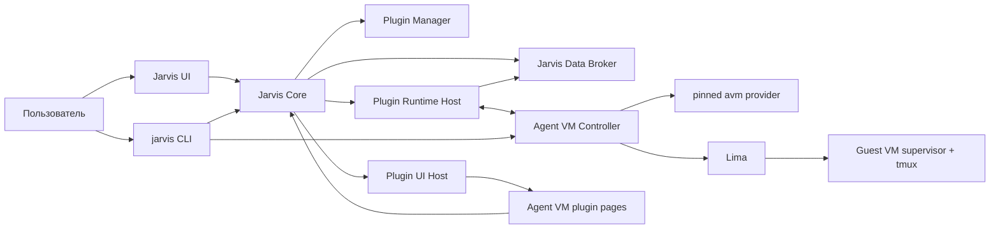
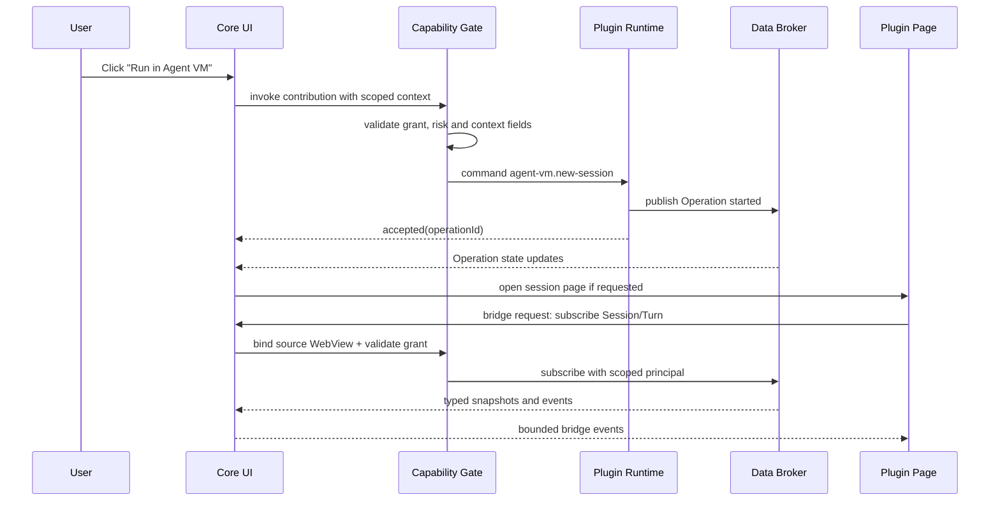

# Jarvis Plugin Platform v2 и Agent VM как устанавливаемый runtime-плагин

Дата: 2026-07-31

Статус: дизайн одобрен; независимые UI/API, runtime и security review
инкорпорированы перед implementation planning

Заменяет конфликтующие решения из:

- [`2026-07-03-plugin-system-agent-vm-design.md`](2026-07-03-plugin-system-agent-vm-design.md);
- [`2026-07-28-agent-vm-project-runtime-design.md`](2026-07-28-agent-vm-project-runtime-design.md).

Старые документы остаются историей принятых решений и реализованных швов. Эта
спецификация имеет приоритет в вопросах упаковки плагинов, собственного UI,
extension points, межплагинного обмена, CLI, multi-session и жизненного цикла
Agent VM.

## 1. Решение

Jarvis получает версионированную Plugin Platform v2. Исходники официальных и
принимаемых в основной репозиторий плагинов живут в monorepo:

```text
plugins/
  <plugin-id>/
    README.md
    plugin.json
    src/
    ui/
    schemas/
    tests/
```

Плагин собирается, версионируется и устанавливается независимо от Jarvis. Наличие
исходников в `plugins/<plugin-id>/` не означает, что плагин входит в базовый
Jarvis `.app`. Установка загружает отдельный подписанный package из GitHub
Release этого же репозитория.

Плагин может:

1. объявить одну или несколько полноценных собственных страниц;
2. поставлять свой HTML/CSS/JavaScript UI внутри изолированной plugin surface;
3. регистрировать команды в глобальном поиске;
4. добавлять host-rendered действия в чат, проект, контекстные меню и другие
   разрешённые extension points;
5. предлагать hotkeys, которые пользователь может изменить;
6. публиковать типизированные данные и события;
7. предоставлять типизированные команды другим плагинам;
8. получать данные других плагинов только через Jarvis Broker и явные grants.

Agent VM становится первым полноценным native runtime-плагином на этом
контракте. При миграции нельзя потерять уже реализованные возможности:

- project runtime;
- Claude и Codex;
- чат и результаты;
- terminal attach;
- files/diff/open;
- изображения;
- авторизацию;
- notifications и deep links;
- autostart;
- project memory/config mirror;
- безопасную VM-изоляцию.

Дополнительно Agent VM получает multi-session, standalone CLI, durable
reconciliation, resource budgets, multiple mounts, scoped memory и полноценный
VM Manager.

## 2. Почему это не один implementation increment

Запрос состоит из семи связанных, но независимо проверяемых подсистем:

1. fail-safe host power ownership и shutdown recovery;
2. package manager и Plugin Manifest v2;
3. custom Plugin UI Host и extension points;
4. Jarvis Data Broker;
5. generic Project Runtime API;
6. standalone CLI и durable runtime controller;
7. миграция Agent VM на новые контракты.

Они используют один архитектурный контракт, но не должны внедряться одним
огромным изменением. Каждый следующий слой строится на публичном API
предыдущего. Agent VM остаётся working reference implementation на каждом
миграционном шаге.

## 3. Архитектурные принципы

### 3.1 Monorepo source, independent distribution

Исходники плагина находятся рядом с Jarvis, чтобы:

- менять core contract и официальный плагин атомарно;
- переиспользовать fixtures, schemas и test host;
- проводить единый code review;
- не размножать репозитории и release automation.

При этом package и runtime независимы:

- отдельная версия;
- отдельный release artifact;
- отдельная подпись и checksum;
- отдельный install/update/rollback/uninstall;
- собственный persistent data directory;
- отсутствие в базовой установке Jarvis.

### 3.2 Custom pages, controlled core integration

Плагин свободно рисует собственные страницы, но не получает прямой доступ к DOM
core-экранов Jarvis.

Есть две разные UI-модели:

1. **Plugin pages** — собственный UI плагина в изолированной web surface.
2. **Core contributions** — декларативные кнопки, команды и menu actions,
   которые рисует Jarvis и которые вызывают команды плагина.

Это сохраняет свободу плагина и одновременно не позволяет сломать чат, проекты,
навигацию или глобальные hotkeys.

### 3.3 Jarvis is the only plugin-to-plugin broker

Плагины не импортируют код друг друга, не читают чужие directories и не
соединяются по приватным sockets.

Весь обмен идёт через три versioned plane:

- entities — актуальное durable состояние;
- events — последовательность изменений;
- commands — типизированные действия/RPC.

Это обязательный supported contract и enforceable security boundary для
sandboxed UI. Verified native code технически может обойти его с правами
macOS-пользователя, поэтому устанавливается как exact-digest trusted code.

### 3.4 Agents stay inside the VM

Нативный Agent VM adapter является доверенным управляющим кодом, но Claude,
Codex и исполняемые ими команды не переходят на host. Доступ агента к host
ограничен отдельно выданными mounts, memory snapshots и brokered credentials.

### 3.5 One source of truth per responsibility

| Ответственность | Источник истины |
|---|---|
| Установленная версия плагина | Plugin install receipt |
| Plugin package integrity | Подписанный catalog + package digest |
| Project identity | Core Project Catalog |
| Desired runtime/session state | Agent VM Controller DB |
| Реальное существование VM | Lima |
| Материализация VM | pinned `avm` Record |
| Живая agent-сессия | guest supervisor/tmux/PID |
| История turns/events | durable journal |
| Межплагинный snapshot | Jarvis Data Broker |
| Доставка уведомления | Notification Receipt |

## 4. Контекст и контейнеры



| Компонент | Ответственность |
|---|---|
| Plugin Manager | catalog, install, update, rollback, disable, uninstall |
| Plugin Runtime Host | activation, handshake, heartbeat, graceful shutdown, capabilities |
| Plugin UI Host | isolated pages, bridge, navigation, theme, contribution routing |
| Data Broker | schemas, entities, events, commands, subscriptions, ACL, audit |
| Project Runtime API | Project/Runtime/Session/Turn model for UI and plugins |
| Jarvis CLI | command discovery and dispatch to core/plugin controllers |
| Agent VM Controller | single writer, VM/session lifecycle, reconciliation, CLI attach |
| Agent VM UI | VM Manager, project runtime, session detail, settings |

## 5. Repository layout

Целевая структура:

```text
plugins/
  agent-vm/
    README.md
    plugin.json
    plugin.lock.json
    Cargo.toml
    src/
    ui/
      pages/
        manager/
        project-runtime/
        session/
        settings/
      shared/
    schemas/
      runtime.schema.json
      session.schema.json
      events.schema.json
    tests/
      contract/
      fixtures/
      live/
  examples/
    hello-page/
    project-action/
    data-consumer/

crates/
  jarvis-plugin-protocol/
  jarvis-plugin-sdk/
  jarvis-plugin-test-host/

ui/
  plugin-host/
  plugin-ui-sdk/

docs/
  plugins/
    getting-started.md
    manifest.md
    ui.md
    data-contracts.md
    security.md
```

Agent VM может зависеть только от опубликованных workspace crates,
предназначенных для Plugin SDK. Internal path dependencies вроде прямого
доступа к Jarvis Secret Store запрещены; credentials выдаёт broker.

Plugin ID `agent-vm` сохраняется как canonical ID первой миграции, чтобы не
сломать существующие settings, tokens, entity ownership и project profiles.
Новые community IDs обязаны быть namespaced (`<publisher>.<name>`). Reserved
first-party short IDs выдаёт только owner catalog.

## 6. Версионирование и distribution

### 6.1 Отдельные версии в одном репозитории

Jarvis и каждый плагин имеют независимый SemVer:

```text
Jarvis:                  0.4.0
Agent VM plugin:         1.0.0
Plugin API:              2
Agent VM state schema:   1
Upstream avm provider:   v0.2
```

Рекомендуемый Git tag:

```text
plugin/agent-vm/v1.0.0
```

GitHub Release содержит platform-specific packages:

```text
agent-vm_1.0.0_darwin_arm64.jarvis-plugin
agent-vm_1.0.0_darwin_amd64.jarvis-plugin
checksums.txt
plugin-release.json
plugin-release.minisig
```

### 6.2 Catalog

Jarvis получает подписанный catalog, а не исполняет содержимое raw `main`.
Catalog содержит:

- plugin ID;
- publisher identity;
- latest stable version;
- supported Jarvis range;
- artifact URLs и digests;
- permission summary;
- release channel;
- revoked versions.

Catalog envelope содержит root key IDs, monotonically increasing sequence,
issued/expires timestamps и previous digest. Trusted roots поставляются с
Jarvis; rotation требует threshold signatures старых и новых roots. Expired,
replayed/frozen или conflicting catalogs fail-closed для install/update.
Revocation запрещает activation и rollback соответствующего digest.

### 6.3 Publisher tiers

| Tier | Источник | Возможности |
|---|---|---|
| Owner | Подпись владельца Jarvis | Может запросить verified native runtime |
| Reviewed | Принятый в catalog publisher | Sandboxed UI; native только после отдельного review |
| Local developer | `jarvis plugin link` | Работает только при включённом Developer Mode |
| Unverified package | Внешний файл/URL | Только Developer Mode и exact-digest consent |

Trust определяется подписью publisher, а не hardcode по plugin ID.
Verified native code остаётся полным trusted code с правами текущего macOS
пользователя. Capability grants ограничивают только официальный Jarvis API и не
являются OS sandbox для native process. Для WASM runtime в v2 security
гарантии не заявляются: он появится только вместе с отдельным WASI capability
contract.

### 6.4 Install directories

```text
~/.jarvis/plugins/<id>/versions/<version>/   immutable package
~/.jarvis/plugins/<id>/current               atomic active pointer/receipt
~/.jarvis/plugin-data/<id>/                  persistent plugin data
~/.jarvis/plugin-cache/<id>/                 recoverable downloads/cache
~/.jarvis/plugin-runtime/<id>/               sockets, locks, ephemeral state
```

Update заменяет package, но не data. Uninstall по умолчанию сохраняет data.
`purge data` является отдельной destructive operation.

При disable/uninstall всегда удаляются ephemeral handles, sockets, tokens,
service registrations и runtime leases. Persistent data становится
недоступным исполняемому коду, а Plugin Manager показывает размер, retention и
sensitivity. Reinstall может унаследовать его только при совпадении plugin ID и
publisher key lineage; другой publisher key требует отдельного import consent.

### 6.5 Agent VM provider lock

`plugins/agent-vm/plugin.lock.json` фиксирует:

- upstream repository;
- tag;
- commit;
- platform asset URL;
- SHA-256;
- upstream license;
- supported Record schema;
- compatibility tests.

`avm` загружается из официального GitHub Release в versioned plugin directory и
не устанавливается глобально. Значение `avm --version` не используется как
единственный источник версии.

### 6.6 Package, verification and receipt

`.jarvis-plugin` — deterministic archive со следующим корнем:

```text
plugin.json
package.json
SIGNATURE
SBOM.spdx.json
bin/<target>/...
ui/...
schemas/...
migrations/...
licenses/...
```

`package.json` фиксирует concrete target triple, минимальную macOS, state schema
и migration graph, а также exact file list, mode, size и SHA-256 всех archive
entries, кроме самого `package.json` и detached `SIGNATURE`. В packaged
`plugin.json` нет `${target}`: pack заменяет source-template на concrete entry
и затем валидирует итоговый manifest.

Packing сортирует UTF-8 paths, нормализует timestamps/mode и строит canonical
`package.json`. `SIGNATURE` подписывает domain-separated exact canonical bytes
`package.json`; тем самым покрываются `plugin.json`, SBOM, schemas, binaries и
payload Merkle root без циклического self-hash. Catalog release record отдельно
фиксирует SHA-256 всего final archive.
Archive parser запрещает absolute paths, `..`, symlinks, hardlinks, duplicate
normalized names, special files и превышение unpack quotas.

Verification order:

1. проверить freshness и подпись catalog root;
2. проверить publisher chain, rotation/revocation и release binding;
3. скачать во временный quarantine;
4. проверить size, package digest и canonical signature до extraction;
5. распаковать безопасно и перепроверить каждый file digest;
6. провалидировать manifest/schema/compatibility/permission diff;
7. показать permission diff и per-digest native trust consent;
8. выполнить host-interpreted declarative migrations на копии state;
9. после consent выполнить bounded health-check exact unpacked digest;
10. атомарно записать install receipt и переключить `current`.

До шага 7 native code не исполняется. Pre-activation migrations являются
declarative JSON/SQL subset, который host выполняет без extensions, `ATTACH`,
filesystem callbacks или network на temporary copy. Native migration возможна
только после exact-digest consent и до active-pointer switch, в quarantine с
backup/timeout. UI-only health-check проверяет только assets/schemas.

Receipt содержит plugin ID, version, package digest, publisher key ID/lineage,
target, granted permissions, installedAt, previous receipt и schema versions.
Rollback атомарно возвращает previous package и только backward-compatible
state snapshot. Если migration необратима, update до активации создаёт backup и
явно помечает невозможность rollback.

Миграция текущего bundled Agent VM сначала импортирует settings, project
profiles, provider receipts и data directories, затем создаёт installed receipt.
Automatic bundled-copy выключается только после успешного import; VM disk и
guest state не удаляются.

### 6.7 Developer Mode

`Settings → Plugins → Developer Mode` выключен по умолчанию и всегда показывает
постоянный warning/badge. CLI:

```text
jarvis plugin link PATH
jarvis plugin unlink ID
jarvis plugin list --dev
jarvis plugin reload ID
jarvis plugin logs ID
jarvis plugin validate PATH
jarvis plugin pack PATH
```

Link принимает built package root, вычисляет canonical path/inode/digest, затем
создаёт immutable digest-addressed staged snapshot и receipt с publisher
identity. Runtime и UI assets всегда исполняются/serve-ятся из snapshot, а не
из mutable source directory. Изменение source блокирует reload до explicit
`jarvis plugin reload`, полной revalidation и нового native consent.
Developer Mode обходит catalog/signature только; schema validation, isolation,
grants, quotas и audit остаются обязательны.

Unverified native code требует отдельного consent на exact digest/version, не
получает unattended `onStartup` или persistent service, и требует нового
consent после restart либо content change. Выключение Developer Mode закрывает
страницы, отменяет in-flight calls, отзывает grants, unregisters services и
останавливает linked runtimes, но сохраняет disclosed persistent data.

### 6.8 Plugin Manager product workflow

Public CLI/API:

```text
jarvis plugin catalog [search]
jarvis plugin info ID
jarvis plugin install ID[@VERSION] | FILE
jarvis plugin update [ID]
jarvis plugin rollback ID [--to VERSION]
jarvis plugin enable ID
jarvis plugin disable ID
jarvis plugin uninstall ID
jarvis plugin purge ID --confirm ID
jarvis plugin doctor [ID]
```

`Settings → Plugins` имеет Catalog, Installed, Updates и Developer sections.
Details показывают publisher/native trust, versions, compatibility,
permissions/data retention, release notes, processes/health и actions.
Install/update показывают permission diff; irreversible migration отдельно
предупреждает об отсутствии rollback. Все CLI/UI операции возвращают один
durable Operation и используют тот же package-manager API. Recovery CTA
Enable/Install/Repair вызывает этот API.

## 7. Plugin Manifest v2

Manifest является декларативным контрактом package. Ниже canonical,
schema-valid Agent VM manifest; последующие короткие JSON-фрагменты лишь
иллюстрируют его отдельные поля:

```json
{
  "schemaVersion": 2,
  "id": "agent-vm",
  "name": "Agent VM",
  "version": "1.0.0",
  "publisher": "jarvis-owner",
  "compatibility": {
    "jarvis": ">=0.4.0 <0.5.0",
    "pluginApi": 2
  },
  "runtime": {
    "kind": "verified-native",
    "lifecycle": "service-bridge",
    "bridgeEntry": "bin/darwin-arm64/agent-vm-plugin-bridge",
    "service": {
      "id": "agent-vm-controller",
      "manager": "launchd-user",
      "entry": "bin/darwin-arm64/agent-vm-controller",
      "survivesCoreExit": true
    },
    "protocol": 2,
    "activationEvents": [
      "onPage:manager",
      "onPage:project-runtime",
      "onPage:session",
      "onCommand:agent-vm.new-session",
      "onProjectRuntime:agent-vm.runtime"
    ]
  },
  "permissions": [
    {"id": "projects.read", "scope": "selected"},
    {"id": "filesystem.mount", "scope": "selected", "modes": ["read", "write"]},
    {"id": "memory.read", "scope": ["global", "selected-project"]},
    {"id": "memory.propose-write", "scope": ["global", "selected-project"]},
    {"id": "notifications.publish"},
    {"id": "credentials.request", "scope": ["claude", "codex"]},
    {"id": "process.vm-provider"},
    {"id": "chat.compose.contribute"},
    {"id": "chat.composer.text.read", "scope": "invocation"},
    {"id": "projects.contribute"}
  ],
  "state": {
    "schemaVersion": 1,
    "migrations": [],
    "rollbackCompatibleThrough": 1
  },
  "contributes": {
    "pages": [
      {
        "id": "manager",
        "title": "VM Manager",
        "entry": "ui/pages/manager/index.html",
        "placements": ["sidebar", "commandPalette"],
        "instancePolicy": "singleton"
      },
      {
        "id": "project-runtime",
        "title": "Project Runtime",
        "entry": "ui/pages/project-runtime/index.html",
        "placements": ["deepLink"],
        "paramsSchema": "schemas/project-page-params.schema.json",
        "instancePolicy": "per-project"
      },
      {
        "id": "session",
        "title": "Agent Session",
        "entry": "ui/pages/session/index.html",
        "placements": ["deepLink"],
        "paramsSchema": "schemas/session-page-params.schema.json",
        "instancePolicy": "per-session"
      },
      {
        "id": "settings",
        "title": "Agent VM Settings",
        "entry": "ui/pages/settings/index.html",
        "placements": ["pluginSettings"],
        "instancePolicy": "singleton"
      }
    ],
    "commands": [
      {
        "id": "agent-vm.open-manager",
        "title": "Agent VM: Open VM Manager",
        "risk": "read",
        "placements": ["globalPalette"],
        "handler": {"type": "openPage", "page": "manager"}
      },
      {
        "id": "agent-vm.new-session",
        "title": "Agent VM: New Session",
        "risk": "control",
        "placements": ["globalPalette"],
        "argsSchema": "schemas/new-session.schema.json",
        "resultSchema": "schemas/operation-ref.schema.json",
        "invocationUI": {
          "type": "schemaForm",
          "defaultsFromContext": ["project.id", "chat.id"]
        },
        "handler": {"type": "runtimeCommand", "command": "session.create"}
      },
      {
        "id": "agent-vm.attach",
        "title": "Agent VM: Attach in Terminal",
        "risk": "control",
        "placements": ["globalPalette"],
        "argsSchema": "schemas/attach.schema.json",
        "invocationUI": {
          "type": "schemaForm",
          "defaultsFromContext": ["project.id", "session.id"]
        },
        "handler": {"type": "runtimeCommand", "command": "session.attach"}
      }
    ],
    "actions": [
      {
        "id": "agent-vm.run-in-vm",
        "title": "Run in Agent VM",
        "icon": "server-play",
        "locations": ["chat.composer.actions", "project.actions"],
        "command": "agent-vm.new-session",
        "when": "project.registered && plugin.enabled",
        "context": ["project.id", "chat.id", "composer.text"]
      },
      {
        "id": "agent-vm.attach-session",
        "title": "Attach in Terminal",
        "icon": "terminal",
        "locations": ["project.session.context"],
        "command": "agent-vm.attach",
        "when": "session.state in ['ready','working','waiting']",
        "context": ["project.id", "runtime.id", "session.id"]
      }
    ],
    "hotkeys": [
      {
        "command": "agent-vm.open-manager",
        "default": "Cmd+Shift+V",
        "scope": "global"
      }
    ],
    "settings": [
      {
        "id": "agent-vm.idle-timeout-minutes",
        "title": "Idle stop timeout",
        "type": "integer",
        "default": 30,
        "minimum": 0,
        "maximum": 1440
      },
      {
        "id": "agent-vm.max-running-vms",
        "title": "Maximum running VMs",
        "type": "integer",
        "default": 3,
        "minimum": 1,
        "maximum": 20
      }
    ],
    "projectRuntimes": [
      {
        "id": "agent-vm.runtime",
        "title": "Agent VM",
        "projectKinds": ["local-folder"],
        "page": "project-runtime",
        "providerSchema": "dev.jarvis.core/project-runtime-provider@1.0.0",
        "lifecycleCommands": {
          "provision": "dev.jarvis.agent-vm/runtime.provision@1.0.0",
          "start": "dev.jarvis.agent-vm/runtime.start@1.0.0",
          "stop": "dev.jarvis.agent-vm/runtime.stop@1.0.0",
          "destroy": "dev.jarvis.agent-vm/runtime.destroy@1.0.0",
          "sessionCreate": "dev.jarvis.agent-vm/session.create@1.0.0",
          "sessionStop": "dev.jarvis.agent-vm/session.stop@1.0.0"
        },
        "contracts": {
          "runtime": {
            "core": "dev.jarvis.core/runtime@1.0.0",
            "extension": "dev.jarvis.agent-vm/runtime@1.0.0"
          },
          "session": {
            "core": "dev.jarvis.core/session@1.0.0",
            "extension": "dev.jarvis.agent-vm/session@1.0.0"
          },
          "turn": {
            "core": "dev.jarvis.core/turn@1.0.0",
            "extension": "dev.jarvis.agent-vm/turn@1.0.0"
          }
        }
      }
    ],
    "dataContracts": [
      {
        "id": "dev.jarvis.agent-vm/runtime@1.0.0",
        "kind": "entity",
        "schema": "schemas/runtime.schema.json",
        "visibility": "granted",
        "sensitivity": "internal"
      },
      {
        "id": "dev.jarvis.agent-vm/session@1.0.0",
        "kind": "entity",
        "schema": "schemas/session.schema.json",
        "visibility": "granted",
        "sensitivity": "internal"
      },
      {
        "id": "dev.jarvis.agent-vm/turn@1.0.0",
        "kind": "entity",
        "schema": "schemas/turn.schema.json",
        "visibility": "granted",
        "sensitivity": "internal"
      },
      {
        "id": "dev.jarvis.agent-vm/runtime.provision@1.0.0",
        "kind": "command",
        "argsSchema": "schemas/runtime-provision.schema.json",
        "resultSchema": "schemas/operation-ref.schema.json",
        "risk": "control"
      },
      {
        "id": "dev.jarvis.agent-vm/runtime.start@1.0.0",
        "kind": "command",
        "argsSchema": "schemas/runtime-ref.schema.json",
        "resultSchema": "schemas/operation-ref.schema.json",
        "risk": "control"
      },
      {
        "id": "dev.jarvis.agent-vm/runtime.stop@1.0.0",
        "kind": "command",
        "argsSchema": "schemas/runtime-stop.schema.json",
        "resultSchema": "schemas/operation-ref.schema.json",
        "risk": "control"
      },
      {
        "id": "dev.jarvis.agent-vm/runtime.destroy@1.0.0",
        "kind": "command",
        "argsSchema": "schemas/runtime-destroy.schema.json",
        "resultSchema": "schemas/operation-ref.schema.json",
        "risk": "destructive"
      },
      {
        "id": "dev.jarvis.agent-vm/session.create@1.0.0",
        "kind": "command",
        "argsSchema": "schemas/new-session.schema.json",
        "resultSchema": "schemas/operation-ref.schema.json",
        "risk": "control"
      },
      {
        "id": "dev.jarvis.agent-vm/session.stop@1.0.0",
        "kind": "command",
        "argsSchema": "schemas/session-stop.schema.json",
        "resultSchema": "schemas/operation-ref.schema.json",
        "risk": "control"
      }
    ]
  }
}
```

Manifest проходит JSON Schema validation. Неизвестные security-sensitive поля
отклоняются, а не игнорируются. Корневая и вложенные schemas используют
`additionalProperties: false`; remote `$ref` запрещён, а depth, regex, size и
validation time ограничены. Contract ID всегда содержит полный SemVer; ranges
используются только consumer-ом при resolution. Version, ranges и IDs
валидируются строго.

### 7.1 Public SDK boundary

Публично версионируются независимо:

```text
Plugin Manifest schema
Plugin process protocol
Rust runtime SDK
Plugin UI Bridge + TypeScript SDK
Data Contract schemas
Project Runtime schemas
```

`jarvis-plugin-sdk` даёт lifecycle/command/Operation/Broker/storage/
credential clients; прямые imports из Jarvis Core запрещены. Schema codegen
создаёт Rust и TypeScript DTO, compatibility fixtures и test host. Одна
toolchain реализует `validate`, deterministic `pack`, mocked host и contract
tests. Agent VM является reference plugin и обязан собираться только через эту
публичную границу.

## 8. Plugin-owned UI

### 8.1 Pages

Плагин может объявлять любое количество страниц:

```json
{
  "pages": [
    {
      "id": "manager",
      "title": "VM Manager",
      "entry": "ui/pages/manager/index.html",
      "placements": ["sidebar", "commandPalette"],
      "icon": "server"
    },
    {
      "id": "session",
      "title": "Agent Session",
      "entry": "ui/pages/session/index.html",
      "placements": ["deepLink"]
    },
    {
      "id": "settings",
      "title": "Agent VM Settings",
      "entry": "ui/pages/settings/index.html",
      "placements": ["pluginSettings"]
    }
  ]
}
```

Host route:

```text
plugin/<plugin-id>/<page-id>?context=<host-issued-context-ref>
jarvis://plugins/<plugin-id>/pages/<page-id>
```

Плагин может навигировать только на собственные declared pages либо попросить
Jarvis открыть разрешённый core deep link.

Page parameters валидируются `paramsSchema`; context создаёт host, а не query
string плагина. `instancePolicy` определяет singleton/per-project/per-session.
Host владеет history/back/focus/reload и восстанавливает только schema-valid
route. Deep link на disabled/uninstalled/incompatible/crashed plugin открывает
host-rendered recovery page с Enable/Install/Repair, а не пустой WebView.

### 8.2 Isolation

Plugin page загружается в dedicated child WebView с отдельного origin:

```text
jarvis-plugin://<package-instance-id>/<asset-path>
```

`package-instance-id` является opaque authority, однозначно привязанной к
plugin ID, version и полному verified package digest. Две версии или два
digest никогда не делят origin/storage.

Требования:

- отдельный child WebView, а не main Jarvis webview;
- host-injected strict CSP без plugin override;
- нет `window.__TAURI__`;
- нет доступа к parent DOM;
- нет прямого filesystem/process/socket API;
- network запрещён по умолчанию;
- bridge принимает только versioned typed messages;
- identity выводится из source WebView + verified package instance, а не только
  из bearer token;
- page instance связан с plugin ID, page ID, params и navigation generation;
- package assets canonicalized, read-only, MIME allowlisted и `nosniff`;
- external navigation, popups, downloads, service workers, media/device APIs,
  file pickers, clipboard и drag/drop denied до отдельной host capability;
- message count/size/rate и outstanding calls ограничены;
- cache/storage/service workers очищаются при uninstall/digest change.

Iframe не является fallback по умолчанию. Он может быть принят только если
проходит тот же isolation suite на каждой поддерживаемой платформе.

Verified first-party UI использует тот же bridge. Подпись не является причиной
давать странице доступ к main DOM.

При update/rollback/disable host инвалидирует navigation generation, закрывает
старые page instances, отменяет in-flight requests/subscriptions/handles и
предлагает безопасный reload. UI старой версии не продолжает работать с runtime
новой версии.

### 8.3 Plugin UI Bridge v1

До доступа к API child WebView и host выполняют handshake:

```json
{
  "type": "hello",
  "supportedProtocols": [1],
  "sdkVersion": "1.0.0"
}
```

Host отвечает `welcome` с выбранным protocol, page instance ID, navigation
generation, resolved plugin/package identity, granted namespaces, theme и
bounded initial context. Эти identity-поля информационные для страницы:
authorization всегда использует server-side binding source WebView.

Request envelope:

```json
{
  "v": 1,
  "type": "request",
  "id": "request/opaque",
  "generation": 7,
  "namespace": "broker",
  "method": "entities.watch",
  "params": {},
  "deadlineMs": 10000
}
```

Namespaces v1: `commands`, `broker`, `storage`, `settings`, `navigation`,
`dialogs`, `notifications`, `theme` и `telemetry`. Response содержит `ok/result` либо
stable redacted error `{code,message,retryable,detailsRef}`. Subscriptions
возвращают subscription ID и cursor; event envelope содержит monotonic seq.
Определены `cancel`, `unsubscribe`, deadline, backpressure, gap/resync и
page-close semantics.

Default limits: 1 MiB message, 64 in-flight calls, 32 subscriptions и host
rate quota; manifest может запросить только меньший лимит. Binary/large data
идут через scoped resource handle, не base64 в bridge.

Все Broker-вызовы страницы проходят `child WebView → host bridge → Capability
Gate → Broker`. Прямого Plugin Page → Broker socket/channel нет. На каждом
request/watch host повторно проверяет current generation, exact installed
digest, permission и subject scope.

### 8.4 UI SDK

`@jarvis/plugin-ui` предоставляет:

- CSS design tokens;
- theme и reduced-motion signals;
- Button, Input, Select, Tabs, Table, EmptyState, StatusBadge;
- page chrome helpers;
- command invocation;
- entity/event subscriptions;
- typed context;
- navigation и dialogs;
- accessibility primitives.

Использование SDK рекомендуется, но плагин может иметь полностью свой UI внутри
своей surface. Jarvis контролирует только outer chrome, sandbox и bridge. SDK
поставляется локально вместе с Plugin API, имеет generated TypeScript types,
protocol compatibility matrix, mock/test host и примеры; plugin package не
загружает SDK с CDN.

### 8.5 No arbitrary markup in core surfaces

Плагин не вставляет HTML в chat toolbar, project card или context menu.
Он объявляет contribution, Jarvis рисует кнопку своим компонентом и вызывает
typed plugin command.

Так core UI остаётся согласованным, а собственные страницы плагина остаются
свободными.

## 9. Extension points

### 9.1 Commands and global search

Каждая команда плагина появляется в command palette:

```json
{
  "commands": [
    {
      "id": "agent-vm.open-manager",
      "title": "Agent VM: Open VM Manager",
      "keywords": ["vm", "claude", "codex"],
      "risk": "read",
      "handler": {"type": "openPage", "page": "manager"}
    },
    {
      "id": "agent-vm.new-session",
      "title": "Agent VM: New Session",
      "risk": "control",
      "argsSchema": "schemas/new-session.schema.json",
      "invocationUI": {
        "type": "schemaForm",
        "defaultsFromContext": ["project.id"]
      }
    }
  ]
}
```

Команды доступны даже если плагин не закреплён в sidebar.
Command/action IDs namespaced plugin ID; duplicate registration отклоняется.
Порядок contributions детерминирован host-правилами и пользовательскими
настройками, а не временем активации процессов.

Command с required args обязан объявить `invocationUI`: host-rendered
`schemaForm` с allowlisted context defaults либо declared plugin page с typed
params. Без него manifest отклоняется. Global palette никогда не угадывает args
из произвольного active UI. Plugin chat slash palette не входит в initial v2;
для чата используется `chat.composer.actions`.

Host вычисляет минимальный risk из фактических capabilities/handler;
plugin-declared risk может только повысить его.

### 9.2 Host-rendered actions

Начальный набор stable locations:

```text
chat.toolbar
chat.message.context
chat.composer.actions
project.header
project.actions
project.session.context
project.file.context
global.sidebar
global.status
settings.plugin
```

| Location | Available identity context | Дополнительная capability | Cardinality |
|---|---|---|---|
| `chat.toolbar` | chat ID, optional project ID | `chat.contribute` | 3 visible |
| `chat.message.context` | chat/message IDs | `chat.message.contribute` | menu |
| `chat.composer.actions` | chat/project IDs, text handle | `chat.compose.contribute` | 3 visible |
| `project.header` | project/runtime summary | `projects.contribute` | 2 visible |
| `project.actions` | project ID | `projects.contribute` | menu |
| `project.session.context` | project/runtime/session IDs | `projects.contribute` | menu |
| `project.file.context` | project ID, file handle | `projects.files.contribute` | menu |
| `global.sidebar` | none | `navigation.contribute` | user-pinned |
| `global.status` | bounded status DTO | `status.contribute` | 2 visible |
| `settings.plugin` | plugin ID | none | own plugin only |

Overflow всегда host-rendered. Contributions задают optional `group`, `order`
и `priority`, но final order стабилен: user override → host group → priority →
plugin ID → action ID. Hidden/disabled различаются; disabled item обязан иметь
host-safe reason. Context snapshot имеет TTL и перепроверяется в момент command.

Пример:

```json
{
  "actions": [
    {
      "id": "agent-vm.run-in-vm",
      "title": "Run in Agent VM",
      "icon": "server-play",
      "locations": ["chat.composer.actions", "project.actions"],
      "command": "agent-vm.new-session",
      "when": "project.registered && plugin.enabled",
      "context": ["project.id", "chat.id", "composer.text"]
    }
  ]
}
```

`when` использует небольшой allowlisted expression language без eval:
boolean literals, `&&`, `||`, `!`, `==`, `!=`, `in`, parentheses и доступ
только к документированным scalar context keys. Нет функций, regex, property
enumeration, coercion или plugin data lookup. `when` влияет лишь на
visibility/enabled state и никогда не является authorization.

Control/destructive action получает host confirmation по вычисленному risk.
Command result — `completed(result)` либо `accepted(operationId)`; contribution
не может самостоятельно закрыть host dialog или объявить success до terminal
Operation state.

### 9.3 Context minimization

Плагин получает только поля, перечисленные contribution и разрешённые grant:

```json
{
  "schemaVersion": 1,
  "surface": "chat.composer.actions",
  "invocationId": "opaque-id",
  "project": {"id": "project-id"},
  "chat": {"id": "chat-id"},
  "composer": {"textHandle": "opaque-resource-handle"}
}
```

Большой или чувствительный контент передаётся opaque handle. Плагин отдельно
запрашивает чтение через capability gate. Raw host path не передаётся без
`projects.path.read`.

### 9.4 Hotkeys

Плагин объявляет предлагаемую комбинацию:

```json
{
  "hotkeys": [
    {
      "command": "agent-vm.open-manager",
      "default": "Cmd+Shift+V",
      "scope": "global"
    }
  ]
}
```

Jarvis:

- проверяет конфликт;
- показывает владельца комбинации;
- позволяет изменить или отключить;
- не разрешает плагину самостоятельно регистрировать global shortcut;
- динамически применяет Settings override и снимает shortcut при
  disable/update/uninstall;
- никогда не активирует destructive command без обычного confirmation.

### 9.5 Pinning and navigation

Пользователь может:

- закрепить plugin page в sidebar;
- оставить её доступной только через поиск;
- открыть page из action/deep link/notification;
- скрыть отдельные contributions без отключения всего плагина.

## 10. Plugin UI invocation flow



Acceptance не означает completion. UI показывает durable Operation и получает
финальный state через Broker.

## 11. Jarvis Data Broker

### 11.1 Contract registry

Каждый shared contract имеет:

- namespaced ID;
- SemVer;
- JSON Schema;
- publisher plugin;
- sensitivity classification;
- visibility;
- retention;
- compatible consumer ranges.

Пример:

```text
dev.jarvis.agent-vm/runtime@1.0.0
dev.jarvis.agent-vm/session@1.0.0
dev.jarvis.agent-vm/session-event@1.0.0
```

Namespace binding `(publisher key lineage, plugin ID, contract ID, version,
schema digest)` записывается при install; опубликованная версия immutable и не
может быть переопределена другим signer. Caller/owner identity всегда выводится
host из authenticated process/page channel. Любые identity-поля из plugin
payload игнорируются.

### 11.2 Entities

Entities представляют актуальное durable состояние:

```json
{
  "contract": "dev.jarvis.agent-vm/session@1.0.0",
  "id": "session/01...",
  "owner": "agent-vm",
  "revision": 42,
  "state": "working",
  "data": {},
  "updatedAt": 1785440000000
}
```

Требования:

- durable storage;
- optimistic revision;
- owner-only writes;
- schema validation;
- bounded payload;
- snapshot query;
- watch from revision/cursor;
- stale/degraded marker after provider loss.

### 11.3 Events

Events описывают изменения:

```json
{
  "contract": "dev.jarvis.agent-vm/session-event@1.0.0",
  "eventId": "opaque",
  "seq": 123,
  "subject": "session/01...",
  "kind": "turn.completed",
  "correlationId": "operation/01...",
  "data": {},
  "at": 1785440000000
}
```

Гарантии:

- monotonic sequence per stream;
- at-least-once delivery;
- durable cursor для важных streams;
- explicit gap event при потере retention window;
- resync через Entity snapshot;
- backpressure и payload quotas.

### 11.4 Commands/services

Плагин может предоставить typed command:

```json
{
  "id": "dev.jarvis.agent-vm/session.create@1.0.0",
  "argsSchema": "schemas/new-session.schema.json",
  "resultSchema": "schemas/operation-ref.schema.json",
  "risk": "control",
  "idempotent": true
}
```

Consumer вызывает contract через Jarvis. Broker:

1. находит совместимого provider;
2. проверяет consumer grant;
3. валидирует args;
4. при необходимости показывает confirmation;
5. добавляет caller identity и correlation ID;
6. валидирует result;
7. пишет audit entry.

### 11.5 Inter-plugin permissions

Manifest consumer:

```json
{
  "consumes": [
    {
      "contract": "dev.jarvis.agent-vm/session@1.0.0",
      "range": "^1.0.0",
      "operations": ["query", "watch"],
      "selectors": {
        "projects": "user-selected",
        "subjects": ["runtime", "session"],
        "fields": ["id", "state", "updatedAt"]
      },
      "purpose": "Show VM state in project dashboard",
      "retention": "none",
      "expires": "session"
    }
  ]
}
```

Manifest request является только ceiling. Фактический grant связывает consumer
exact digest, provider/signer, resolved contract+schema digest, operations,
project/session/subject selectors, field projection, purpose, retention и
expiry. Установка показывает эти scopes; пользователь может сузить их.

Grant можно отозвать без uninstall. Revocation атомарно закрывает watches,
инвалидирует cursors/handles, отменяет queued work и заставляет in-flight
request повторно проверить ACL перед выдачей результата. Старый cursor нельзя
использовать для чтения после revoke.

### 11.6 Sensitive resources

Files, chat text, project paths и credentials не кладутся в shared entity
payload как raw values. Используются opaque resource handles:

- bound to exact plugin digest and authenticated page/process instance;
- bound to invocation, resource/subject, operation and snapshot generation;
- time-limited;
- read-count/size limited;
- non-replayable outside declared method;
- revocable;
- audited.

Handle никогда не хранится в durable entity/event/audit payload. Он
инвалидируется при page navigation, update, disable, revoke и terminal
Operation state; ACL и underlying file identity перепроверяются на каждом read.
Secret values никогда не становятся межплагинными data contracts.

### 11.7 Durable broker and private plugin storage

Broker хранит schemas, entities, cursors, grants и audit metadata в private
versioned SQLite store с WAL, migrations и integrity check. Повреждение payload
одного owner quarantine-ится и не блокирует остальных.

Private состояние плагина не публикуется автоматически. Для него существует
scoped storage API:

```text
storage.get/set/delete/list
```

Storage namespace всегда равен caller plugin ID, имеет quota и переживает
update/rollback. Plugin page local storage не является durable source of truth:
origin включает version+digest и очищается.

Broker SQLite является projection source для межплагинного состояния, но не
заменяет domain DB владельца runtime. Owner пишет Broker projection через
transactional outbox; duplicate outbox delivery идемпотентна.

### 11.8 Credential leases

Credential Broker не выдаёт auth store как mount или shared data. Lease
привязан к:

```text
exact plugin digest + runtimeId + vmId + sessionId + backend + purpose
```

Lease требует consent, содержит minimum fields, TTL/refresh policy и revoke
generation. Материализация внутри guest идёт в guest-private path вне project и
memory mounts с минимальными permissions. Secrets запрещены в args, logs,
journals, backups, VM snapshots и sync-back.

Каждая managed Session запускается под отдельным guest OS principal с private
HOME; другие Sessions и отдельный unmanaged-shell user не имеют доступа.
Supervisor передаёт short-lived material после admission и не раскрывает его в
tmux environment. Если backend требует долгоживущий refresh token/file и не
умеет brokered refresh, TTL/revoke требует termination Session и verified
scrub её HOME — логическая revoke без этого не считается завершённой.

Disable/revoke закрывает refresh, переводит controller в teardown-only mode,
останавливает affected Sessions и scrub-ит Jarvis-provisioned material.
Успешный uninstall невозможен, пока scrub не подтверждён; если VM недоступна,
operation остаётся `blocked_cleanup` и предлагает reconnect+scrub либо
отдельное подтверждённое уничтожение VM disk. Сохранение VM disk/data никогда
не включает provisioned credentials.

### 11.9 Typed plugin settings

`contributes.settings` регистрирует host-owned typed schema. Canonical values
живут в Core Settings Store со scopes `user | project`; defaults вычисляются из
manifest и не материализуются до изменения. Public API:

```text
settings.get
settings.set
settings.reset
settings.watch
```

Set проходит type/range/enum validation, permission check и atomic revision.
Change event содержит key/scope/revision, но не secret value. Manifest помечает
`restartRequired` либо `runtimeReload`; controller получает те же changes через
authenticated Core adapter. Host-rendered Settings и custom plugin Settings
page используют один API. Versioned declarative migrations входят в state
graph package; sensitive settings хранят только Credential Broker references.

## 12. Plugin lifecycle

### 12.1 Activation

Поддерживаемые activation events:

```text
onCommand:<id>
onPage:<id>
onProjectRuntime:<id>
onDataContract:<id>
onStartup
manual
```

Обычные плагины активируются лениво. Persistent native runtime требует
отдельного permission, signed publisher и per-version/per-digest native trust
approval. Перед каждым activation host перепроверяет receipt, package digest и
revocation state; stale/revoked receipt fail-closed.

### 12.2 Heartbeat and operations

Plugin Runtime Host отслеживает:

- process PID;
- handshake;
- protocol version;
- heartbeat;
- readiness;
- queue depth;
- current operations;
- last durable cursor;
- retry/backoff.

Accepted command сначала сохраняется как Operation, затем отправляется runtime.
Crash процесса не удаляет принятую команду.

### 12.3 Graceful shutdown

Последовательность:

1. stop accepting new commands;
2. persist cursors/operations;
3. request plugin shutdown;
4. wait for ack with deadline;
5. send TERM;
6. force kill only after deadline.

Plugin shutdown не означает VM stop или data purge.
Для `service-bridge` эта последовательность завершает только UI/Core bridge.
Normal Jarvis exit disconnects bridge и не посылает TERM launchd controller;
service останавливается только explicit disable/uninstall/revoke flow.

### 12.4 Disable, update and uninstall

Disable/revoke/uninstall сначала закрывает admission, затем:

1. инвалидирует pages, external grants, handles и Broker subscriptions;
2. выдаёт exact current controller одноразовую teardown-only lease;
3. controller блокирует new Turns и safe-drain/stop-ит managed Sessions;
4. revoke-ит credential refresh и подтверждает scrub per-session HOME;
5. останавливает VM, чем физически снимает live host mounts;
6. проверяет отсутствие guest processes, mounted host paths и provisioned
   credentials;
7. останавливает controller, unload/removes LaunchAgent, socket и tokens;
8. только затем деактивирует receipt.

VM disk и disclosed persistent plugin data могут остаться, но удалённый или
disabled host controller, live host mount или credential lease не остаётся.
Normal Jarvis app close не является plugin disable: тогда controller/VM/session
может продолжить работу. Disable/uninstall с active sessions возвращает
`busy/pending-disable`, пока user не выберет drain либо explicit force; до
завершения cleanup receipt не считается disabled/uninstalled. Если scrub
невозможен, доступны reconnect+scrub или separate destructive VM-disk cleanup.
Purge отказывается работать, пока live VM/process не остановлены.

Update сначала закрывает admission старой generation, дожидается/отменяет
accepted Operations по policy, checkpoint-ит WAL/outbox и fence-ит старый
writer. Только после этого выполняет backup/migration, запускает новый exact
verified digest на новом socket generation и делает controller handoff. После
readiness старый process завершается. При ошибке восстанавливаются compatible
DB snapshot и previous non-revoked receipt. CLI никогда не resurrect-ит service
из stale, disabled, uninstalled или revoked receipt.

## 13. Project Runtime API

Core model:

```text
Project
  └── Runtime × N
        └── Session × N
              └── Turn × N

Operation
Attachment
MemorySnapshot
NotificationReceipt
```

Core owns provider-neutral schemas
`dev.jarvis.core/{project-runtime-provider,runtime,session,turn}@1.0.0`.
Каждый provider projection обязан валидироваться core schema; специфичные поля
живут только в extension envelope:

```json
{
  "extension": {
    "contract": "dev.jarvis.agent-vm/session@1.0.0",
    "data": {}
  }
}
```

Generic UI читает только core fields и может передать opaque validated
extension plugin page. Provider manifest обязан указать полный lifecycle
command set provision/start/stop/destroy/session-create/session-stop; каждый ID
должен быть зарегистрированным typed Broker command contract.

### 13.1 Project

Project Catalog хранит stable local ID, canonical roots и aliases. UI, CLI и
плагины не вычисляют разные ID из basename.

Migration создаёт alias table:

```text
legacyProjectId | legacyCanonicalPath | projectId | validFrom | reason
```

Текущий FNV/path-derived ID не становится новым canonical ID. Moves, renames и
temporarily unavailable roots сохраняют Project identity; Runtime всегда
ссылается на catalog ID. Existing folders, favorites и `agentVm.projects`
import-ятся idempotently.

### 13.2 Runtime

```text
runtimeId
providerId
projectId
desiredState
observedState
generation
revision
hostBootId
lifecycleLease
providerReceiptId
reason
resourceSummary
lastActivityAt
```

`desiredState`: `stopped | running | destroyed`.
`observedState`: `missing | provisioning | stopped | starting | running |
stopping | error | unmanaged | quarantined`. Уникальность:
`(projectId, providerId, providerInstance)`.

### 13.3 Session

```text
sessionId
runtimeId
backend
mode
transportId
backendSessionId
state
desiredState
revision
guestBootId
tmuxTarget
processStartIdentity
currentTurnId
resumability
createdAt
lastActivityAt
```

`state`: `creating | ready | working | waiting | draining | stopped | failed |
interrupted | quarantined`. Один Session соответствует одной private
guest-supervisor-owned PTY/tmux target и сохраняет backend resume identity.

### 13.4 Turn

```text
turnId
sessionId
operationId
state
seq
idempotencyKey
inputRef
attachmentRefs
memorySnapshotId
errorCode
startedAt
completedAt
resultSummary
```

`state`: `queued | admitted | starting | working | waiting | completed | failed
| cancelled | interrupted | timed_out`. Queue policy v1 — bounded FIFO per
Session с configurable limit; default один active Turn и восемь queued.

Текущий Agent VM `runId` мигрируется в `sessionId` compatibility alias, а
старые deep links продолжают резолвиться через alias. Один Session может
содержать много Turns.

### 13.5 Generic Project UI

Core Project Detail является provider-neutral и всегда показывает:

- project header и registration/path health;
- runtime selector и runtime cards;
- unified sessions list с provider badge;
- `New session` flow с выбором runtime/backend;
- stable status/action slots из manifest;
- files/favorites без runtime-specific rendering;
- link на полноэкранную plugin page.

Card/query читают только Project Runtime projections. Открытие страницы не
создаёт Runtime и не запускает Session. Если provider отсутствует, core
показывает install/enable CTA; если Runtime drifted — Doctor/Repair.

`contributes.projectRuntimes` связывает provider ID, supported project kinds,
create/start/stop/session commands, page route и Runtime/Session/Turn contract
IDs. Core не вызывает Agent VM-specific IPC. Старые folders/favorites,
profile settings, run IDs и routes сначала работают через compatibility
adapter, затем удаляются только после migration telemetry и rollback window.

## 14. Agent VM plugin UI

Agent VM объявляет четыре страницы:

1. **VM Manager** — глобальный inventory и resource monitor.
2. **Project Runtime** — runtime выбранного проекта.
3. **Session Detail** — chat/result/files/terminal attach.
4. **Agent VM Settings** — provider, lifecycle, memory, mounts и budgets.

Core contributions:

- `Run in Agent VM` в project actions;
- runtime selector в new-session flow;
- Agent VM action в chat composer;
- `Attach in Terminal` в session actions;
- status badge в project header;
- commands в global search;
- optional customizable hotkey.

Project остаётся core-сущностью. Agent VM UI использует те же
Project/Runtime/Session data contracts, поэтому отдельная plugin page и core
Project UI не расходятся по состоянию.

Открытие project card не создаёт VM и не запускает агента.

## 15. Agent VM controller

### 15.1 Single writer

Controller — единственный процесс, мутирующий Agent VM state. Jarvis UI, plugin
pages и CLI не вызывают raw `avm` параллельно.

Controller хранит private SQLite DB:

```text
projects
runtimes
sessions
turns
operations
memory_snapshots
mount_grants
notification_receipts
reconcile_runs
outbox
schema_migrations
```

DB использует WAL, foreign keys, integrity check, transactional versioned
migrations и pre-migration backup. Controller держит OS file lock и fencing
generation; stale generation не может commit-ить mutation. Domain transaction
и outbox append атомарны, поэтому UI- и CLI-created Operations восстанавливаются
одинаково.

Persistent process принадлежит `launchd` user service, а не UI Plugin Runtime
Host. Stable launcher читает только active verified receipt и запускает exact
digest. Private socket находится в owner-only `0700` directory, создаётся
`0600` без symlink, проверяет peer UID и выполняет protocol/version/profile/
generation challenge handshake. Jarvis adapter и CLI являются клиентами этого
socket. Controller replay-ит transactional outbox в Core после reconnect.

### 15.2 Guest supervisor and session transport

В каждой существующей или новой VM controller bootstrap-ит pinned,
versioned guest supervisor и tmux без VM recreate. Одна Session соответствует
одной supervisor-owned private tmux target/PTY. Только supervisor создаёт
backend process, принимает Turn, отслеживает waiting/input, terminal state и
backend resume ID.

Structured registry и bounded append-only journal хранятся на guest-private
disk вне project mount:

```text
protocolVersion
guestBootId
sessionId
turnId
seq
eventKind
payload
checksum
writtenAt
```

Append fsync-ится по documented durability policy; controller хранит ingestion
cursor. После outage он проверяет `guestBootId`, продолжает с cursor,
дедуплицирует seq и публикует explicit gap при истёкшем retention. tmux нужен
для PTY/attach, но не является источником structured recovery. Supervisor
protocol имеет compatibility matrix и staged in-guest upgrade.

Interactive attach подключает display/output сразу, но keyboard input проходит
через supervisor admission. Отправка prompt создаёт managed Turn с budget,
memory snapshot и journal. Raw guest shell — отдельная явно unsafe/unmanaged
command, выключенная по умолчанию; она не называется Agent Session и не
получает credential lease автоматически.

### 15.3 Reconciliation

Reconcile выполняется:

- при старте;
- периодически;
- до mutation;
- после mutation;
- после reconnect;
- вручную через UI/CLI.

Сверяются:

```text
desired DB state
↕
pinned avm Record
↕
Lima observed state
↕
guest boot identity, tmux and PIDs
↕
durable event journals
```

Reconcile никогда автоматически не удаляет orphan/unmanaged VM и никогда не
создаёт новую VM без Operation, инициированной пользователем или явным
autostart policy.

Повреждённый Record/journal quarantine-ится отдельно и не блокирует inventory
остальных проектов.

Минимальная drift/repair matrix:

| Desired/DB | Record/Lima/guest | Результат | Допустимый repair |
|---|---|---|---|
| `running` + valid lease | всё совпадает | healthy | none |
| `running` + valid lease | Record есть, Lima stopped | stopped/drifted | explicit/allowed start |
| `stopped` | Lima stopped | healthy | none |
| `stopped` | Lima running | unexpected-running | audited stop или change desired |
| `destroyed` | artifacts отсутствуют | healthy terminal | none |
| `destroyed` | artifacts остались | drifted | explicit cleanup/adopt |
| non-destroyed | Record/Lima отсутствуют | error/missing | reprovision только с consent |
| no runtime | Record/Lima есть | unmanaged | ignore или audited adopt |
| any live | новый guestBootId | sessions interrupted | resume-compatible session only |
| any | journal corrupt/gap | degraded | snapshot/resync, never fabricate |
| any | provider receipt mismatch | blocked | install compatible provider |
| any | external Record mutation | drifted | import diff или restore with consent |

`--repair` выводит planned audited actions до mutation. Implicit
adopt/delete/recreate запрещены.

### 15.4 Resource guards

Configurable policy:

- max managed VM;
- max running VM;
- max provisioning operations;
- total CPU budget;
- total memory budget;
- disk free-space floor;
- per-project lifecycle lease;
- one active turn per session;
- total concurrent turns;
- operation deadlines;
- idle stop policy.

Create/start используют idempotency key. Повторный запрос не создаёт вторую VM.

Budget admission использует атомарную reservation с units/defaults и expiry.
После crash controller reconcile-ит reservations с observed operations. Policy
явно выбирает queue либо reject; изменение settings не останавливает уже
running VM автоматически. CPU/RAM/disk, которые provider не выдаёт
структурированно, помечаются `best-effort/degraded`, а не точными.

### 15.5 Process survival

Agent tmux живёт внутри guest VM. Закрытие Jarvis UI или terminal client не
останавливает session.

Persistent controller запускается как user service и может пережить закрытие
Jarvis. Если controller падает, guest process продолжает работать; после
restart controller восстанавливает состояние по guest registry/tmux/journal.

Controller не является дочерним процессом UI-bound Plugin Runtime Host.
Install регистрирует versioned user-service entrypoint, а update переключает
его только после graceful handoff и backup совместимого state. UI-bound adapter
является клиентом controller.

Controller хранит host boot ID. Restart controller в том же boot может
adopt-ить live VM/process после identity checks. После logout/reboot старые host
PIDs считаются interrupted; `desiredState=running` не запускает все VM заново.
Автоматически стартуют только runtimes с отдельной explicit autostart policy и
действующей lifecycle lease.

### 15.6 Migration from current Agent VM

Idempotent importer покрывает:

- `<jarvis-dir>/agent-vm/lima`, `host-home` и `runs`;
- текущие v0.1 и v0.2 Record fixtures, включая `mounts`;
- JSONL runs и `runId`/deep-link aliases;
- EntityStore projections;
- `agentVm.projects`, folders, favorites и profiles;
- FNV/path Project IDs через alias table;
- current credential precedence без копирования auth в new memory.

Каждый imported Runtime сохраняет evidence фактического provider. Exact v0.2
receipt с commit `e11870c3881716ecfdae3dd32efe1f534cc2d7aa` и asset digest
выдаётся только если provenance проверен. v0.1/глобально найденный или
неопределимый provider получает `legacy/unknown` + Record schema fingerprint и
остаётся blocked for mutation до explicit verified provider migration.
`avm --version=dev` не используется как доказательство версии.

Active legacy run не имеет нового supervisor/journal и не импортируется
прозрачно. Migration ждёт terminal state либо с explicit consent прерывает
legacy process, сохраняет доступный backend resume identity/output и создаёт
новую managed Session; бесшовная история Turn не обещается. Import работает
через dual-read/compare, пишет migration receipt и оставляет rollback window;
исходные directories не удаляются до отдельного verified cleanup.

## 16. Standalone CLI

Canonical namespace:

```text
jarvis agent-vm ...
```

Alias:

```text
jarvis vm ...
```

Commands:

```text
jarvis vm discover [--cwd PATH]
jarvis vm current
jarvis vm list [--sessions] [--json]
jarvis vm start [PROJECT]
jarvis vm use [PROJECT] [--session ID] --print-env
jarvis vm session list [PROJECT]
jarvis vm session new [PROJECT] --agent claude|codex
jarvis vm session inspect --session ID
jarvis vm session send --session ID [--file PATH | --stdin]
jarvis vm session answer --session ID [--file PATH | --stdin]
jarvis vm turn list --session ID
jarvis vm turn cancel --turn ID
jarvis vm attach [PROJECT] [--session ID]
jarvis vm shell PROJECT --unsafe-unmanaged
jarvis vm session stop --session ID [--drain] [--force]
jarvis vm stop [PROJECT] [--drain] [--force]
jarvis vm destroy PROJECT --confirm PROJECT_ID
jarvis vm events --follow
jarvis vm reconcile [PROJECT] [--repair]
jarvis vm doctor [--json]
```

Resolution order:

1. explicit project/session ID;
2. explicit path;
3. `JARVIS_PROJECT_ID` / `JARVIS_SESSION_ID`;
4. nearest registered project root from cwd.

Machine-global “last selected project” не используется.
`jarvis vm use ... --print-env` печатает shell-specific `export`/`unset`
команды; CLI не пытается изменить environment parent shell.

Если attach неоднозначен:

- interactive TTY показывает selector;
- non-interactive mode возвращает список IDs и ошибку;
- `--json` никогда не показывает interactive prompt.

Attach подключает только существующую session и ничего не создаёт.
Он требует TTY, проксирует resize/signals, корректно восстанавливает terminal
mode и возвращает stable detach reason. Input идёт через guest supervisor и
Turn admission; unmanaged shell существует только под отдельным explicit flag.

Текущий GUI binary выполняет early CLI dispatch до Tauri/UI initialization.
App installer создаёт user-owned shim в `~/.local/bin/jarvis`; отдельный GUI
launch остаётся обычным. Global options:

```text
--profile prod|dev|NAME
--jarvis-dir PATH
--json
--wait[=STATE]
--timeout DURATION
```

Mutation по умолчанию печатает Operation ID и завершается после durable
acceptance; `--wait` ждёт terminal state, а `--wait=ready|stopped|...` —
заданный observed state. Stable exit codes различают usage,
not-found, ambiguous, denied, busy, incompatible, core-unavailable, timeout и
internal. `events --follow` читает controller journal/outbox с cursor,
reconnect и JSONL mode, а не transient UI stream.

CLI работает без открытого Jarvis UI: он читает проверенный install receipt,
подключается к private controller socket и при необходимости запускает
зарегистрированный user service. Если Plugin API/core broker недоступен, CLI
разрешает только уже авторизованные controller-local read/lifecycle commands.
Он не создаёт новые mount/memory/credential grants, не mint-ит resource handles
и не меняет cross-plugin state; такие операции возвращают явный
`core_unavailable`. Перед service activation CLI проверяет enabled receipt,
exact digest, profile и controller protocol compatibility.

## 17. Safe lifecycle

Default policy:

- active VM/session продолжает работать после закрытия или crash Jarvis;
- idle VM без активных sessions останавливается после configurable timeout;
- stop сохраняет disk и state;
- destroy выполняется только явно;
- plugin update не делает VM recreate;
- plugin uninstall не удаляет VM/data.

Safe stop:

1. persistently close new-turn admission before any signal;
2. treat `waiting` as active and report `busy` for active sessions;
3. `--drain` persists deadline and requests checkpoint/backend session ID;
4. wait for terminal journal event and flush ingestion cursor;
5. without `--force`, deadline не посылает signal: VM остаётся running,
   Operation становится `timed_out/busy`;
6. только explicit `--force` разрешает после deadline TERM, затем KILL по
   отдельному force timeout;
7. Session после forced signal получает `interrupted`, а resume identity
   сохраняется, если backend его успел выдать;
8. stop VM and report success only after observed Lima state is stopped.

`suspend` добавляется только если provider действительно поддерживает suspend.
Он не маскируется под stop.

### 17.1 Mandatory host power cleanup

VM persistence не означает persistence host power overrides. При любом штатном
завершении Jarvis обязан отдельно вернуть macOS power state:

- освободить Jarvis-owned IOKit keep-awake assertions;
- завершить только Jarvis-owned `caffeinate`-подобные процессы, если такие
  transport появятся;
- снять Jarvis-owned `pmset disablesleep`;
- очистить ownership marker только после подтверждённого восстановления;
- выполнить cleanup и для headless profile;
- не ждать завершения plugin shutdown перед power cleanup.

`PowerCleanupManager` создаётся до UI/headless branching, plugin activation и
любого power grant. На shutdown он сначала атомарно закрывает admission новых
grants, затем первым независимым этапом восстанавливает power state. Late async
task после этого не может re-arm. Cleanup не прерывается из-за ошибки другого
subsystem, идемпотентен и имеет собственный deadline. Те же hooks вызываются
для app Exit, headless completion, SIGTERM, launchd stop, updater relaunch,
panic-unwind где безопасно и normal process teardown.

Jarvis не завершает чужой Amphetamine/caffeinate process: для process cleanup
он проверяет executable, process group и start identity. Для
`pmset disablesleep` такой owner identity не существует — это machine-global
scalar. Поэтому ownership означает только доказанную mutation Jarvis
`baseline 0 → applied 1`, а не возможность распознать любого внешнего writer.

`pmset disablesleep` является machine-global, поэтому profile-local marker
недостаточен. Все prod/dev/custom profiles используют один machine-wide
privileged helper/registry с exclusive lock и logical lease/refcount. Каждая
lease привязана к uid, macOS boot ID, profile ID, owner generation, audit-token/
process-start identity, baseline, applied state и `didMutate`.

Jarvis не выполняет `disablesleep 1`, пока одновременно не выполнены условия:

1. helper доказал non-interactive возможность rollback;
2. baseline однозначно прочитан;
3. write-ahead ownership record атомарно записан и fsync-нут вместе с parent
   directory;
4. renewable helper lease/watchdog активен;
5. mutation read-back подтверждён.

Если baseline уже `1`, Jarvis записывает `didMutate=false` и никогда не
восстанавливает его в `0`. Если baseline был `0`, Jarvis показывает, что на
время lease становится exclusive owner этого scalar, а last lease всегда
возвращает `0`. Сторонний same-value write `1` технически не обнаружим; safe
coexistence с другим `disablesleep` manager во время Jarvis lease не обещается.
Если current state уже вернулся к baseline, helper не пишет повторно. Marker
удаляется лишь после read-back baseline. Corrupt/ambiguous marker запрещает
новую mutation.

При crash/SIGKILL app-level cleanup не гарантируется. Поэтому persistent
helper/watchdog на parent death или lease TTL сам выполняет compare-and-restore.
Если helper не установлен/недоступен, persistent `pmset` clamshell mode
fail-closed и не включается. Следующий запуск до любого headless early return и
до активации plugins дополнительно:

1. читает ownership marker;
2. сверяет фактический power state;
3. восстанавливает baseline;
4. удаляет marker только после успеха;
5. показывает actionable warning, если восстановление требует отсутствующего
   privilege.

Обычный IOKit assertion должен исчезнуть вместе с процессом, но это отдельно
проверяется integration test. Персистентный `pmset disablesleep` всегда
защищается write-ahead marker, helper lease и startup recovery. Jarvis-owned
`caffeinate` child/process-group хранит executable identity и start time и
завершается только после их повторной проверки.

### 17.2 Privileged power helper trust contract

Helper поставляется только внутри signed/notarized Jarvis app и устанавливается
через supported macOS privileged-service mechanism с explicit admin consent.
Installer проверяет Team ID/designated requirement, version и anti-downgrade;
root-owned executable/state нельзя заменить current user.

XPC API минимален и versioned:

```text
acquireLease(profile, ownerGeneration, ttl)
renewLease(leaseId, ttl)
releaseLease(leaseId)
status()
recoverExpired()
```

Нет arbitrary command/path/pmset arguments. Helper проверяет audit token,
designated requirement и calling uid на каждом connection/request. State
хранится root-owned `0700/0600`, атомарно fsync-ится и содержит boot ID,
baseline, mutation/refcount и lease deadlines. Logs не содержат credentials.

Update сначала восстанавливает baseline либо передаёт leases новому
same-signer compatible helper через fenced handoff. Uninstall обязан
restore+verify baseline до удаления service/state; при неуспехе uninstall
блокируется с repair action. Старый/revoked/downgraded app не может управлять
helper. Helper tests и security review являются частью Increment 0.

## 18. Mounts and isolation

Primary project mount:

- live read-write by default;
- read-only доступен только как snapshot/copy с отличающимися freshness и
  write semantics;
- true live read-only для upstream v0.2 помечен `unsupported`;
- exact canonical root appears in permission UI.

Every additional folder:

- requested separately;
- canonicalized;
- deduplicated;
- gets explicit guest mount name;
- grants `snapshot-read` or live `read-write`;
- shown in VM Manager;
- live set immutable after v0.2 Runtime provision.

Upstream `avm v0.2` supports multiple additional mounts but currently makes
primary и additional mounts `writable:true`. Plugin не должен silently claim
read-only support.

Until upstream supports read-only live mounts:

- `read-write` may use upstream mount;
- read-only data uses a snapshot/copy contract;
- true live read-only mount is marked unsupported rather than downgraded.

Upstream v0.2 `avm recreate` повторно использует тот же Record и не меняет
`mounts`; adapter не переписывает Record за спиной provider. Поэтому
post-create add/remove live mount помечен `unsupported in place`. Controlled
change создаёт replacement Runtime с новым initial mount set после safe
stop/export, затем пользователь отдельно подтверждает переключение и удаление
старого. UI предупреждает о guest-private disk state и предлагает backup.

Manifest permission — только ceiling. Каждый real canonical path требует
отдельного per-project grant. Capability Gate запрещает `/`, home root,
`.ssh`, Keychain, Jarvis/plugin/runtime state, nested/overlapping grants и
guest-name collisions. Перед materialization path открывается no-follow,
проверяются device/inode/owner и отсутствие symlink swap; identity повторно
проверяется перед provision replacement. Pending revoke немедленно блокирует
новые Turns; physical revoke требует stop old VM либо confirmed replacement.

Agent VM v2 по умолчанию имеет normal guest network egress. Поэтому agent и
guest tooling считаются доверенными относительно всех выданных RW mounts и
credential leases; предотвращение network exfiltration не заявляется.
`restricted/offline` network profiles остаются отдельным security increment,
а install/run UI явно раскрывает текущую egress policy.

## 19. Memory, configs and hooks

### 19.1 Scopes

```text
global/user
project/<projectId>
session/<sessionId>
```

VM selected for one project receives:

- allowlisted global user memory;
- memory of the selected project;
- private session overlay.

Memory of other projects is excluded.

### 19.2 Snapshot model

Host memory is canonical read-only source. Broker creates a snapshot:

```text
snapshotId
scope
sourceGeneration
fingerprint
files
createdAt
```

Guest receives:

- immutable base snapshot;
- writable overlay/outbox;
- generated guest-safe config.

На admission каждого Turn controller фиксирует `memorySnapshotId`; изменения во
время Turn видит только следующий Turn. Concurrent Sessions получают
независимые immutable bases и overlays. Перед admission controller сравнивает
generation/fingerprint; refresh failure следует explicit policy
`block | use-last-with-warning`, никогда silently. Snapshot GC учитывает active
Turn refs, quota и offline-Core retention. Changed snapshot применяется без VM
recreate.

### 19.3 Sync-back

Guest writes proposals, not host files. Sync-back:

1. calculates diff against base snapshot;
2. validates scope and size;
3. removes secrets/history;
4. shows review;
5. applies accepted changes with conflict detection;
6. records audit entry.

Эта гарантия относится только к внешней Jarvis-managed memory, смонтированной
через snapshot/overlay. При live RW project mount файлы `CLAUDE.md`, `AGENTS.md`
и любая memory внутри project tree являются обычными workspace files и могут
быть изменены агентом напрямую. UI раскрывает это; строгий режим использует
read-only project snapshot вместо live mount.

Secret scanning является defense-in-depth и не заменяет обязательный review
proposal.

### 19.4 Config allowlist

Allowlist задаётся по schema fields и transformations, а не только по именам
файлов. Allowed portable sources include:

- Claude `CLAUDE.md`, agents, commands, skills;
- Codex `AGENTS.md`, skills and safe config;
- selected project memory;
- Jarvis-managed global memory.

Excluded:

- auth stores;
- raw session history;
- SSH keys;
- keychains;
- `.env`;
- unrelated project directories;
- caches/logs;
- host-specific absolute commands.

Skills, agents и commands являются guest-executable code. Их source, digest и
permissions показываются в consent; неизвестные binaries/scripts не
материализуются автоматически.

### 19.5 Hooks

Host hooks are never copied verbatim. Jarvis generates guest hooks that:

- use guest paths;
- emit normalized events;
- carry a per-VM scoped identity;
- write outside project mount;
- cannot invoke arbitrary host commands.

Credentials use a dedicated broker and are not memory/data contracts.

## 20. Notifications

Controller writes normalized lifecycle events. Jarvis creates notifications for:

- VM ready/error;
- agent waiting for input;
- turn completed/failed/interrupted;
- budget/resource warning;
- reconciliation drift.

`NotificationReceipt` содержит event ID, dedupe key, presentation attempt,
expiry и supersession. Event ingest имеет at-least-once семантику, durable
dedupe — idempotent, а OS presentation — best-effort/at-most-once после claim;
абсолютная exactly-once доставка не обещается.

If Jarvis Core is unavailable, controller retains pending notification events.
На reconnect устаревший `waiting` supersede-ится более новым `completed`, а
expired informational events не показываются. Terminal transitions остаются в
history даже если OS notification не была показана.

## 21. Upstream synchronization

Initial supported provider is exact `MikD1/agent-vm v0.2`.

Automation:

1. scheduled workflow checks upstream releases;
2. bot opens PR in this monorepo;
3. PR updates `plugin.lock.json`;
4. compatibility fixtures run against old and new Records;
5. live VM smoke runs on supported macOS architecture;
6. release is published only after review.

No `latest` install and no automatic provider update.

Desired upstream improvements:

- correct `avm --version`;
- `list/inspect --json`;
- Record schema version;
- explicit config root;
- read-only additional mounts;
- safe exec interface;
- machine-readable errors.

Until upstream implements them, the adapter owns compatibility and records the
exact provider receipt.

## 22. Error handling

All mutations return a durable Operation:

```text
accepted
running
waiting
succeeded
failed
cancelled
timed_out
```

Requirements:

- accepted is never treated as completed;
- every Operation has correlation/idempotency IDs;
- public errors are redacted;
- private diagnostics preserve actionable cause;
- plugin crash keeps pending Operation recoverable;
- timeout produces explicit state;
- incompatible plugin/provider does not start;
- broken one-plugin state does not block other plugins;
- UI exposes repair/doctor action.

## 23. Security model

### 23.1 Plugin code

Sandboxed UI-only package является default для community code. WASM runtime не
входит в v2 security claims.

Verified native plugins:

- signed by accepted publisher;
- show explicit native-code trust notice per version/exact digest;
- receive only fine-grained Jarvis API grants;
- run with cleared environment;
- host process does not receive credentials as env vars;
- have resource/heartbeat limits;
- remain trusted host code at the OS level.

Broker ACL является security boundary для sandboxed Plugin UI. Verified native
package добавляет exact version/digest в trusted computing base Jarvis:
API grants ограничивают штатный API, UX и audit, но native process с правами
пользователя технически может читать user files/sockets в обход Broker.
Подпись подтверждает происхождение, а не безопасность кода. Процессная изоляция
не называется security sandbox; реальное confinement потребует отдельного
macOS Sandbox/XPC/container increment. Guest credential delivery регулируется
Credential Lease, а не host environment.

### 23.2 Plugin UI

Threats covered:

- DOM takeover;
- arbitrary Tauri invoke;
- cross-plugin page access;
- forged page identity;
- unapproved network;
- unbounded message payload;
- stale navigation token;
- access to undeclared context fields.

### 23.3 Agent VM

Threats covered:

- accidental host-home mount;
- mount path escape/symlink;
- other-project memory leakage;
- blind auth-store copy;
- guest hook invoking host command;
- duplicate VM create;
- VM stop under active agent;
- unmanaged VM deletion;
- unsafe downgrade of Record schema.

Normal network egress означает, что malicious/compromised guest agent может
эксфильтрировать содержимое выданных mounts/credentials; v2 раскрывает этот
риск, но не заявляет его предотвращение.

## 24. Observability

Plugin Manager exposes:

- installed/current/previous version;
- publisher/signature;
- permissions;
- process lifecycle;
- heartbeat;
- restart/backoff;
- current operations;
- event cursor/gap;
- data contract health.

Agent VM Manager additionally exposes:

- desired/observed VM state;
- sessions and guest PIDs;
- CPU/RAM/disk;
- mount grants;
- provider/plugin versions;
- memory snapshot generation;
- last reconciliation;
- drift/orphan/unmanaged reason;
- operation duration;
- journal/notification backlog.

`jarvis vm doctor` produces redacted diagnostics without secret values or direct
personal paths unless explicitly requested.

## 25. Test strategy

### 25.1 Manifest/package

- JSON Schema and SemVer/range validation;
- signature and digest verification;
- malicious archive/path traversal;
- atomic install/rollback;
- permission-diff confirmation;
- uninstall keeps persistent data;
- revoked package rejection;
- catalog freeze/expiry, key rotation and signer conflict;
- activation rehash and exact-digest native approval;
- no native migration/health code before approval;
- Developer link executes immutable staged digest only;
- archive case collision, link/special-file and decompression-bomb rejection;
- bundled Agent VM import/rollback without VM/data loss.

### 25.2 UI isolation

- no parent DOM access;
- no Tauri global;
- CSP/navigation/window/download/device/file/clipboard/network denial;
- forged token/page ID rejection;
- navigation generation invalidation;
- cross-page handle replay and in-flight revoke;
- storage/service-worker cleanup;
- message/rate/quota/cancel/backpressure;
- contribution context minimization;
- hotkey conflict resolution;
- multiple pages and deep links;
- plugin disable removes routes/actions.

### 25.3 Data Broker

- schema compatibility;
- owner-only writes;
- cross-project/subject/field ACL and revoke;
- entity durability;
- event cursor and gap/resync;
- command args/results validation;
- idempotency;
- resource handle expiry;
- handle invocation/generation binding and replay rejection;
- audit and payload quotas.

### 25.4 Project Runtime

- one Project with multiple Runtimes;
- one Runtime with multiple Sessions;
- one Session with multiple Turns;
- no project-card auto-start;
- UI and CLI observe identical state;
- provider conforms core Runtime/Session/Turn envelopes and full lifecycle
  commands;
- legacy Project/run/deep-link alias migration.

### 25.5 Agent VM

- exact provider receipt;
- exact v0.1/v0.2 Record fixtures;
- v0.2 multi-mount parsing;
- read-only request never becomes writable silently;
- dangerous/nested/symlink-swap mount rejection;
- mount revoke blocks admission until stop/recreate;
- global + current-project memory only;
- per-Turn immutable memory and concurrent overlays;
- project-RW memory bypass is disclosed/tested;
- hook regeneration;
- credentials never appear in logs/args;
- credential revoke/uninstall scrub;
- per-session guest OS principal isolation;
- safe stop/drain/force;
- controller/Jarvis crash and reconnect;
- controller handoff/disable/uninstall removes service/socket;
- successful disable physically stops live mounts before controller removal;
- guest journal outage/replay/gap/boot-ID recovery;
- multi-session list/select/attach;
- duplicate create prevented;
- corrupt single Record/journal quarantine;
- notification durable dedupe/supersession/expiry;
- uninstall/update preserves VM.

### 25.6 Power exit safety

- normal app exit releases keep-awake assertion;
- headless exit выполняет тот же cleanup;
- SIGTERM/launchd/updater exit выполняют тот же cleanup;
- plugin shutdown hang не блокирует power restore;
- два Jarvis profiles используют общий ownership registry;
- Jarvis-owned `disablesleep` снимается;
- baseline `disablesleep=1` не сбрасывается, чужие Amphetamine/caffeinate
  processes не завершаются;
- crash между write-ahead marker и `pmset` не ломает baseline;
- parent death/lease expiry восстанавливает state без следующего app launch;
- stale/corrupt marker обрабатывается fail-closed;
- baseline already-on сохраняется;
- missing rollback privilege запрещает arm;
- current state, уже равный baseline, не перезаписывается;
- same-value external-writer limitation показано в consent;
- helper rejects wrong signer/audit token, downgrade and arbitrary arguments;
- helper update/uninstall restores or fenced-handoffs baseline;
- cleanup идемпотентен;
- reused PID не считается Jarvis-owned;
- partial failure сохраняет marker и выдаёт actionable warning;
- late async task не может re-arm после shutdown admission close.

### 25.7 Independent review

Before release three independent review tracks are mandatory:

1. security/trust/mount/memory review;
2. UI/plugin SDK/extension-point review;
3. runtime/state/reconciliation/CLI review.

Findings are resolved before live smoke.

### 25.8 Live macOS smoke

Smoke covers:

1. clean Jarvis without Agent VM installed;
2. install Agent VM from catalog;
3. create project VM;
4. start two Claude/Codex sessions;
5. attach from separate terminal;
6. close/restart Jarvis while sessions continue;
7. stop with busy/drain behavior;
8. memory refresh without VM recreate;
9. multiple mounts;
10. notification delivery;
11. plugin update and rollback;
12. uninstall while preserving VM;
13. reinstall and reconcile preserved VM.
14. enable keep-awake and clamshell, exit Jarvis and verify normal macOS sleep
    state;
15. simulate stale clamshell marker, restart Jarvis and verify recovery.

## 26. Delivery increments

### Increment 0 — host power exit safety

- вынести power restore в независимый idempotent shutdown guard;
- выполнять guard до потенциально блокирующих disposals;
- убрать различие cleanup между UI/headless exit;
- добавить global multi-profile ownership registry, write-ahead marker и
  startup recovery;
- управлять persistent `pmset` через renewable helper/watchdog lease;
- добавить fake-backend tests и live macOS smoke.

Этот increment выпускается отдельно и не ждёт Plugin Platform v2: battery safety
важнее миграции плагинов.

### Increment A — contracts and package manager

- Manifest v2;
- signed catalog/package;
- independent plugin versions;
- install/update/rollback/uninstall;
- SDK/protocol/test host foundation;
- remove automatic bundled Agent VM install.

### Increment B — Plugin UI Host

- isolated custom pages;
- multi-page routing;
- UI SDK/tokens;
- command palette;
- extension actions;
- hotkey registration;
- Developer Mode.

### Increment C — Data Broker

- durable EntityStore;
- schema registry;
- events/cursors;
- typed commands;
- ACL/audit;
- opaque resources.

### Increment D — Generic Project Runtime

- Project/Runtime/Session/Turn model;
- generic project UI;
- plugin runtime contributions;
- remove Agent VM-specific core rendering/IPC;
- compatibility migration for current runs.

### Increment E — Agent VM controller and CLI

- durable controller DB;
- single-writer leases;
- reconciliation;
- guest supervisor/journal/tmux multi-session;
- standalone CLI;
- safe stop/drain;
- resource budgets.

### Increment F — Agent VM plugin migration

- move all plugin-specific logic behind public SDK;
- package from `plugins/agent-vm`;
- pinned upstream v0.2 download;
- custom VM Manager/session/settings pages;
- core actions/search/hotkeys;
- update/rollback/uninstall.

### Increment G — memory, mounts and notifications

- scoped Memory Broker;
- snapshot/overlay/sync-back;
- multiple mount grants;
- durable notification dedupe/supersession ledger;
- drift/resource UI.

### Increment H — validation and release

- independent reviews;
- full automated suites;
- macOS live smoke;
- migration/rollback rehearsal;
- docs and sample plugins.

## 27. Acceptance criteria

Plugin Platform v2 считается готовой, когда:

1. Clean Jarvis не содержит и не запускает Agent VM.
2. Agent VM source находится в `plugins/agent-vm`, но package устанавливается
   отдельно.
3. У каждого плагина есть README, manifest, version и independent build.
4. Плагин может предоставить несколько custom pages.
5. Plugin page не имеет доступа к main DOM/Tauri без bridge.
6. Плагин может объявить commands, actions и hotkeys.
7. Action может появиться в chat/project location и получить только разрешённый
   typed context.
8. Sandboxed UI и все supported inter-plugin integrations обмениваются
   schema-validated entities/events/commands только через Jarvis; native
   exact-digest code отдельно считается trusted OS-level code.
9. Grants можно отозвать без uninstall.
10. Agent VM сохраняет весь текущий пользовательский функционал.
11. UI и CLI используют одну Runtime/Session state model.
12. Один project runtime поддерживает несколько сохранённых и активных sessions.
13. `jarvis vm attach` подключается к выбранной active session из terminal.
14. Crash/close Jarvis не уничтожает VM и не теряет active session.
15. Stop под active agent требует drain/force.
16. Duplicate create и превышение resource budget блокируются.
17. VM получает global memory и memory текущего проекта, но не других проектов.
18. Upstream provider pinned exact tag/commit/digest и не обновляется через
   `latest`.
19. Update/rollback/uninstall плагина не пересоздаёт и не удаляет VM.
20. Independent security/UI/runtime reviews и live smoke завершены.
21. После shutdown Jarvis не остаётся ни одного Jarvis-owned механизма,
    запрещающего нормальный сон macOS.
22. Crash/SIGKILL app приводит к автоматическому restore persistent power
    override по helper lease/TTL, без обязательного следующего запуска Jarvis.
23. Успешно disabled/uninstalled/revoked Agent VM не оставляет host controller,
    service/socket, live host mount или provisioned credential material; пока
    teardown не подтверждён, операция остаётся pending, хотя VM disk может быть
    сохранён после scrub.
24. Native trust показан и подтверждён для exact version/digest; API grants не
    описываются как OS sandbox.
25. Primary/additional live read-only mount в upstream v0.2 никогда не
    симулируется как RW; используется snapshot либо явный `unsupported`.
26. CLI доступен без UI, различает profiles, поддерживает multi-session
    inspect/send/answer/cancel/attach и не обходит Core grants.

## 28. Не входит в первую стабильную версию

- публичный monetized marketplace;
- запуск unreviewed native plugins без Developer Mode;
- прямой DOM injection в core UI;
- прямые plugin-to-plugin sockets/imports;
- секреты как shared data contract;
- автоматическое удаление idle/orphan VM;
- автоматический provider `latest`;
- произвольное изменение upstream VM Record сторонним плагином;
- синхронизация памяти без scope и review.

## 29. Дополнительные расширения после v2

- network profiles `normal`, `restricted`, `offline`;
- mount permission inspector;
- environment lock для Claude/Codex/toolchain versions;
- VM checkpoint/backup integration при поддержке provider;
- cost/resource history;
- plugin page notifications/badges;
- plugin-defined onboarding wizard;
- multiple runtime providers для одного Project;
- remote runtime providers по тому же Project Runtime API;
- policy packs для корпоративной установки;
- signed community catalog channels.
